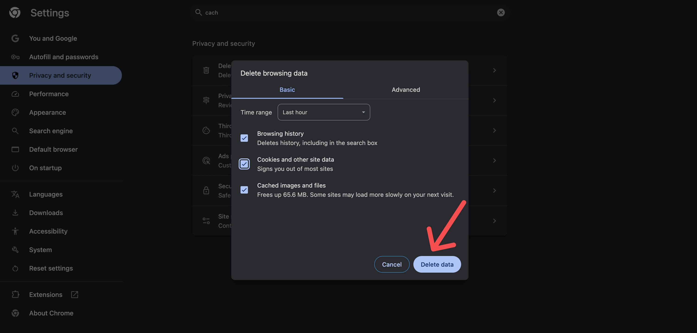

# My app is starting from HomePage after logging in once in the Run Mode

If your app always starts from the HomePage after logging in once (especially in Run Mode), this is likely due to cached authentication or session data in your browser.

## Troubleshooting Steps

- **Clear your browser cache and history.**

- **Try a different browser** or use **incognito/private browsing mode** to see if the issue persists.

If the problem continues, consider checking your authentication flow and session management in your app settings.

:::tip[Pro Tip]
When testing in Run Mode, **FlutterFlow retains your authentication state across sessions** unless explicitly reset. To simulate a real first-time user experience, consider adding a **"Log Out" button** on your HomePage that calls the `Sign Out` action. This ensures that the next time you run the app, it starts from the login screen rather than using stored session data.
:::

