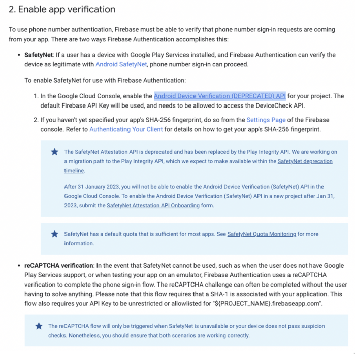
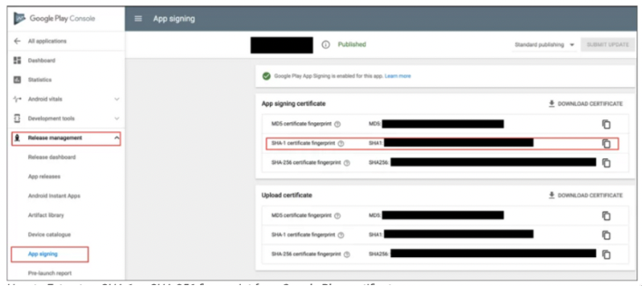

# SafetyNet Phone Sign-In Issue on Android Devices

If you're experiencing issues with Firebase Phone Authentication on Android devices, especially when using emulators or testing in release mode, this guide will help you identify and resolve common problems.

Firebase uses either **SafetyNet** or **reCAPTCHA** to verify that phone number sign-in requests originate from your app. Issues typically arise when one of these verification methods is not correctly configured.

## Troubleshooting Checklist

Ensure the following configurations are in place:

- **Firebase Setup**  
  - Your project is correctly set up in the [Firebase Console](https://console.firebase.google.com/).
  - Firebase Authentication is enabled.
  - The Phone Sign-In method is activated.

- **Phone Authentication Flow**  
  - Prompt the user to enter their phone number.
  - Send a verification code to the user's phone.
  - Accept and verify the code entered by the user.

- **SafetyNet / reCAPTCHA Configuration**  
  - Your app includes the required Firebase and Play Services dependencies.
  - SHA-1 and SHA-256 fingerprints are added to your Firebase project settings.
  - Your API key is either unrestricted or allowlisted.

- **Testing Environment**  
  - If you're using an emulator, test on a physical device instead. Emulators may bypass or fail certain integrity checks.

## Firebase Verification Methods

Firebase uses one of the following methods to confirm the authenticity of phone sign-in requests:

1. **SafetyNet (Deprecated)**

    If the device supports Google Play Services, Firebase uses **SafetyNet Attestation** to confirm the device’s legitimacy.

    :::warning[Deprecated API]  
    The SafetyNet Attestation API is deprecated and has been replaced by the [Play Integrity API](https://developer.android.com/google/play/integrity). After **January 31, 2023**, you can no longer enable the SafetyNet API for new projects in the Google Cloud Console.  
    :::

   To use SafetyNet (if still active for your project):
      - Enable **Android Device Verification (Deprecated)** in the [Google Cloud Console](https://console.cloud.google.com/).
      - Ensure your app's **SHA-256** is added in the Firebase Console under **Project Settings > General > Your Apps**.
      - Use the default Firebase API key or request onboarding for SafetyNet if needed.
      - Monitor your quota [here](https://developer.android.com/google/play/safetynet/quotas).

      

2. **reCAPTCHA Verification**
  
    If SafetyNet is unavailable (e.g. device without Google Play Services or running on an emulator), Firebase falls back to **reCAPTCHA verification**.The reCAPTCHA challenge usually completes without user interaction. This flow requires:

      - A valid **SHA-1** fingerprint added to your Firebase project.
      - An **unrestricted** or **domain-allowlisted** API key (e.g. `your-project-name.firebaseapp.com`).
      - Ensure both SafetyNet and reCAPTCHA flows are working to support a wider range of Android devices.

  :::info[Release Mode Configuration]
  When releasing your app to the Google Play Store, ensure you include the **SHA-1** and **SHA-256** keys from your **Play Console**. Here is how to do that:

  - Navigate to **Play Console → Your App → Release → Setup → App Signing**  
  - Then copy both **SHA-1** and **SHA-256** fingerprints and add them to Firebase Console under **Project Settings > General > Your Apps**.
  :::

  

:::info[Learn more]
- [Firebase Phone Authentication (FlutterFire)](https://firebase.flutter.dev/docs/auth/phone/)
- [Using Firebase Auth in FlutterFlow](https://docs.flutterflow.io/authentication)
- [Play Integrity API Migration](https://developer.android.com/google/play/integrity)

Still stuck? Check Firebase logs, test on a physical device, and ensure your API keys and fingerprints are correctly added. Proper configuration of SafetyNet or reCAPTCHA is critical to ensuring phone number sign-in works reliably across devices.
:::

