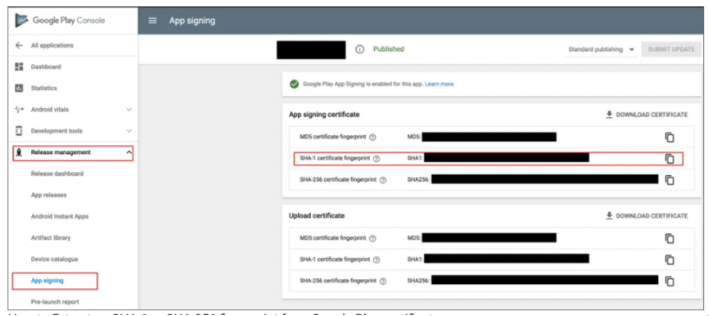

---
keywords:
  - android
  - signing
  - release
slug: >-
  /troubleshooting/authentication/safetynet-phone-sign-in-issue-on-android-devices
title: Android Phone Sign-In App Verification Issues
description: >-
  If you're experiencing issues with Firebase Phone Authentication on Android
  devices, especially when using emulators or testing in release mode, this
  guide will help you identif...
tags:
  - FlutterFlow
  - Troubleshooting
  - Authentication
last_verified: 2026-09-02
---
# SafetyNet Phone Sign-In Issue on Android Devices

If you're experiencing issues with Firebase Phone Authentication on Android devices, especially when using emulators or testing in release mode, this guide will help you identify and resolve common problems.

Firebase Phone Authentication uses **Play Integrity** when available and can fall back to **reCAPTCHA** for Android app verification. Older SafetyNet instructions are obsolete.

## Troubleshooting Checklist

Ensure the following configurations are in place:

- **Firebase Setup**
  - Your project is correctly set up in the [Firebase Console](https://console.firebase.google.com/).
  - Firebase Authentication is enabled.
  - The Phone Sign-In method is activated.

- **Phone Authentication Flow**
  - Prompt the user to enter their phone number.
  - Send a verification code to the user's phone.
  - Accept and verify the code entered by the user.

- **Play Integrity / reCAPTCHA Configuration**
  - Your app includes the required Firebase and Play Services dependencies.
  - SHA-1 and SHA-256 fingerprints are added to your Firebase project settings.
  - Any API-key application restrictions permit the exact Firebase Auth fallback domain and APIs required by your configuration. Do not remove production restrictions without understanding the exposure.

- **Testing Environment**
  - If you're using an emulator, test on a physical device instead. Emulators may bypass or fail certain integrity checks.

## Firebase Verification Methods

Firebase uses one of the following methods to confirm the authenticity of phone sign-in requests:

1. **Play Integrity**

   For Play Integrity verification, ensure the Android app is registered in Firebase with the exact package name and the SHA-256 fingerprint of the certificate that signed the installed build. For Play-distributed builds, use the App Signing certificate shown by Play Console, not only your local upload key.

2. **reCAPTCHA Verification**

    If Play Integrity cannot be used, Firebase can fall back to **reCAPTCHA verification**. This flow requires:

      - A valid **SHA-1** fingerprint added to your Firebase project.
      - An API key configuration that permits the Firebase Auth handler domain (for example, `your-project-name.firebaseapp.com`) and required API. Prefer the narrowest working restriction.
      - The API key used by the installed app must match the current Firebase configuration.

  :::info[Release Mode Configuration]
  When releasing your app to the Google Play Store, ensure you include the **SHA-1** and **SHA-256** keys from your **Play Console**. Here is how to do that:

  - Navigate to **Play Console → Your App → Release → Setup → App Signing**
  - Then copy both **SHA-1** and **SHA-256** fingerprints and add them to Firebase Console under **Project Settings > General > Your Apps**.
  :::

  

:::info[Learn more]
- [Firebase Phone Authentication for Flutter](https://firebase.google.com/docs/auth/flutter/phone-auth)
- [Using Firebase Auth in FlutterFlow](https://docs.flutterflow.io/authentication)
- [Play Integrity API Migration](https://developer.android.com/google/play/integrity)

Still stuck? Record the exact Firebase Auth error code, test both a physical device and an authorized Firebase test phone number, and verify package name, signing fingerprints, quotas, billing/region availability, and the generated Firebase configuration. Never post real phone numbers, SMS codes, API credentials, or unredacted logs in a public issue or AI prompt.
:::

## Related documentation

See [App Starts from HomePage in Run Mode](/troubleshooting/authentication/app-starts-from-homepage-in-run-mode) for a related FlutterFlow workflow.
