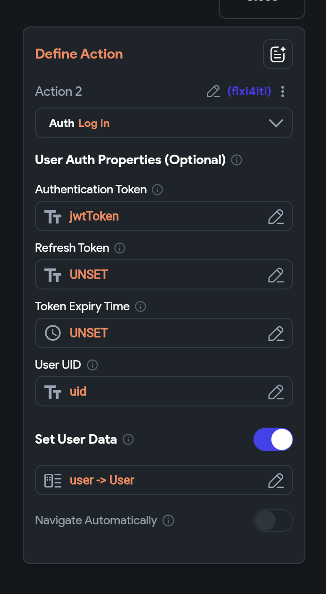

# Troubleshooting Custom Authentication

:::info[Prerequisites]
- Ensure you have a **custom server** with login and sign-up endpoints that return a JWT token upon success.
- **Custom authentication** must be enabled in FlutterFlow, with entry and logged-in pages correctly set.
:::

Here's an example:

## How to Fix Custom Authentication Issues

1. **Verify Server and API Endpoints**
    - Confirm that your server correctly returns JWT tokens for login and sign-up requests. The server's response should include the **authentication token**, **refresh token**, **expiration time**, and **user ID (UID)**.
    - Double-check the API endpoint configurations in FlutterFlow to ensure they match your server’s requirements.

2. **FlutterFlow Configuration**
    - Make sure **Custom Authentication** is enabled in your project settings.
    - Verify that the **Entry Page** and **Logged In Page** are correctly set.

3. **UI Configuration**
    - Ensure your app includes the essential pages for the authentication flow: **Login**, **Sign Up**, and **Home Page** (the page shown when a user is authenticated).

4. **API Integration and Authentication Flow**
    - Test API calls from FlutterFlow to your custom server to confirm responses are working as expected.
    - Use the **Backend Call** action to trigger login/signup, then handle the **Custom Login** action using the response data.

5. **Handling Tokens and User Data**
    - Parse the API response properly to extract and store:
      - `auth token`
      - `refresh token`
      - `expiration time`
      - `user ID (UID)`
    - Store these values in local state or secure app storage.

  

6. **Navigation**
    - If navigation does not occur automatically after login/signup:
      - Disable automatic navigation.
      - Use a **manual navigation** action to route users to the appropriate page.

:::tip[General Tips]
- Test your flow with **dummy credentials** before using real user data. This helps debug token handling, API responses, and navigation.
- Add **logging** on both the server and in FlutterFlow (example, using snack bars or alerts) to monitor each step of the flow.
- Verify the full flow—from login to protected pages—to ensure everything works as expected.
:::

:::info[More Resources]
- [FlutterFlow Custom Authentication Video](https://www.youtube.com/watch?v=hnX3CvBtGvI)
- **Sample project:** [Custom Auth Checklist](https://app.flutterflow.io/project/custom-auth-checklist-fdjkno)
- [FlutterFlow Custom Authentication Documentation](https://docs.flutterflow.io/data-and-backend/custom-authentication)
:::