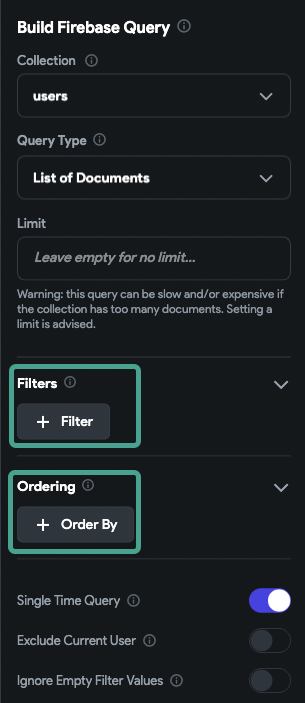

# Backend query is failing and my list shows a gray box instead of a list of items. I get a red screen in test mode.

## Issue

You are trying to load a list of items from the database and it doesn't work, showing a gray box.

## What Is The Cause Of This Issue?

The gray box means the back-end query failed and can't return any result.

## How Do I Tell If My Query Is Working?

- If a query is working, you should see the items generated.
- If there is no result in the database and the query was successful, you should see the **empty state** of the list you generated the item on.

  

  :::tip
  Always make sure if you have a query on a list, set the empty state. This way, when the list is empty and there wasn't any result, you can see the empty state and be sure that the query was working fine.
  :::

## How To Identify This Issue

  If your query is failing, you will see different results in **Run** vs. **Test** mode:

## - RUN Mode:
  A gray box on the real device

## - TEST Mode:
  A red screen with an error message

Below you can see two examples:

### Working query with no results

### Failed query with a gray box that will result in a red screen error

## Troubleshooting This Issue

  If you have a query without any filter or order applied to it and you are experiencing the gray box, the data itself is likely the issue.

  Null values in your database will cause issues in your FlutterFlow project.

  

## How To Identify Null Values In Your Database

- Check your data in Firebase and search for any null value on your fields.
- If your dataset is small, you can also use the FlutterFlow CMS to identify null values.

For example, in this picture you can see the `created_time` is null. If you were to use the `created_time` in your items, your query would fail and you would see the red error message.

We would be setting the formatting on a value that is null, which would cause an issue.

---

:::note 
If you are not sure you have a null value in your database or not, you can use **visibility rules** to hide the widget you are trying to show data in.
:::

:::note 

If you are doing a document from reference query again in your item widget on the reference loaded from your item, make sure to put a visibility rule on the widget you are performing the query on. In case the field was empty and the query is not executed, it won't cause the whole list to fail.
:::