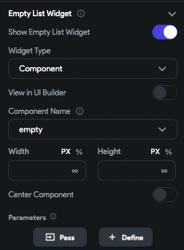
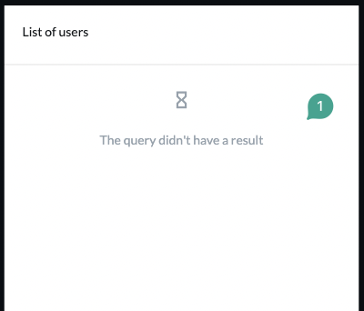
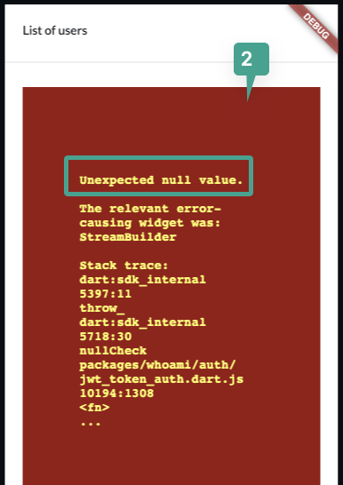
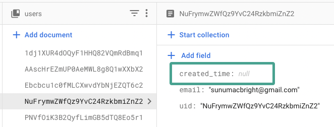
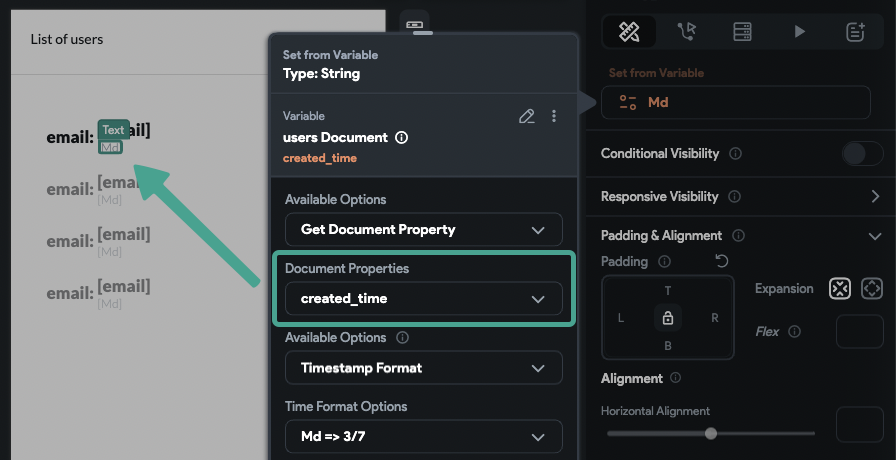
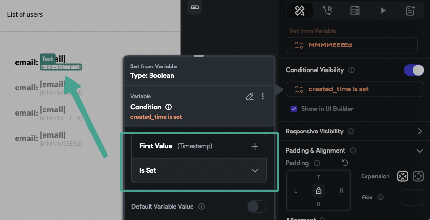

# ListView Gray Box and Red Screen Errors

When loading a list of items from the database, you might encounter a gray box or red error screen. This article explains the possible causes and how to resolve them.

:::info[Prerequisites]
- Ensure your query is correctly connected to a Firestore collection or CMS.
- Confirm that your app builds and runs correctly in **Run** and **Test** modes.
:::

**Understanding the Error:**

A **gray box** usually indicates that the backend query failed to return results. A **red screen** in Test mode suggests a runtime error caused by invalid data or query failure.

**Step-by-Step Troubleshooting:**

1. **Verify Query Results**

    - If the query is successful and returns items, the list will populate as expected.
    - If there are no records matching the query, you will see the **empty state** you configured.
    - If the query fails, a gray box (in Run mode) or a red error screen (in Test mode) will appear.

    

    :::tip
    Always configure an empty state for lists. This helps distinguish between a failed query and an empty dataset.
    :::

2. **Behavior by Mode**

    - **Run mode**: Displays a gray box when the query fails.
    - **Test mode**: Shows a red screen with a specific error message.

        **Example: Working Query with No Results**  
        

        **Example: Failed Query**  
        

3. **Check for Null Values in the Data**

    Null values in critical fields may cause queries or widgets to fail.

    Here is how to check for null values:

        1. Inspect your data in **Firebase** or **CMS** for any fields with `null` values.
        2. Pay attention to fields used in filters, formatting, or conditional visibility.
        3. For example, if `created_time` is null and you are formatting a date from this field, the query may fail.

        **Example: Null Field Causing Error**

          
        

    :::note
    Use **visibility rules** to hide widgets that depend on potentially null values.
    :::

4. **Handle Document-From-Reference Queries Safely**

    If you use document references inside a list item widget, and the reference is null or missing, it will break the query.

    

    :::note
    Always add a visibility rule to any widget performing document-from-reference queries. This ensures the widget is only visible when the reference is valid.
    :::

:::info[Summary]
- A **gray box** means the backend query failed.
- A **red screen** indicates a runtime error in **Test mode**.
- **Null values** in your database are a common cause of failure.
- Always configure **empty states** and apply **visibility rules** to handle null or missing data gracefully.
:::

