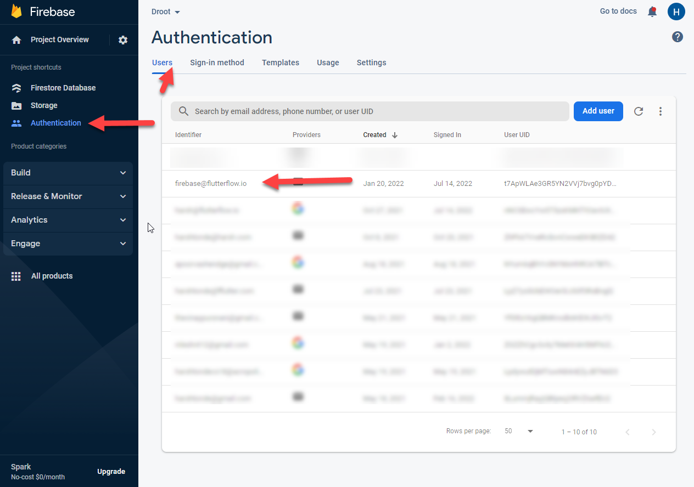
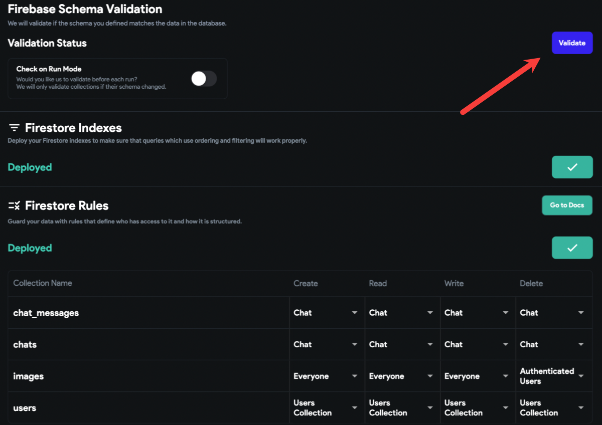

# Resolving Backend Configuration Issues

If you are facing issues related to the backend in FlutterFlow, follow these steps to ensure your Firebase setup is correctly configured:

- **Add Proper Cloud Permissions**

    Grant the following permissions to **firebase@flutterflow.io** in your Firebase project:

        - **Editor**
        - **Cloud Functions Admin**
        - **Service Account User**

    Learn how to **[assign Firebase permissions](/integrations/firebase/connect-to-firebase/#allow-flutterflow-to-access-your-project)**. 

- **Update Firebase Rules**

    Ensure that your Firebase Firestore security rules are updated correctly. See how to **[update Firebase rules](/integrations/database/cloud-firestore/firestore-rules/)**.

    After updating the rules, delete **firebase@flutterflow.io** from your authenticated users, redeploy the Firestore rules, and validate the schema again.

    

- **Match Data Field Types and Names**

    Verify that all data field types and field names match between **Firestore** and **FlutterFlow**.

- **Validate Firestore Schema**

    Use the **Validate** button in **Firestore → Settings** inside FlutterFlow to confirm that the Firestore collection schema matches the FlutterFlow configuration.

    

- **Reset Firebase Setup (If Needed)**

    If you have already completed the Firebase setup but continue to experience issues, remove existing permissions and complete the setup process from scratch.

    **[Follow Firebase setup instructions](/integrations/firebase/connect-to-firebase/)**.

- **Authorized Domains**

    Add `app.flutterflow.io` to your **Authorized Domains** under the **Authentication** tab in Firebase.

- **Refresh FlutterFlow**

    Make sure you are using the latest version of FlutterFlow:

    - Press **Ctrl/Cmd + Shift + R** to refresh.
    - Clear your browser cache.
    - Log out and back into FlutterFlow.

- **Use Blaze Plan for Cloud Functions**

    To use Cloud Functions like Push Notifications, Payments, and other features, ensure your Firebase project is on the **Blaze Plan**.

By following these steps, most backend issues in FlutterFlow can be resolved effectively.
