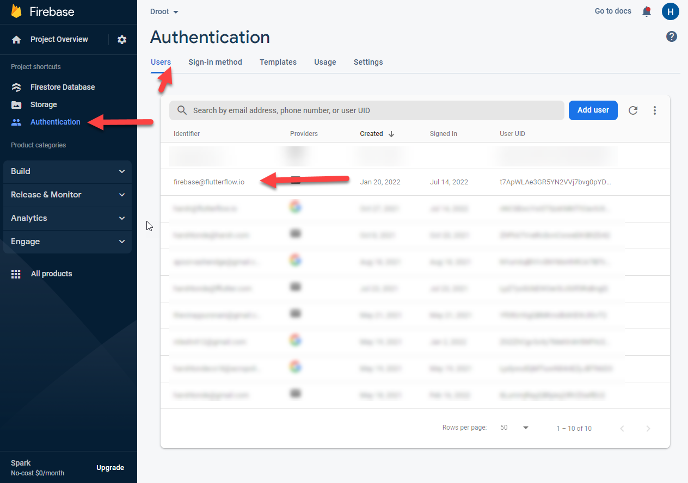

# Resolving Firebase Configuration Issues

If you're experiencing backend errors, failed schema validation, or data sync issues, this guide will help you verify and fix your Firebase setup in FlutterFlow.

:::info[Prerequisites]
- You must have already connected your Firebase project to FlutterFlow.
- You should have access to your Firebase console with admin rights.
:::

Follow the steps below to fix firebase configuration:

1. **Grant Required Permissions**

   Assign the following permissions to `firebase@flutterflow.io` in your Firebase project:
    - Editor  
    - Cloud Functions Admin  
    - Service Account User

    Learn how to **[assign Firebase permissions](/integrations/firebase/connect-to-firebase/#allow-flutterflow-to-access-your-project)**.

2. **Update Firestore Rules**

   Update your Firestore security rules to allow access for FlutterFlow.

   After making changes:
        - Remove `firebase@flutterflow.io` from your authenticated users.
        - Redeploy your Firestore rules.
        - Validate your schema again.

        

3. **Match Field Types and Names**

   Check that data field types and names match between Firestore and FlutterFlow exactly. Mismatches will cause query errors.

4. **Validate Firestore Schema in FlutterFlow**

   Use the **Validate** button under **Firestore → Settings** in FlutterFlow to confirm that your collection schema matches your Firestore structure.

   

5. **Reset Firebase Setup (If Needed)**

   If issues persist after following the steps above:
        - Revoke the current setup.
        - Reconnect your Firebase project using the **[Firebase setup instructions](/integrations/firebase/connect-to-firebase/)**.

6. **Add Authorized Domains**

   In the Firebase console, go to **Authentication → Sign-in Method → Authorized Domains** and add: `app.flutterflow.io`

7. **Refresh FlutterFlow**

    Make sure you're using the latest version of the platform:

        - Press `Ctrl`/`Cmd + Shift + R`
        - Clear your browser cache
        - Log out and back in to FlutterFlow

8. **Upgrade to Blaze Plan (If Using Cloud Functions)**

    Cloud Functions such as Push Notifications and Payments require a billing-enabled Firebase project. Make sure you’re on the **Blaze Plan**.

:::tip
After updating Firestore rules, always validate the schema using the **Validate** button before proceeding with other fixes.
:::