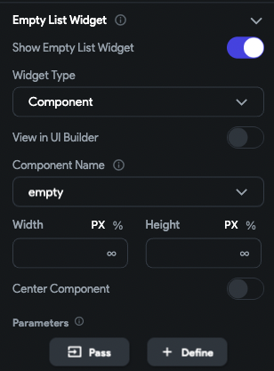
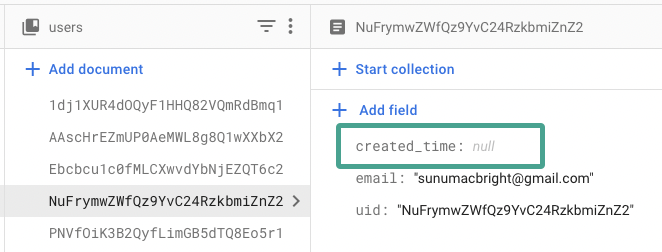
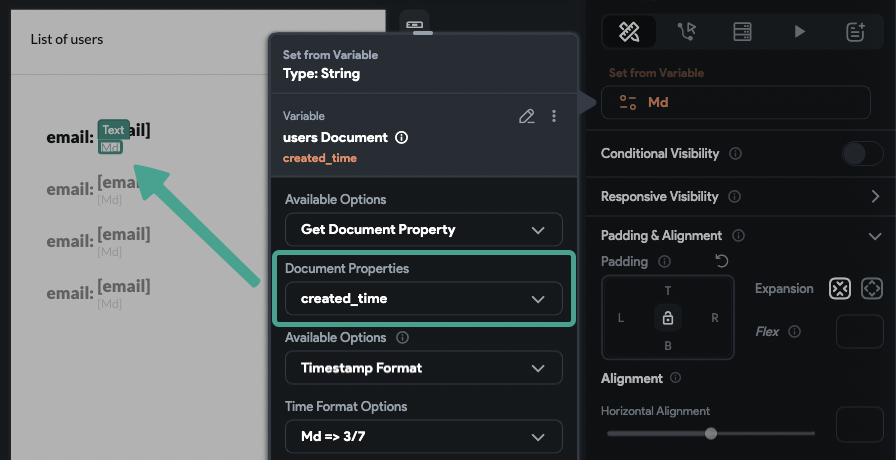
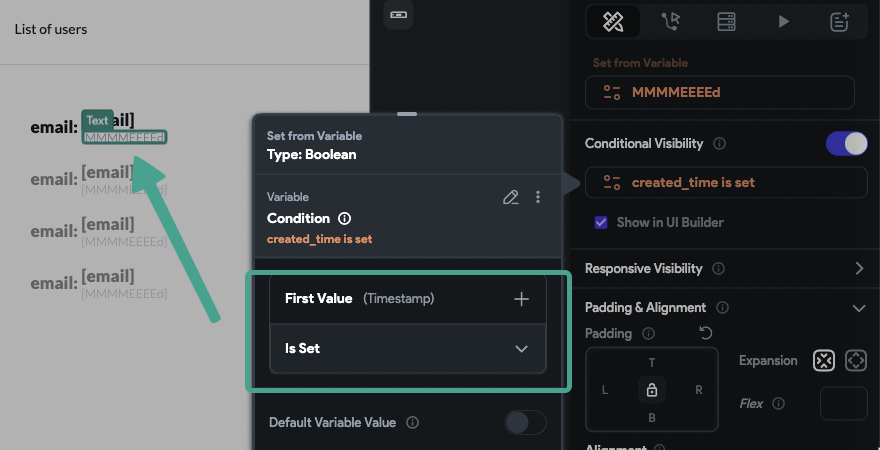

# Why Your ListView Shows a Gray Box or Red Screen in FlutterFlow

**Issue**

When trying to load a list of items from the database, the list doesn't load and displays a gray box.

**Cause**

A gray box means the backend query failed and couldn't return any result.

**How to Know if Your Query is Working**

    - If the query is successful and returns items, you will see the list populated.
    - If there are no records matching the query, but the query itself is successful, you will see the **empty state** that you have configured for your list.

    

:::tip
Always configure an empty state for lists. This helps differentiate between an empty dataset and a failed query.
:::

**Behavior in Different Modes**

The behavior may differ depending on whether you are in **Run** or **Test** mode:

    - **Run mode**: A gray box is displayed.
    - **Test mode**: A red screen with an error message appears.

    **Working Query with no Results**

    

    **Failed query**

    

**Troubleshooting Steps**

    If you are seeing a gray box and no filters or ordering are applied to your query, the issue is likely with the data itself — specifically, **null values** in your database.

    Null values can cause FlutterFlow queries to fail.

    

    **How to check for null values**

        - Inspect your data in Firebase for any fields that have null values.
        - If your dataset is small, you can use the FlutterFlow CMS to review the data.

        For example, in the image below, the `created_time` field is null. If your widget relies on this field (e.g., formatting the date), the query will fail.

        
        

:::note 
When unsure if a value is null, use **visibility rules** to hide widgets that depend on potentially null data.
:::

:::note 
If you are performing document-from-reference queries inside an item widget, always add a visibility rule to that widget. This prevents the query from breaking if the reference field is empty.
:::

:::info[Summary]
- A gray box means the query failed.
- A red screen means an error occurred in test mode.
- Null values in your data are a common cause.
- Always configure empty states and use visibility rules to handle null data safely.
:::

