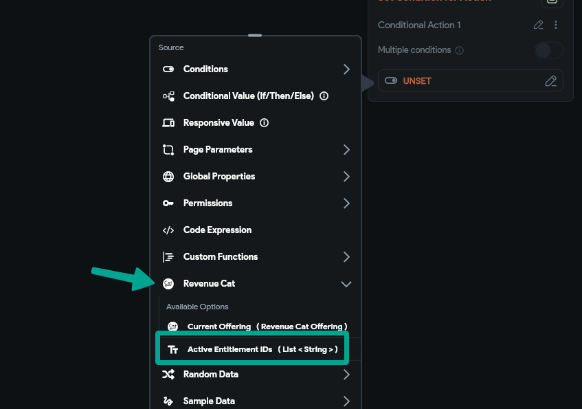

# RevenueCat for Subscription and One-Time Payments in FlutterFlow – PayWall

In-app purchases and subscriptions represent a major revenue opportunity for mobile apps. RevenueCat simplifies the management of these monetization models, especially when integrated with FlutterFlow. This guide explains how to implement paywalls for both subscription and one-time payments, using RevenueCat and FlutterFlow.

## Understanding RevenueCat's Role

RevenueCat acts as a middle layer between your app and the app stores (Google Play and Apple App Store), handling in-app subscriptions and purchases. It abstracts store-specific APIs and provides a unified interface to manage receipts, subscriptions, and user purchases.

## Preparing the App

Before integrating RevenueCat:

- Ensure the app is deployed to both Google Play and Apple App Store.
- Use **Settings > Integrations > Mobile Deployment** in FlutterFlow to configure deployments.
- Define all subscription and one-time products in the stores before setting them up in RevenueCat.

## Configuring Products in RevenueCat

### Subscriptions

Subscriptions in RevenueCat are auto-renewable products. Set each with:

- A unique product ID
- Duration and pricing
- Tier-level options

### One-Time Purchases

Configure these as non-consumable products in RevenueCat:

- Assign a unique identifier
- Track and manage separately from subscriptions

## Entitlements and Offerings

**Entitlements** represent access to features or content. For example, an entitlement named `PremiumAccess` might unlock additional features for subscribed users.

**Offerings** define the products available for purchase and link your UI to what is configured in RevenueCat.

:::note
If the user has purchased a one-time product (not a subscription), they still receive an entitlement. The paywall action evaluates both one-time and recurring entitlements equally.
:::

This makes it possible to allow purchases such as tokens to bypass the paywall via one-time entitlements.

## Implementing the Paywall in FlutterFlow

Create a paywall screen or modal that fetches RevenueCat offerings. Use the following actions:

- **Check Subscription Status**
- **Initiate Purchase**

The **Paywall** action returns a boolean. Add a condition after the action:

- If true: trigger content access
- If false: prompt the user to subscribe (via modal or navigation)

## Managing User Transactions

Use the **Purchase** action in FlutterFlow to start a transaction.

- RevenueCat communicates with the store
- After purchase, user entitlements are updated

To restore purchases:

- Use **Restore Purchase** action
- Allows access to purchases across devices or after reinstalling

The **paymentId** (a string) is returned from the action. Always check:

- If `paymentId` is not null → trigger post-payment actions

## Summary

Integrating RevenueCat with FlutterFlow enables robust handling of subscriptions and one-time payments. By correctly configuring products, entitlements, and offerings, and leveraging FlutterFlow’s paywall and purchase actions, you can provide a smooth user experience and maximize monetization.
