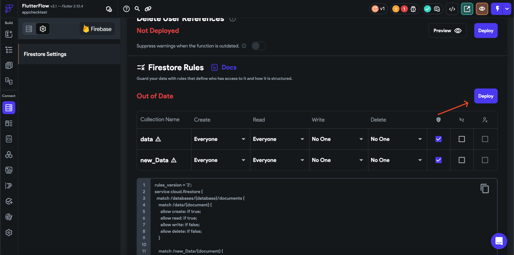
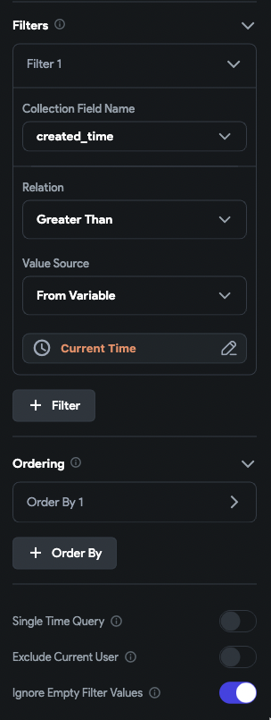
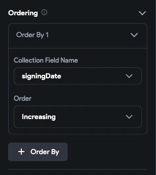
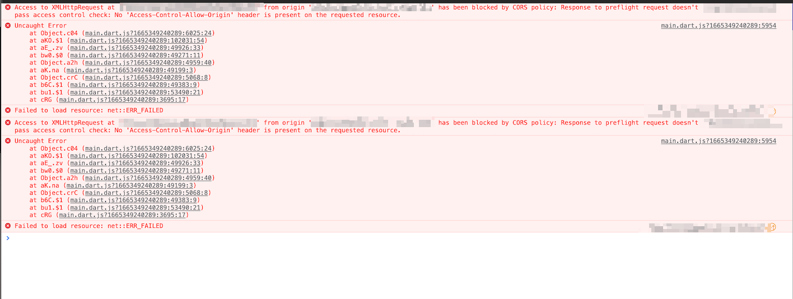

# Backend Query Not Returning Results Despite Existing Data

If your backend query is not returning results even though your Firestore database contains data, it may be due to one of several common misconfigurations.

---

:::info[Prerequisites]
- Ensure your Firebase project is properly connected to FlutterFlow.
- Your Firestore rules are deployed for all relevant collections.
- Your data includes all required fields referenced in your queries.
:::

---

## Common Causes and Fixes

### Missing or Incorrect Firestore Rules

If the collection being queried does not have the correct rules deployed, data will not be returned. This often happens when new collections are added but rules are not updated or deployed.

:::warning
Check your Firestore rules for the collection being queried. Make sure rules are deployed and allow read access for your use case.
:::

---

### "Ignore Empty Filter Values" Option with Missing or Null Data

If the **Ignore Empty Filter Values** option is enabled and documents are missing the field (or the field is `null`), those documents will be ignored.

For example, in the following setup, if any document does not contain the `created_time` field or if that field is `null`, it will not be returned in the query results.

To resolve:

- Check whether **Ignore Empty Filter Values** is enabled.
- Confirm that all documents include the filtered field with valid values.

---

### Using Ordering on a Field That Is Null or Missing

If a query orders results by a field (e.g., `signinDate`), any document that does not contain this field or has a `null` value will be ignored.

In the example below:

- If no documents are returned, none of them have `signinDate` or the value is `null`.
- If only some documents are returned, the others likely have missing or null `signinDate` fields.

:::tip
Always ensure the field used for ordering exists and has non-null values in all documents.
:::

---

### API Responses Are Empty in the Deployed App

If API queries return results in **test mode** but not in the **deployed app**, it is likely due to CORS (Cross-Origin Resource Sharing) restrictions.

Check the browser console for CORS-related errors.

