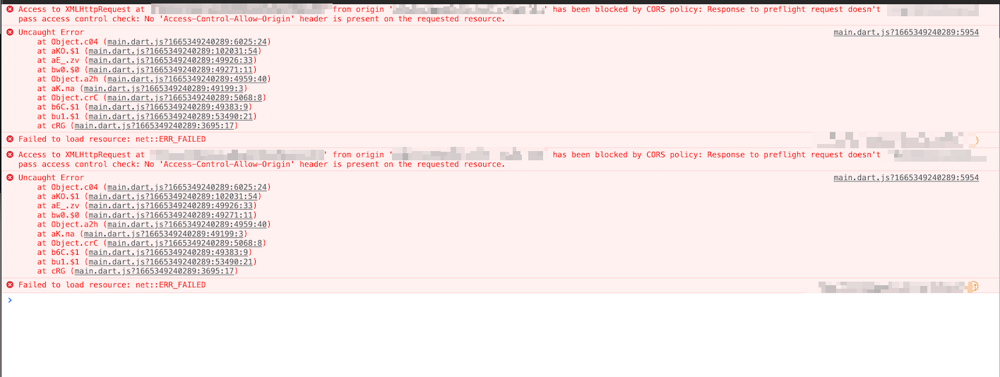

# Fix Backend Query Not Returning Results

If your backend query is not returning data from Firestore even though your database contains records, there may be configuration issues in your Firestore setup or query configuration.

---

:::info[Prerequisites]
- A connected Firestore database with records present.
- Backend query configured in FlutterFlow.
:::

---

## Common Causes and Fixes

### 1. Firestore Rules Not Deployed for the Collection

When creating a new collection, rules for that collection must be defined and deployed. If not, Firebase will block read access.

**Fix:**
- Open the **Firestore Rules** section in FlutterFlow or the Firebase Console.
- Define rules for the collection.
- Deploy the updated rules.

---

### 2. Ignore Empty Filter Values Option with Missing Data

If the **Ignore Empty Filter Values** option is enabled, documents missing the specified filter field or having a `null` value will be excluded from results.

**Fix:**
- Check your query filters for this setting.
- Ensure all documents in the collection have valid values for the filtered field (e.g., `created_time`).

---

### 3. Order By Field Is Null or Missing

If you're using a field for ordering (e.g., `signinDate`), and that field is missing or `null` in some documents, those documents will be ignored.

**Examples:**
- If **no** documents are returned: the field likely doesn't exist in any document.
- If **some** documents are returned: only those with a valid value for the field are included.

**Fix:**
- Ensure the field used for ordering exists and is non-null in every document.

---

### 4. API Returns No Results in Deployed Web App

If an API works in **Test Mode** but fails in the **deployed web app**, it's likely due to **CORS restrictions**.

**Fix:**
- Open the browser’s developer console.
- Look for any **CORS-related errors**.
- If found, update your server configuration or use a proxy.

---

:::warning
If none of the steps above resolve the issue, reach out to FlutterFlow support via the in-app chat or email: **support@flutterflow.io**
:::

---

## Related Resources

- [Connect Firebase to FlutterFlow](/integrations/firebase/connect)
- [Firestore Query Filters](/database/firestore/querying-data)
- [Understanding Firestore Rules](https://firebase.google.com/docs/firestore/security/get-started)
