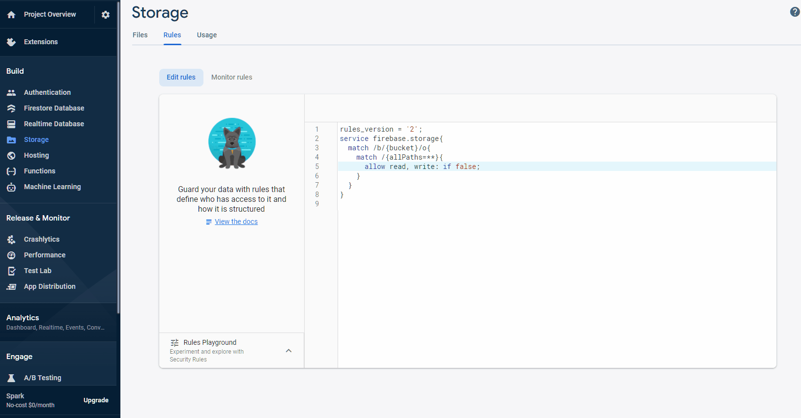

# Fix Image Upload Failure from Action

If image uploads are failing in your app when using the **Image Upload** action, the issue is likely due to a misconfigured Firebase Storage rule.

Firebase requires authenticated access rules to allow uploading images. This guide walks through updating those rules to resolve the issue.

:::info[Prerequisites]
- You must have already connected your FlutterFlow project to Firebase.
- Firebase Storage must be enabled in your Firebase Console.
:::

Follow the steps below to fix the image upload issue:

1. **Open Firebase Storage Rules**

  - Go to the **[Firebase Console](https://console.firebase.google.com)**.
  - Select your project and open the **Storage** section.
  - Click the **Rules** tab at the top.

    

2. **Update Storage Rules**

  - Replace the existing rules with the configuration below:

    ```js
    rules_version = '2';
    service firebase.storage {
      match /b/{bucket}/o {
        match /{allPaths=**} {
          allow read, write: if request.auth != null;
        }
      }
    }
    ```

    

  - Click Publish to save the changes.

3. **Re-upload Previous Media (Optional)**
  If you had previously uploaded media before fixing the rules, re-uploading them may resolve lingering upload issues.

  Make sure the rule change above does not conflict with your app's privacy or security requirements. Only allow `request.auth != null` if authenticated users should have upload access.