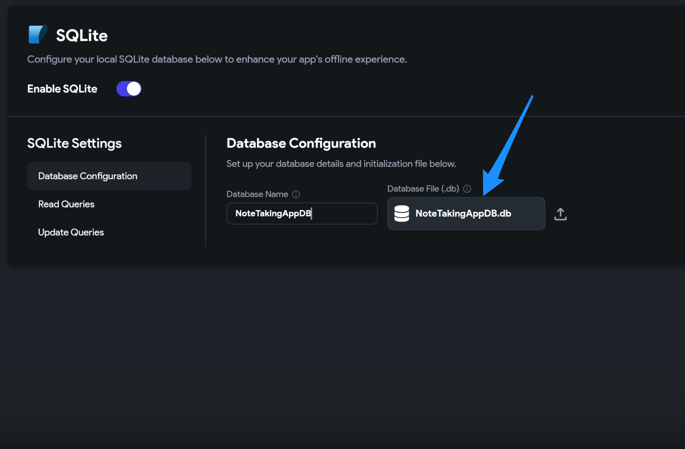
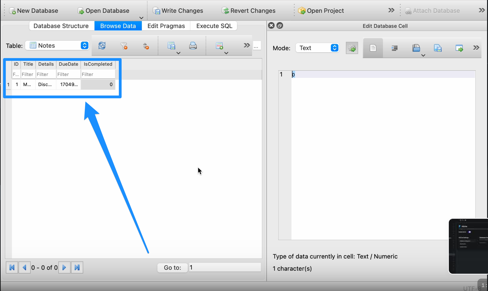

# Resolve Common SQLite Errors

SQLite is a lightweight local database engine supported in FlutterFlow for building offline-first applications. However, configuration or query issues can result in runtime errors or unexpected behavior.

This guide covers the most common SQLite issues and provides step-by-step solutions to help you resolve them efficiently.

:::info[Prerequisites]
- Add and configure your SQLite database under **Settings > Local State**.
- SQLite is not supported on the web. Always test on a physical device or emulator.
:::

- **Database Configuration Errors**

  - Capitalization in Configuration File

      Ensure the first letter of each word in your database configuration file is capitalized. Incorrect capitalization may lead to setup issues.

      

  - Unset Variable Values

      Verify that all database variables are initialized with valid values.

      


- **Late Initialization Error**

  - Late Initialization Error

    This error typically occurs when testing SQLite on the web, which is unsupported.

    :::tip
    Download and run your application on a physical device or emulator to test SQLite functionality.
    :::

- **Syntax Errors in Queries**

  - READ Query Best Practices

    Follow these guidelines to avoid syntax errors when using `SELECT` statements:

      - **Basic SELECT Query**

        ```sql
        SELECT column1, column2 FROM table_name;
        ```

      - **Select All Columns**

        ```sql
        SELECT * FROM employees;
        ```

      - **Use WHERE for Filtering**

        ```sql
        SELECT * FROM employees WHERE department = 'Sales';
        ```

      - **Use Logical Operators**

        ```sql
        SELECT * FROM employees WHERE department = 'Sales' AND salary > 50000;
        ```
      - **Sort with ORDER BY**

        ```sql
        SELECT * FROM employees ORDER BY last_name ASC;
        ```
      - **Limit Result Set**

        ```sql
        SELECT * FROM employees LIMIT 10;
        ```
      - **Column Aliases**

        ```sql
        SELECT first_name AS "First Name", last_name AS "Last Name" FROM employees;
        ```
      - **Use JOIN for Multiple Tables**

        ```sql
        SELECT e.first_name, d.department_name
        FROM employees e
        INNER JOIN departments d ON e.department_id = d.department_id;
        ```
      - **Use Parameterized Queries**

        ```sql
        SELECT * FROM employees WHERE department = ?;
        ```
      - **Follow Naming Conventions**

        Use lowercase letters and underscores for clarity and consistency:  
        `employee_id`, `department_name`, etc.

  - **UPDATE Query Best Practices**
    
    - **Update a Single Field**

      ```sql
      UPDATE employees SET salary = 60000 WHERE id = 1;
      ```
    - **Update Multiple Fields**
      ```sql
      UPDATE employees SET email = 'new@example.com', phone = '1234567890' WHERE id = 1;
      ```
    - **Use Parameter Placeholders**
      ```sql
      UPDATE employees SET email = ?, phone = ? WHERE id = ?;
      ```
    - **Use Another Column in SET**
      ```sql
      UPDATE employees SET salary = bonus + 500 WHERE department = 'Sales';
      ```
    - **Use CASE for Conditional Updates**

      ```sql
      UPDATE orders
      SET status = CASE
        WHEN payment_received = 1 THEN 'Paid'
        ELSE 'Pending'
      END
      WHERE order_date < '2023-01-01';
      ```
    - **Update All Rows (Use with Caution)**

      ```sql
      UPDATE employees SET is_active = 0;
      ```

      :::warning
      Avoid running `UPDATE` queries without a `WHERE` clause unless you're absolutely certain. This can unintentionally affect all rows.
      :::
    - **Wrap Updates in Transactions**

      Use `BEGIN`, `COMMIT`, and `ROLLBACK` when performing multiple updates to maintain data integrity.

**Testing & Tools**

  :::tip
  Use **[SQLite Online](https://sqliteonline.com/)** to test and validate your queries before using them in FlutterFlow.
  :::

:::info[Additional Resources]
- **[SQLite Documentation](https://www.sqlite.org/docs.html)**  
- **[SQLite Online Tool](https://sqliteonline.com/)**
:::