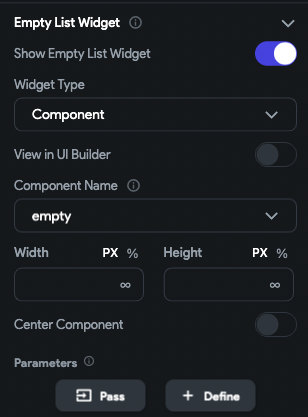
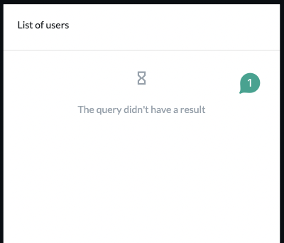
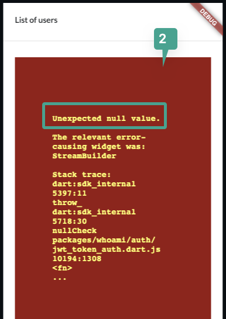
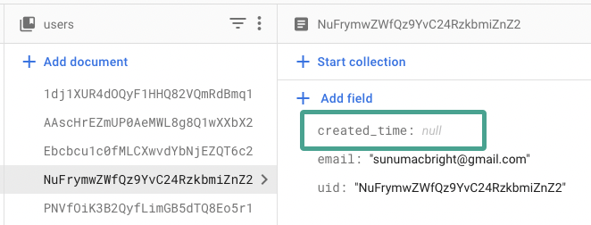
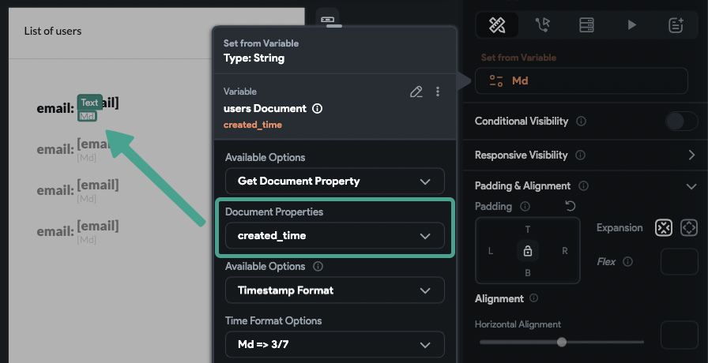
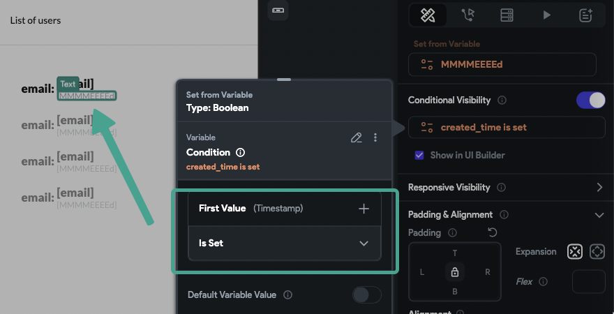

---
keywords:
  - database
  - listview
  - mode
slug: /troubleshooting/backend/listview-gray-box-and-red-screen-errors
title: ListView Gray Box and Red Screen Errors
description: >-
  When loading a list of items from the database, you might encounter a gray box
  or red error screen.
tags:
  - FlutterFlow
  - Troubleshooting
  - Backend
last_verified: 2026-09-02
---
# ListView Gray Box and Red Screen Errors

When loading a list of items from the database, you might encounter a gray box or red error screen. This article explains the possible causes and how to resolve them.

:::info[Prerequisites]
- Ensure your query is correctly connected to a Firestore collection or CMS.
- Confirm that your app builds and runs correctly in **Run** and **Test** modes.
:::

**Understanding the Error:**

A gray placeholder or red error surface means rendering failed, but it does not identify the cause by itself. Capture the first runtime error and stack trace; common causes include a denied or invalid query, an unexpected null/type, a missing referenced document, or a widget layout constraint.

**Step-by-Step Troubleshooting:**

1. **Verify Query Results**

    - If the query is successful and returns items, the list will populate as expected.
    - If there are no records matching the query, you will see the **empty state** you configured.
    - If rendering fails, inspect the browser or device log for the exact exception instead of diagnosing from the color alone.

    

    :::tip
    Always configure an empty state for lists. This helps distinguish between a failed query and an empty dataset.
    :::

2. **Behavior by Mode**

    - **Run mode**: Displays a gray box when the query fails.
    - **Test mode**: Shows a red screen with a specific error message.

        **Example: Working Query with No Results**
        

        **Example: Failed Query**
        

3. **Check for Null Values in the Data**

    Null values in critical fields may cause queries or widgets to fail.

    Here is how to check for null values:

        1. Inspect your data in **Firebase** or **CMS** for any fields with `null` values.
        2. Pay attention to fields used in filters, formatting, or conditional visibility.
        3. For example, if `created_time` is null and you are formatting a date from this field, the query may fail.

        **Example: Null Field Causing Error**

        
        

    :::note
    Check for null before formatting or dereferencing a value, and provide an explicit fallback. Visibility alone is not an authorization boundary and may not prevent every upstream query from running.
    :::

4. **Handle Document-From-Reference Queries Safely**

    If you use document references inside a list item widget, and the reference is null or missing, it will break the query.

    

    :::note
    Check that the reference is non-null before issuing the document query, then handle a nonexistent or unauthorized target as a separate empty/error state.
    :::

:::info[Summary]
- Gray and red error surfaces are symptoms; use the first logged exception to find the cause.
- **Null values** in your database are a common cause of failure.
- Always configure **empty states** and apply **visibility rules** to handle null or missing data gracefully.
:::

## Related documentation

See [ListView Returning Only One Item](/troubleshooting/backend/listview-returning-only-one-item) for a related FlutterFlow workflow.
