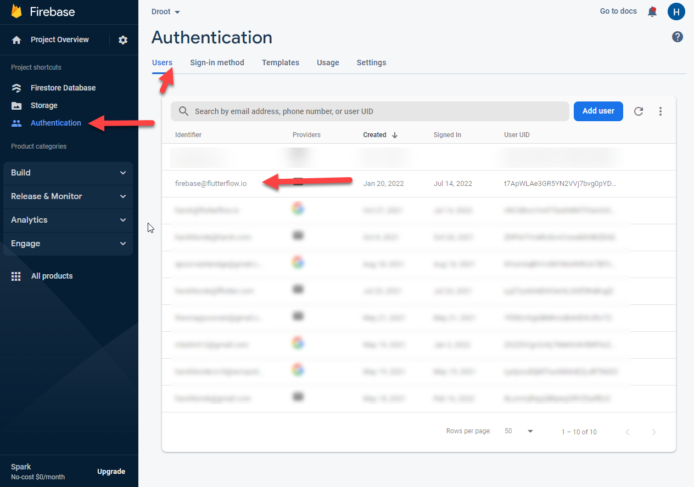
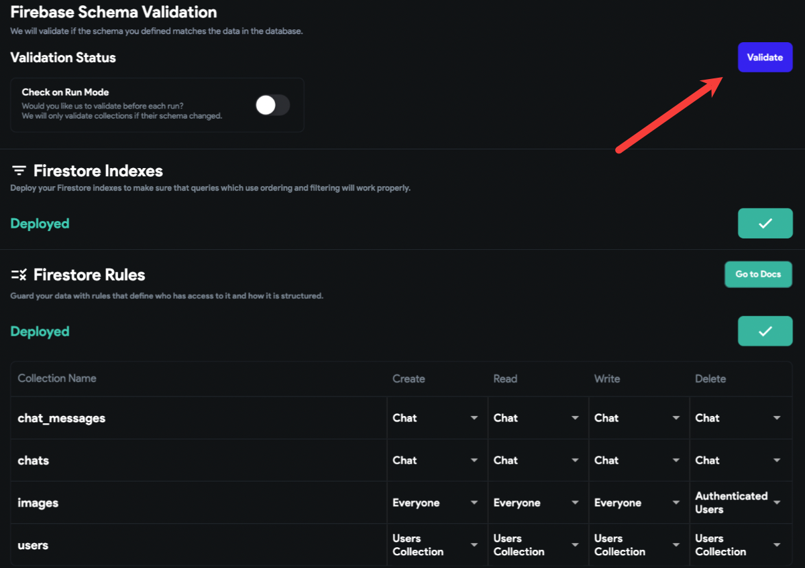

---
keywords:
  - firebase
  - issues
  - configuration
slug: /troubleshooting/backend/resolving-firebase-configuration-issues
title: Resolving Firebase Configuration Issues
description: >-
  If you're experiencing backend errors, failed schema validation, or data sync
  issues, this guide will help you verify and fix your Firebase setup in
  FlutterFlow.
tags:
  - FlutterFlow
  - Troubleshooting
  - Backend
last_verified: 2026-09-02
---
# Resolving Firebase Configuration Issues

If you're experiencing backend errors, failed schema validation, or data sync issues, this guide will help you verify and fix your Firebase setup in FlutterFlow.

:::info[Prerequisites]
- You must have already connected your Firebase project to FlutterFlow.
- You should have access to your Firebase console with admin rights.
:::

Follow the steps below to fix firebase configuration:

1. **Grant Required Permissions**

   Follow the current **[Firebase permission instructions](/integrations/firebase/connect-to-firebase/#allow-flutterflow-to-access-your-project)** for `firebase@flutterflow.io`. Use the documented roles for the features you deploy; do not add Owner or unrelated roles as a generic fix. Organization policies can still deny an operation even when an IAM role appears present.

2. **Update Firestore Rules**

   Deploy the project's intended Firestore security rules and test them with representative signed-in, signed-out, owner, and non-owner cases. Do not publish an allow-all rule to make schema validation pass.

   After making changes:
        - Confirm the FlutterFlow service account and your app users are not being confused; IAM and Firebase Authentication are separate systems.
        - Redeploy the reviewed Firestore rules.
        - Validate your schema again.

        

3. **Match Field Types and Names**

   Check that data field types and names match between Firestore and FlutterFlow exactly. Mismatches will cause query errors.

4. **Validate Firestore Schema in FlutterFlow**

   Use the **Validate** button under **Firestore → Settings** in FlutterFlow to confirm that your collection schema matches your Firestore structure.

   

5. **Reset Firebase Setup (If Needed)**

   If issues persist after following the steps above:
        - Record the current project ID, app IDs, authorized domains, rules, indexes, and deployed resources.
        - Reconnect using the **[Firebase setup instructions](/integrations/firebase/connect-to-firebase/)** only after you understand what the reset changes and have a rollback plan.

6. **Add Authorized Domains**

   In the Firebase console, go to **Authentication → Sign-in Method → Authorized Domains** and add: `app.flutterflow.io`

7. **Refresh FlutterFlow**

    Make sure you're using the latest version of the platform:

        - Press `Ctrl`/`Cmd + Shift + R`
        - Sign out and back in only when the error indicates an expired account session. Clearing all browser data is not a substitute for checking the exact validation error.

8. **Upgrade to Blaze Plan (If Using Cloud Functions)**

    Cloud Functions such as Push Notifications and Payments require a billing-enabled Firebase project. Make sure you’re on the **Blaze Plan**.

:::tip
After updating Firestore rules, always validate the schema using the **Validate** button before proceeding with other fixes.
:::
