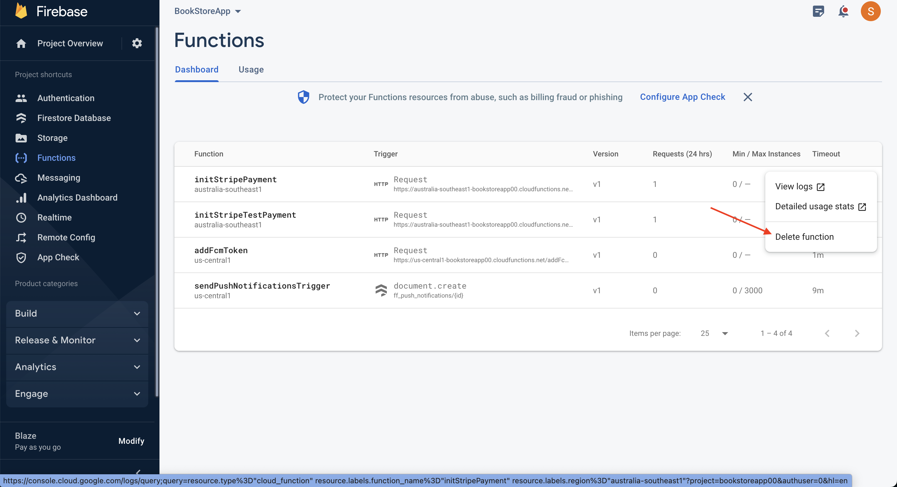
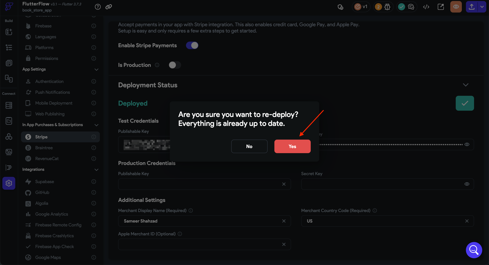

# Fix "Stripe Payment Action Error: Unknown Error Occurred"

When integrating Stripe payments in your FlutterFlow app, you may encounter an error that prevents the payment from processing correctly. This guide walks through the cause and steps to resolve it.

## Problem

**Error Message:**

- **Snackbar:** `Unknown Error Occurred`
- **Console:**  Access to fetch at 'https://us-central1-<your-function>.cloudfunctions.net/initStripeTestPayment'
from origin 'https://ff-debug-service-frontend-xyz.a.run.app' has been blocked by CORS policy:
Response to preflight request doesn't pass access control check:
Redirect is not allowed for a preflight request.

## Cause

This error is caused by a mismatch between the region where your Firebase functions are deployed and the region configured in your FlutterFlow project. The Cloud Function is being called from an incorrect region, leading to a CORS policy error.

## How to Fix It

### Step 1: Set Cloud Functions Region

- Open **Firebase Settings** in FlutterFlow.
- Click **Show Advanced Settings**.
- Set the **Cloud Functions Region** to either `[Default]` or the **same region used in Firebase**.

> You can also use ⌘+K (macOS) or Ctrl+K (Windows) and search for “firebase” to quickly find this section.

### Step 2: Delete Previously Deployed Functions

Remove any previously deployed functions from Firebase that were created using the wrong region.

### Step 3: Re-deploy Stripe Integration

- Go to your FlutterFlow project settings.
- Re-deploy Stripe integration using the updated Cloud Functions region.

## Summary

By aligning the Cloud Function region with your Firebase configuration and re-deploying your Stripe setup, you can resolve the "Unknown Error Occurred" issue related to CORS during Stripe payments.

If the problem persists, contact FlutterFlow support at **support@flutterflow.io**.

