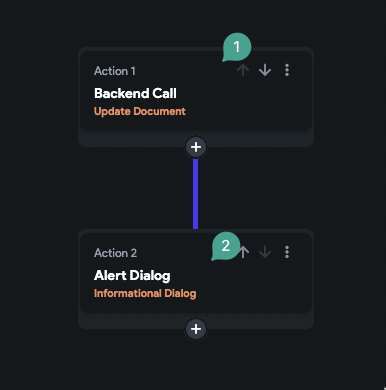
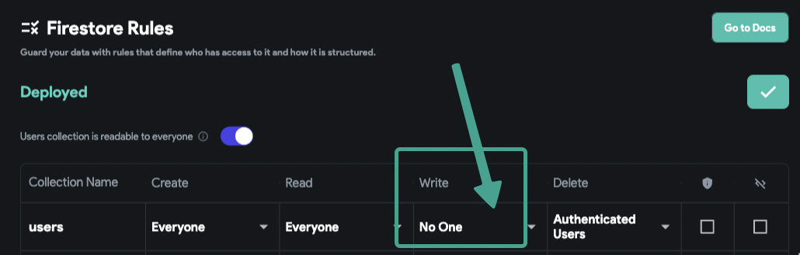
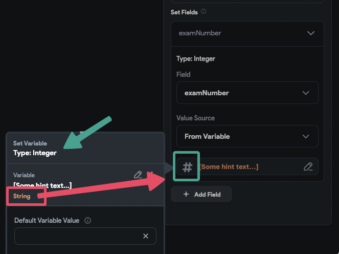
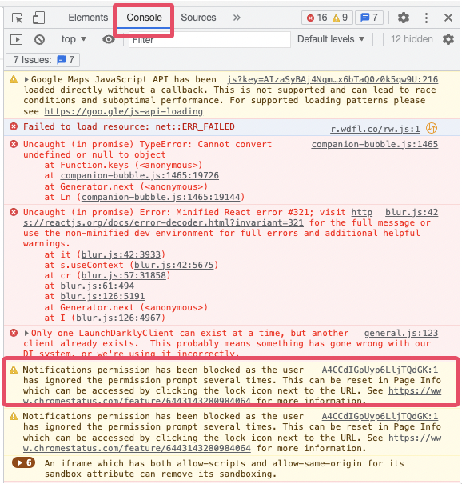

---
keywords:
  - call
  - document
  - backend
slug: /troubleshooting/backend/update-document-action-fails-during-backend-call
title: Update Document Action Fails During Backend Call
description: >-
  When performing the Update Document action, you may encounter a situation
  where the loading indicator appears but then stops without completing the
  action.
tags:
  - FlutterFlow
  - Troubleshooting
  - Backend
last_verified: 2026-09-02
---
# Update Document Action Fails During Backend Call

When performing the **Update Document** action, you may encounter a situation where the loading indicator appears but then stops without completing the action. This indicates that the update was unsuccessful. If the update succeeds, the next steps in your action flow, such as displaying an alert dialog, should execute automatically.

:::note
After performing the update action, always verify that the data has been correctly updated in your database. If your document is not streamed in real-time within your app, the updated data may not immediately appear. Check the data in FlutterFlow CMS or directly in Firebase to confirm the update.
:::

**Causes of Document Update Failures:**

When the update action fails, the action flow stops, preventing any subsequent actions from executing.

There are two common reasons why the update action may fail:

- **Permission Issue in Firestore**

    The user may not have the necessary permission to write to the document.

    

    **Cause:**
    The Firestore security rules may not allow the current user to write (edit) documents.

    **Solution:**
    Review the rule denial and make the query, document path, and authenticated claims satisfy the intended least-privilege rule. A blanket write grant to every authenticated user is usually too broad; enforce ownership, roles, immutable ownership fields, and permitted field changes as appropriate.

- **Data Type Mismatch**

    The values you are attempting to write may not match the expected field types.

    For example, assigning a string value to a field that expects an integer will result in failure.

    

    **Cause:**
    Attempting to write a value of the wrong type, such as assigning text to a number field.

    **Solution:**
    Verify that the values match the expected types and validation rules. Parse untrusted API or form input with an explicit failure path rather than silently coercing a malformed value.

    :::note
    If you want to save a text field value as a number, ensure that the text field input type is set to **Number**.
    :::

:::info[Additional Troubleshooting]
Check the first error in the browser or device logs and the corresponding backend logs. Redact tokens, document contents, user identifiers, and personal data before sharing an excerpt with support or an AI assistant.

:::

## Related documentation

See [ListView Gray Box and Red Screen Errors](/troubleshooting/backend/listview-gray-box-and-red-screen-errors) for a related FlutterFlow workflow.
