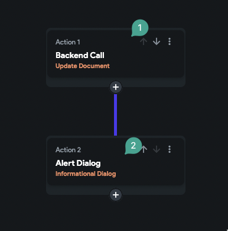

# Update Document Action Fails During Backend Call

When performing the **Update Document** action, you may encounter a situation where the loading indicator appears but then stops without completing the action. This indicates that the update was unsuccessful. If the update succeeds, the next steps in your action flow, such as displaying an alert dialog, should execute automatically.

:::note
After performing the update action, always verify that the data has been correctly updated in your database. If your document is not streamed in real-time within your app, the updated data may not immediately appear. Check the data in FlutterFlow CMS or directly in Firebase to confirm the update.
:::

**Causes of Document Update Failures:**

When the update action fails, the action flow stops, preventing any subsequent actions from executing.

There are two common reasons why the update action may fail:

- **Permission Issue in Firestore**

    The user may not have the necessary permission to write to the document.

    

    **Cause:**  
    The Firestore security rules may not allow the current user to write (edit) documents. 

    **Solution:**  
    Review and configure your Firestore rules to grant write permission. For example, allowing write access to authenticated users is often sufficient if your app requires user authentication.

- **Data Type Mismatch**

    The values you are attempting to write may not match the expected field types.

    For example, assigning a string value to a field that expects an integer will result in failure.

    

    **Cause:**  
    Attempting to write a value of the wrong type, such as assigning text to a number field.

    **Solution:**  
    Verify that the values being written match the expected data types for each field. If the data comes from an API call or form input, consider using custom actions to convert the value to the appropriate type before performing the update.

    :::note 
    If you want to save a text field value as a number, ensure that the text field input type is set to **Number**.
    :::

:::info[Additional Troubleshooting]
You can check for error details in your browser's developer console (F12). For example, permission errors will typically appear in the console logs, as shown below:

:::