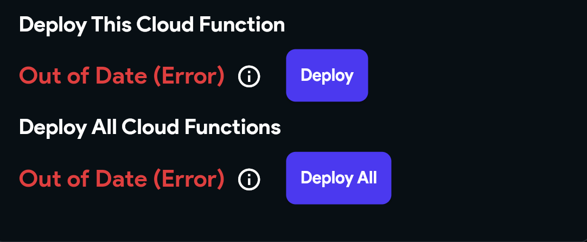
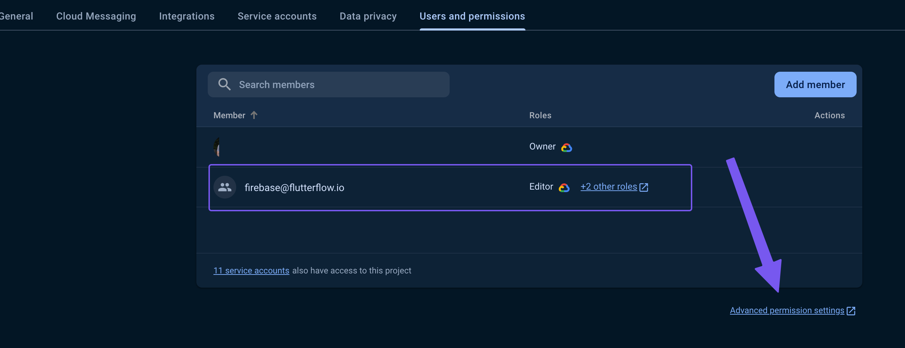
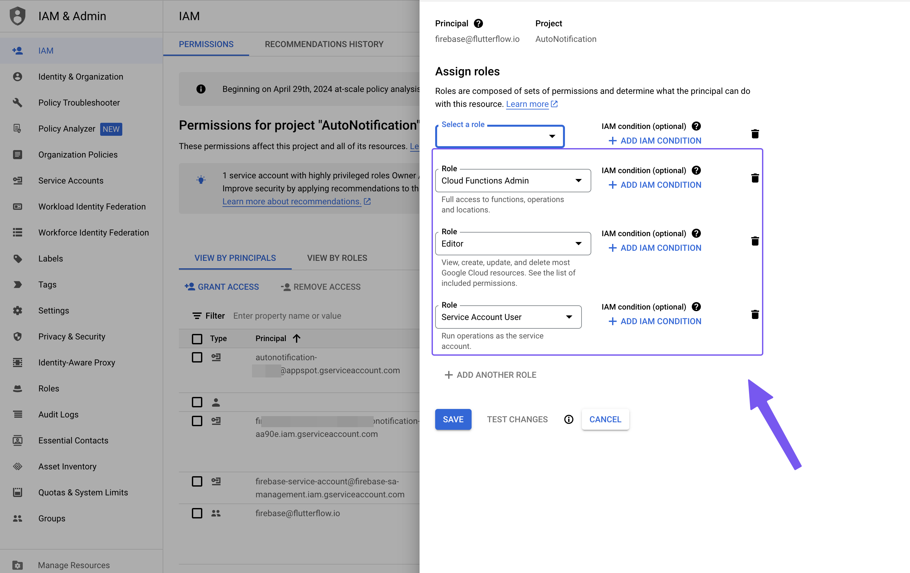
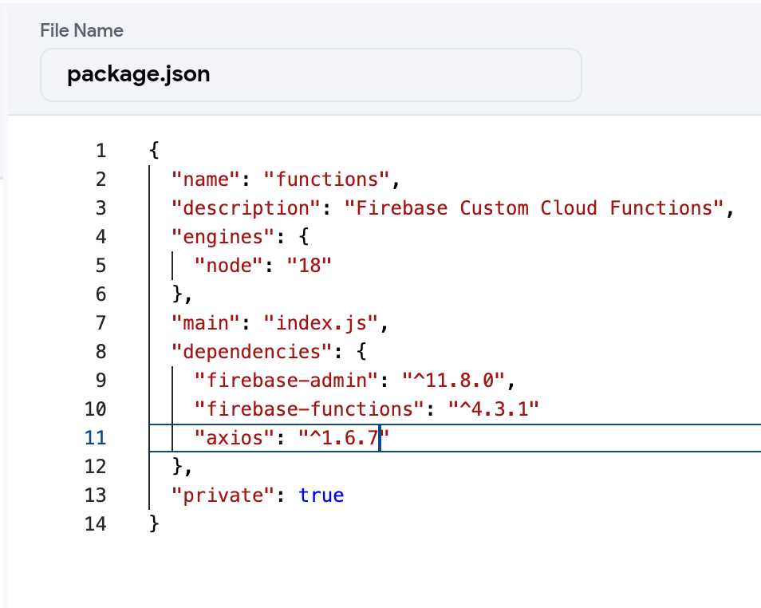

# Fix Cloud Functions Deployment

:::info[Prerequisites]
- You must have a Firebase project connected to FlutterFlow.
- Ensure your project is on the Blaze Plan.
::: 

Cloud Functions allow you to execute backend code in response to events triggered by Firebase features or HTTPS requests. Various situations might cause Cloud Functions to malfunction, often stemming from setup problems or coding mistakes within the Cloud Function's script.

This article guides you through common challenges with Cloud Functions in FlutterFlow and how to resolve them.

**Errors Shown in FlutterFlow Builder**

You may encounter the following errors in the FlutterFlow Builder:

    - `Out of Date (Error)`
    - `Not Deployed (Error)`

    These errors can arise from various situations. Below are screenshots of these errors:

    **Out of Date Error**

    

    **Not Deployed Error**

    


## Key Checks for Resolving Deployment Errors

    1. **Verify [firebase@flutterflow.io](mailto:firebase@flutterflow.io) Has Necessary Permissions**

        To ensure FlutterFlow works smoothly with your project, ensure that `firebase@flutterflow.io` has the following permissions in your Firebase project:

            - Cloud Functions Admin
            - Editor
            - Service Account User

        Follow the steps below to add these permissions:

            - Go to the Firebase Console and log into your account.
            - Open your project and go to **Project Settings > Users and Permissions**.
            - Under **Advanced Settings Permissions**, locate `firebase@flutterflow.io`, click **Edit**, and add the required roles.

                

                


    2. **Check for Function Name Mismatch**

        Ensure the function name in your code exactly matches the function name defined in FlutterFlow.

        For example, in this case, FlutterFlow expects `logoMaker`, but the code incorrectly uses `data`.

        


    3. **Validate Custom Code for Cloud Functions**

        Small mistakes in your custom Cloud Functions code can prevent deployment.

            - Double-check your code for errors.
            - Test locally using an IDE or Firebase CLI.

                


    4. **Verify Firebase Billing Plan (Blaze Plan Required):**

        - Ensure your Firebase project is on the **Blaze Plan**, not Spark Plan.
        - Check billing status on GCP. Even if Firebase shows Blaze, GCP billing issues may still block deployments.


    5. **Check if Other Cloud Functions Are Deploying:** 

        - If some Cloud Functions (like Push Notification or Stripe) are deploying successfully, it indicates your Firebase setup is mostly correct.
        - Focus on inspecting your specific function code and configuration.


    6. **Ensure Region Selection Matches Firebase Project:**

        - The region set for your Cloud Function in FlutterFlow should match your Firebase project's region.
        - Do not leave the region as `[default]`.

            

            

        :::tip
        If you previously deployed functions in the wrong region, delete them, set the correct region, and re-deploy.
        :::

    7. **Protocol Conflicts: HTTP vs Callable Functions**

        If you initially deployed a function as HTTP and later try to redeploy it as Callable (or vice versa), you'll get this error:

        `[makeUserAdmin(us-central1)] Changing from an HTTPS function to a callable function is not allowed. Please delete your function and create a new one instead.`

        Follow the steps below to fix this error:

            - Delete the existing function in Firebase Console.
            - Modify the protocol type in FlutterFlow.
            - Redeploy the function.

    8. **Verify `package.json` Integrity**

        - Use the generated `package.json` file as-is unless you need to add extra packages.
        - Ensure it’s not blank and doesn’t contain invalid characters.

            **Recommended structure:**

                ```js
                {
                "name": "functions",
                "description": "Firebase Custom Cloud Functions",
                "engines": {
                    "node": "18"
                },
                "main": "index.js",
                "dependencies": {
                    "firebase-admin": "^11.8.0",
                    "firebase-functions": "^4.3.1"
                },
                "private": true
                }
                ```


    9. **Ensure Packages Are Included in `package.json`**

        If you are using third-party packages (e.g., `axios`), make sure they are properly added to the `dependencies` section in `package.json`:

        


    10. **Validate Third-Party Package Versions**

        The versions specified in your `package.json` should match available versions listed on **[npmjs.com](https://www.npmjs.com/package/axios?activeTab=versions)**.

        


    11. **Check for Undeployed Firebase Rules and Indexes:**

        - Incomplete Firestore rules or indexes can block function deployment.
        - Make sure all rules and indexes have been deployed from FlutterFlow.


**Additional Troubleshooting and Optimization:**

- **Trigger Configuration Issues**

    If your Cloud Functions are not being triggered:

    **Review Event Triggers:**

        - For Firestore triggers: verify document paths and collection names.
        - For HTTP functions: ensure correct setup in FlutterFlow.

    **Check Permissions and Rules:**

        - Firebase security rules and project permissions must allow the Cloud Function operations.

- **Execution Timeouts**

    - Cloud Functions may fail if execution time exceeds limits.
    - Set a custom timeout duration in FlutterFlow:

        

        For longer processing tasks, increase the timeout duration in your Cloud Function configuration.

        Configuring Cloud Function regions in FlutterFlow can also optimize performance:

        

        :::note
        Longer timeouts may increase Firebase costs.
        :::

- **Cold Start Delays**

    Cloud Functions may respond slower after periods of inactivity:
        - Use **Cloud Scheduler** to periodically invoke functions and keep them warm.
        - Minimize dependencies to reduce cold start delays.

Following this comprehensive troubleshooting guide should help you resolve most issues encountered when working with Cloud Functions.
