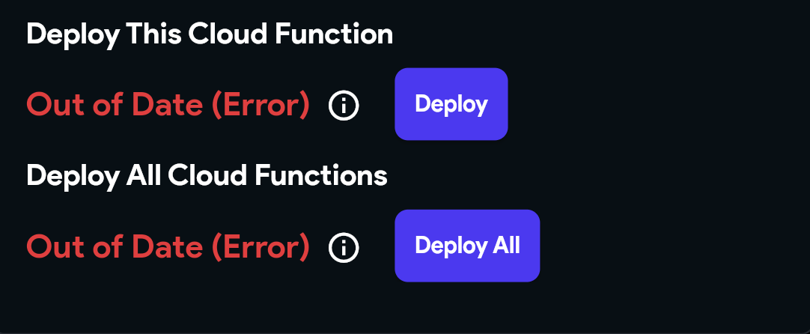
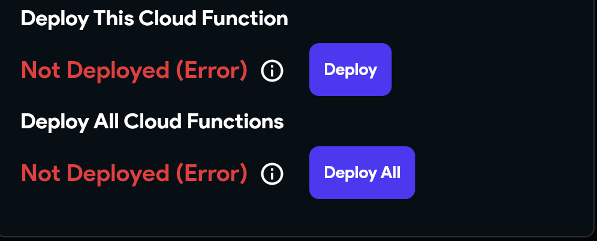
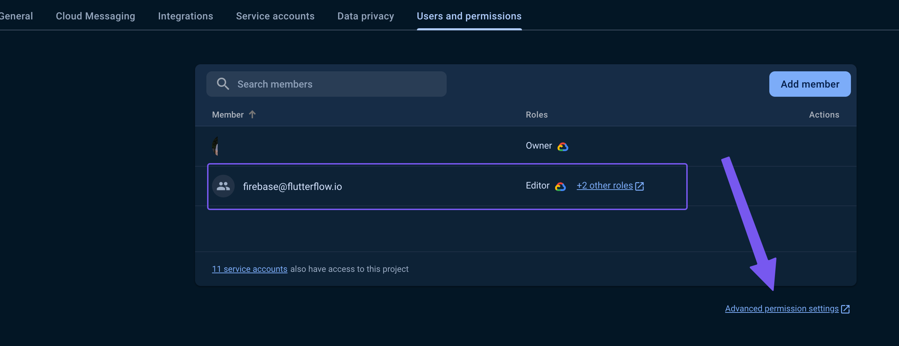
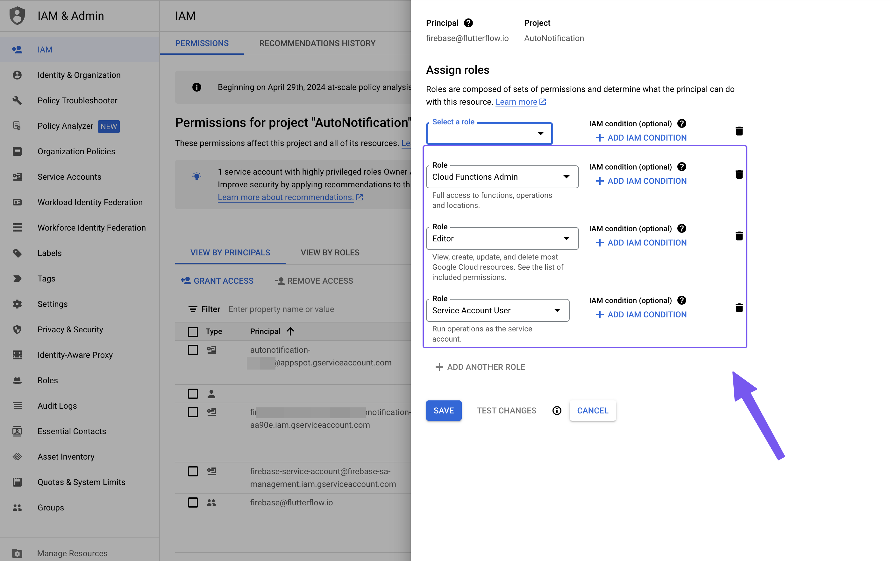
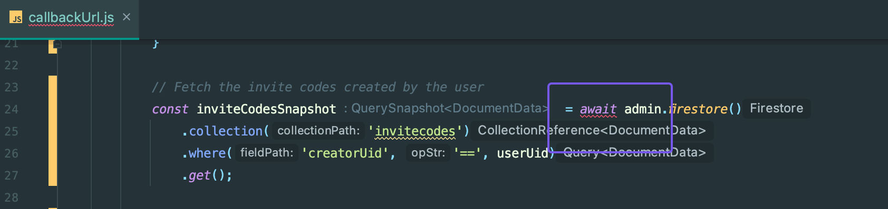
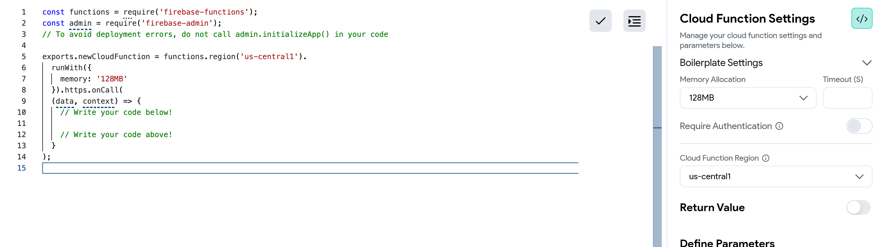
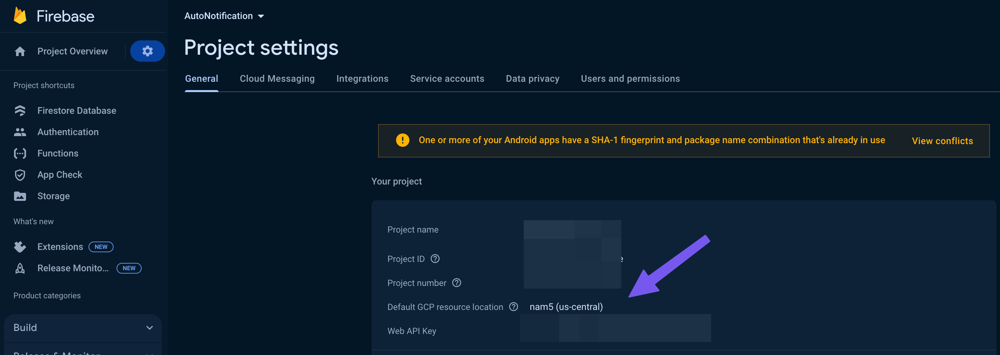
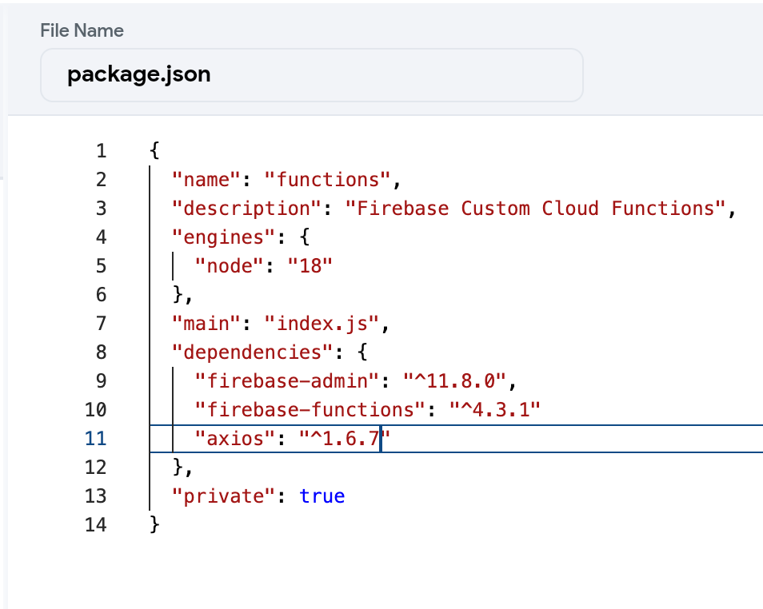
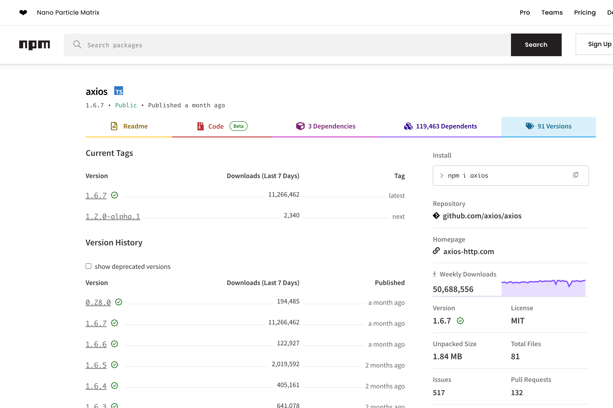

# FlutterFlow Cloud Functions Troubleshooting Guide

Cloud Functions enables developers to execute backend code in response to events triggered by Firebase services (callable) and HTTPS calls.

Various situations might cause cloud functions to malfunction, often stemming from setup problems or coding mistakes within the cloud function's script.

This article guides you through common challenges with Cloud Functions in FlutterFlow.

## Errors Shown In The Builder

Occasionally, you may encounter two specific errors: 

    `Out of Date (Error)` or `Not Deployed (Error).`

    These errors can arise from a variety of situations. If you're facing these issues, follow this troubleshooting guide designed to help you resolve them.

**Out of Date Error**

    

**Not Deployed Error**

    

## Key Checks for Resolving Deployment Errors

    Below are essential steps to verify your project is correctly set up for cloud function deployment.

        1. **Verify firebase@flutterflow.io has all necessary permissions**

            To ensure FlutterFlow works smoothly with your project, you'll need to adjust some settings in Firebase, a tool we use in the background. Here's how you can do it,  

            First, we need to make sure that an email associated with FlutterFlow, which is **`firebase@flutterflow.io`**, has the right kind of access called `cloud function admin permission` in your Firebase project. This lets FlutterFlow do its job without any hiccups.

            Besides the admin permission, we need to add a couple more types of permissions for FlutterFlow. These are called `editor` and `Service account user`.  

            **How to Add These Permissions**:

                - Go to the Firebase website and log into your account.

                - Find your project and open Project Settings.

                - Inside the settings, look for a section named "Users and Permissions." That's where you can manage who has access to your project.

                - You'll find an option for "Advanced Settings Permissions". Click on that. This will open Google Cloud functions, locate **firebase@flutterflow.io** and click on the edit button to add the permissions

                

                

        2. **Make sure there are no errors in the custom code for Cloud Functions**

            Sometimes, small mistakes in your code can stop your cloud function from being deployed. To avoid this, it's a good idea to double-check your code for any errors before you move forward.

            This can be done locally on an IDE of your choice

            

        3. **Make Sure the Project is on Blaze Plan on Firebase**

            If Cloud functions cannot be deployed, be sure to confirm if the project is in blaze plan and not spark plan,

            Additionally, cross-check the logs in the console log. Sometimes, Google Cloud Platform (GCP) sends the log back to inform you that the project is in the Spark plan

            In some cases, even if Firebase shows you're on the Blaze plan, there might be a billing issue on the GCP. Make sure your billing account is active and has yet to expire.  

        4. **Check if any other Cloud Function Deployment succeeds (Push Notification, Stripe.)**

            If some of your functions are already working as expected, it means your Firebase settings are properly in place. Your next steps should be to examine the settings specific to Cloud Functions and review the code itself for any mistakes or incorrect regional settings.on

        5. **Make sure the region is selected and is not left as [default] on both advanced Firebase settings and in the cloud function deployment page**

            The region for the cloud function deployment should be set to the region that is set in your Firebase project setting

            The region should not be left as default; this region should co-respond with all deployed cloud- functions in the project

            

            

            In some cases, where you deployed some of the cloud functions in different regions, you will need to delete any that already exist but in the wrong region, modify the region, and then re-deploy again

        6. **Different Cloud Function Protocols (HTTP VS Callable Functions)**

            Suppose you had deployed the cloud function as an HTTP function. In that case, if you try to redeploy the same function as a callable function, the deployment will  fail, and you will get this error `[makeUserAdmin(us-central1)] Changing from an HTTPS function to a callable function is not allowed. Please delete your function and create a new one instead`. 

            To resolve this, you will have to delete the cloud function in the Firebase Cloud function section and then modify the Function in FlutterFlow and re-deploy the function

        7. **Verify that the package.json file is not left blank and that it doesn’t have invalid characters**

            Confirm that you use the generated package.json file, and don’t make any changes to the file unless you are adding the packages.

            If FlutterFlow fails to generate the file details, it is recommended to use this

            ```js
            {
                "name": "functions",
                "description": "Firebase Custom Cloud Functions",
                "engines": {
                    "node": "18"
                },
                "main": "index.js",
                "dependencies": {
                    "firebase-admin": "^11.8.0",
                    "firebase-functions": "^4.3.1"
                },
                "private": true
                }
            ```

        8. **Ensure that the packages used in the cloud functions are included in the package.json file**

            It's normal to forget to include third packages used in the cloud function in the package.json file. For instance, if you are using `axios`, please ensure that the package is already included in the package.json file

            

        9. **Cross-check that the version of the third-party library used is valid**

            Check that the version of the third-party library used is valid, i.e., the version listed in the package.json file should be among the versions listed in the **[package's version archive](https://www.npmjs.com/package/axios?activeTab=versions)**.

            

        10. **Check for un-deployed Firebase rules**

            Lastly, ensure that you have deployed your Firebase configuration settings from FlutterFlow. This includes Firestore rules and Firestore indexes.

            These can block cloud function function deployment when they are still not deployed


