---
keywords:
  - cloud functions
  - firebase
  - deployment
  - error
slug: /troubleshooting/cloud-functions/fix-cloud-functions-deployment
title: Fix Cloud Functions Deployment
description: '- You must have a Firebase project connected to FlutterFlow.'
tags:
  - FlutterFlow
  - Troubleshooting
  - Cloud Functions
last_verified: 2026-09-02
---
# Fix Cloud Functions Deployment

:::info[Prerequisites]
- You must have a Firebase project connected to FlutterFlow.
- Ensure your project is on the Blaze Plan.
:::

Cloud Functions allow you to execute backend code in response to events triggered by Firebase features or HTTPS requests. Various situations might cause Cloud Functions to malfunction, often stemming from setup problems or coding mistakes within the Cloud Function's script.

This article guides you through common challenges with Cloud Functions in FlutterFlow and how to resolve them.

**Errors Shown in FlutterFlow Builder**

You may encounter the following errors in the FlutterFlow Builder:

    - `Out of Date (Error)`
    - `Not Deployed (Error)`

    These errors can arise from various situations. Below are screenshots of these errors:

    **Out of Date Error**

    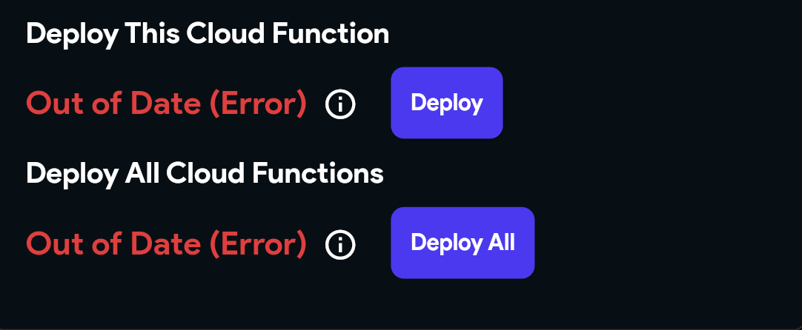

    **Not Deployed Error**

    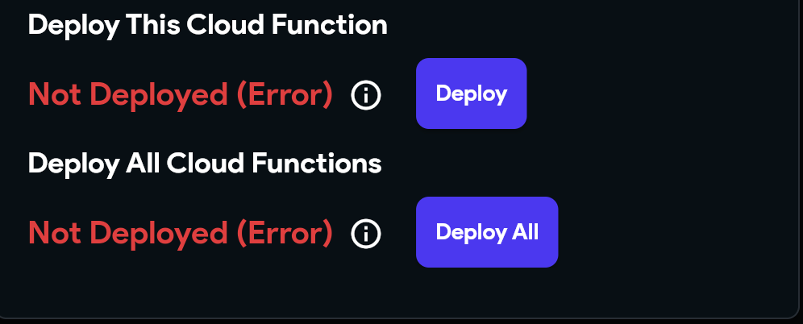

## Key Checks for Resolving Deployment Errors

    1. **Verify [firebase@flutterflow.io](mailto:firebase@flutterflow.io) Has Necessary Permissions**

        To ensure FlutterFlow works smoothly with your project, ensure that `firebase@flutterflow.io` has the following permissions in your Firebase project:

            - Cloud Functions Admin
            - Editor
            - Service Account User

        Follow the steps below to add these permissions:

            - Go to the Firebase Console and log into your account.
            - Open your project and go to **Project Settings > Users and Permissions**.
            - Under **Advanced Settings Permissions**, locate `firebase@flutterflow.io`, click **Edit**, and add the required roles.

                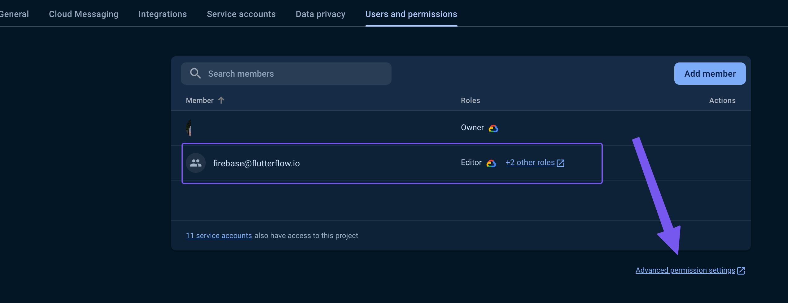

                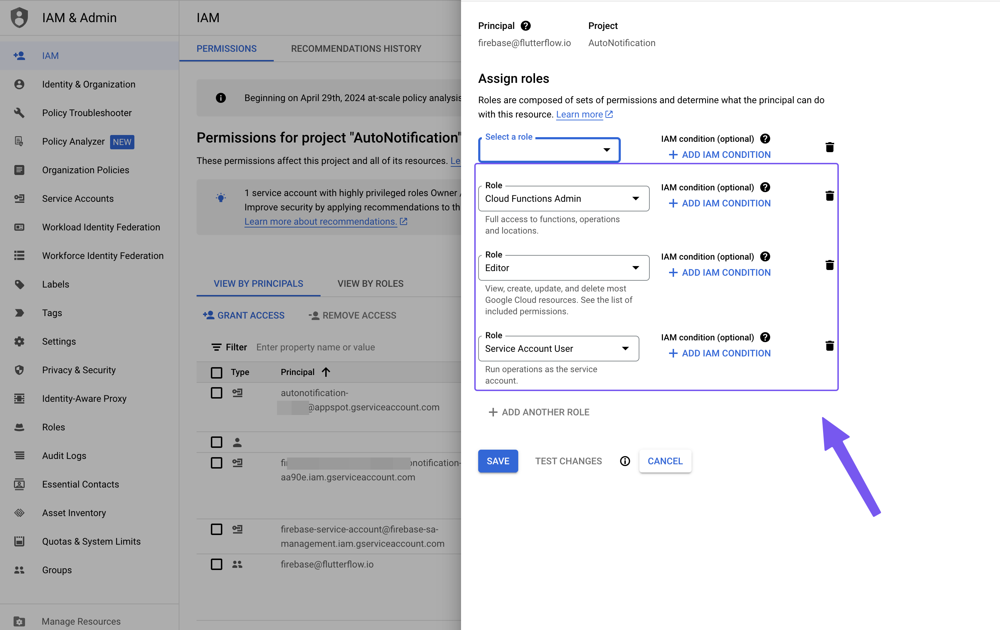

    2. **Check for Function Name Mismatch**

        Ensure the function name in your code exactly matches the function name defined in FlutterFlow.

        For example, in this case, FlutterFlow expects `logoMaker`, but the code incorrectly uses `data`.

        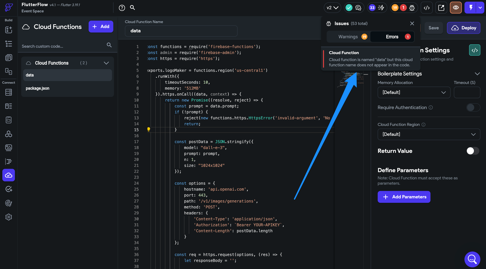

    3. **Validate Custom Code for Cloud Functions**

        Small mistakes in your custom Cloud Functions code can prevent deployment.

            - Double-check your code for errors.
            - Test locally using an IDE or Firebase CLI.

                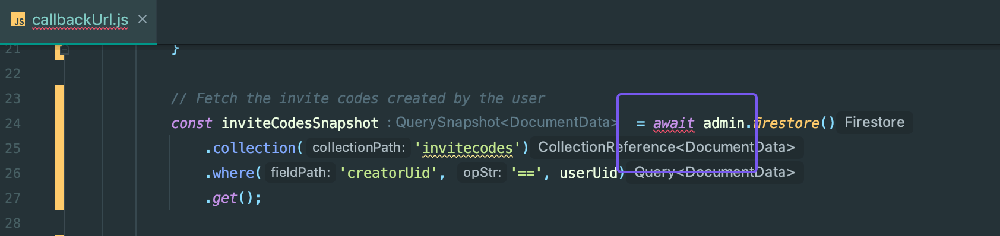

    4. **Verify Firebase Billing Plan (Blaze Plan Required):**

        - Ensure your Firebase project is on the **Blaze Plan**, not Spark Plan.
        - Check billing status on GCP. Even if Firebase shows Blaze, GCP billing issues may still block deployments.

    5. **Check if Other Cloud Functions Are Deploying:**

        - If some Cloud Functions (like Push Notification or Stripe) are deploying successfully, it indicates your Firebase setup is mostly correct.
        - Focus on inspecting your specific function code and configuration.

    6. **Verify Region Selection:**

        - Choose a region supported by the trigger and close to the data or calling users. Some Firebase resources have fixed locations, so cross-region calls can add latency and cost.
        - Compare the selected region with an already deployed function of the same name before redeploying.

            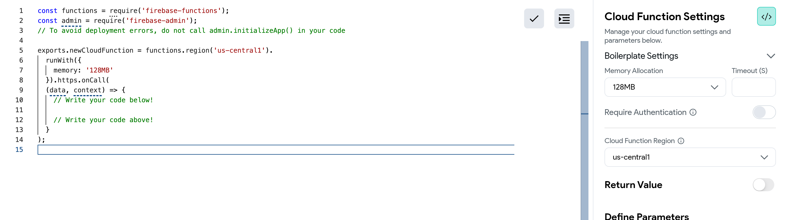

            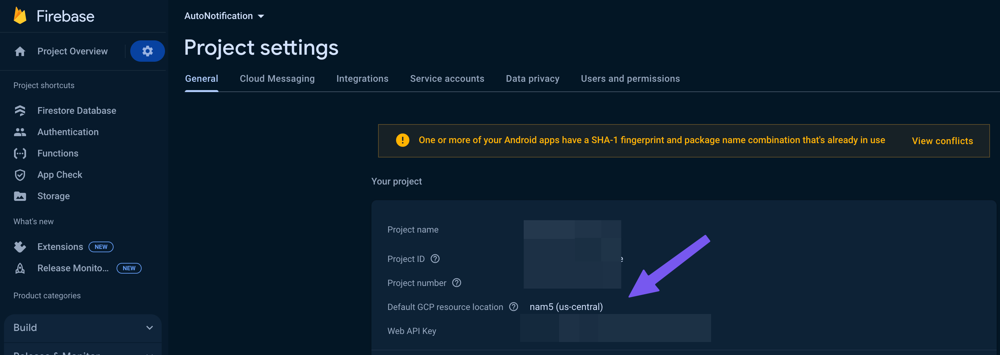

        :::tip
        Moving a function creates a new regional resource. Deploy and validate the replacement before deleting the old function, update callers or triggers, and account for duplicate event processing during migration.
        :::

    7. **Protocol Conflicts: HTTP vs Callable Functions**

        If you initially deployed a function as HTTP and later try to redeploy it as Callable (or vice versa), you'll get this error:

        `[makeUserAdmin(us-central1)] Changing from an HTTPS function to a callable function is not allowed. Please delete your function and create a new one instead.`

        Follow the steps below to fix this error:

            - Deploy the new trigger type under a new function name.
            - Update and test callers.
            - Delete the old function only after traffic has moved and rollback is no longer needed.

    8. **Verify `package.json` Integrity**

        - Start from FlutterFlow's current generated `package.json`, then review every deliberate dependency or runtime change.
        - Ensure it’s not blank and doesn’t contain invalid characters.

        - Check the [currently supported Firebase runtimes](https://firebase.google.com/docs/functions/manage-functions#set_node.js_version). Node.js 18 is deprecated; do not copy an old runtime or dependency version from a screenshot or troubleshooting article.

    9. **Ensure Packages Are Included in `package.json`**

        If you are using third-party packages (e.g., `axios`), make sure they are properly added to the `dependencies` section in `package.json`:

        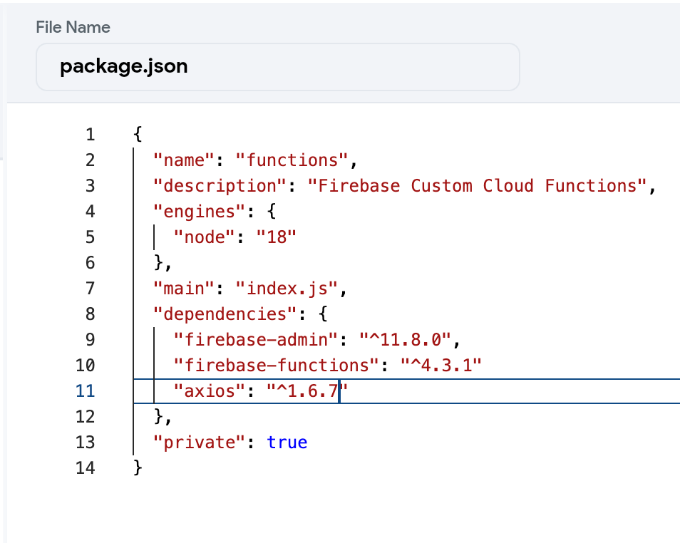

    10. **Validate Third-Party Package Versions**

        The versions specified in your `package.json` should match available versions listed on **[npmjs.com](https://www.npmjs.com/package/axios?activeTab=versions)**.

        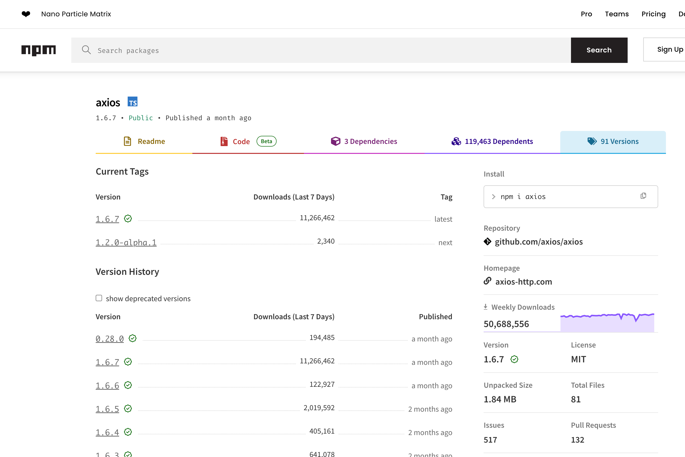

    11. **Check for Undeployed Firebase Rules and Indexes:**

        - Incomplete Firestore rules or indexes can block function deployment.
        - Make sure all rules and indexes have been deployed from FlutterFlow.

**Additional Troubleshooting and Optimization:**

- **Trigger Configuration Issues**

    If your Cloud Functions are not being triggered:

    **Review Event Triggers:**

        - For Firestore triggers: verify document paths and collection names.
        - For HTTP functions: ensure correct setup in FlutterFlow.

    **Check Permissions and Rules:**

        - Verify the trigger's IAM identity and runtime permissions. Firestore and Storage Security Rules govern client SDK requests, but trusted Admin SDK calls normally use IAM instead.

- **Execution Timeouts**

    - Cloud Functions may fail if execution time exceeds limits.
    - Set an appropriate timeout, but first bound external calls, add retries only for safe/idempotent work, and move long-running jobs to an asynchronous design when needed:

        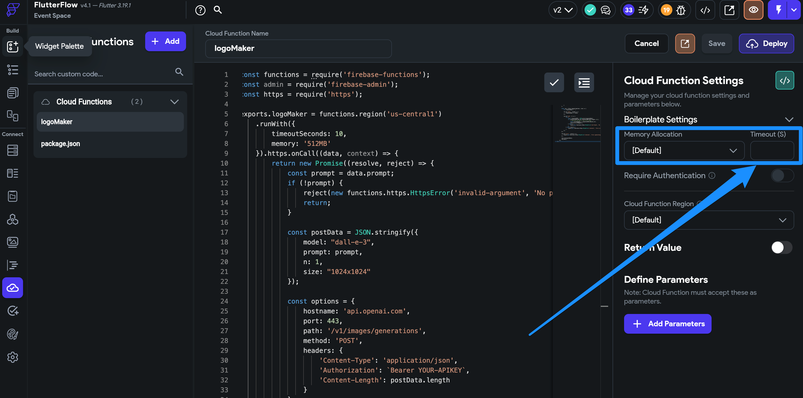

        For longer processing tasks, increase the timeout duration in your Cloud Function configuration.

        Configuring Cloud Function regions in FlutterFlow can also optimize performance:

        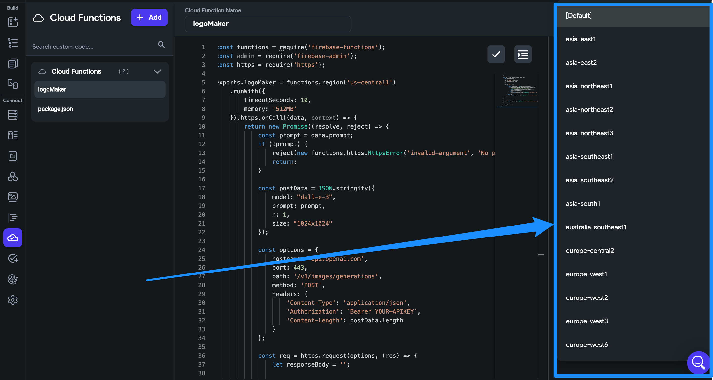

        :::note
        Longer timeouts may increase Firebase costs.
        :::

- **Cold Start Delays**

    Cloud Functions may respond slower after periods of inactivity:
        - Minimize initialization work and dependencies.
        - For latency-critical functions, consider supported minimum-instance settings after estimating the continuous cost. Do not create synthetic scheduler traffic solely to bypass scale-to-zero behavior.

Following this comprehensive troubleshooting guide should help you resolve most issues encountered when working with Cloud Functions.

## Related documentation

See [Initialize GitHub Repository](/troubleshooting/github/initialize-github-repository) for a related FlutterFlow workflow.
