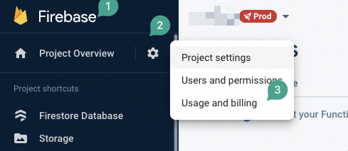
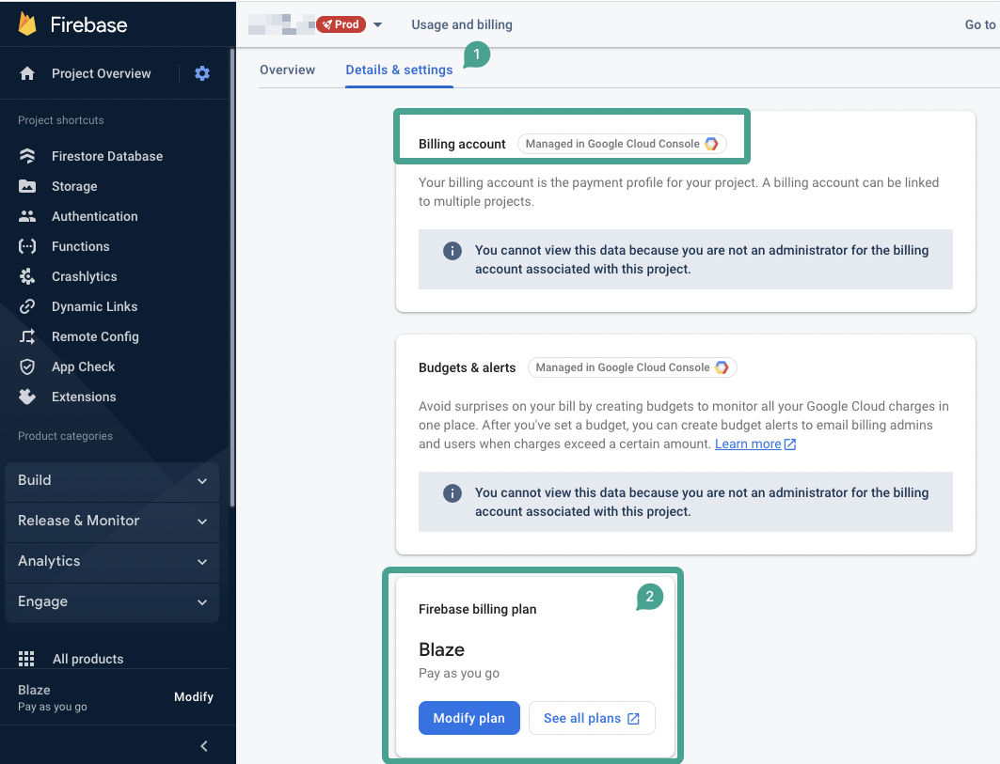

# Grant Cloud Functions Admin Role in Firebase

To enable FlutterFlow features like Push Notifications, you must assign the `Cloud Functions Admin` role to the `firebase@flutterflow.io` service account. This requires your Firebase project to be on the **Blaze plan**.

:::warning
Cloud Functions permissions are only available on the Firebase Blaze plan. You will not be able to grant admin access without upgrading your plan.
:::

:::info[Prerequisites]
- Access to your Firebase Console.
- A billing-enabled Firebase project on the Blaze plan.
:::

**Enable the Blaze Plan**

Follow these steps to activate the Blaze plan:

1. Open your Firebase Console and select your project.
2. Click the **Settings** gear icon in the left panel.
3. Select **Usage and Billing**.

   

4. In the **Details and Settings** tab, confirm that your project is linked to a billing account and has the Blaze plan enabled.

   

## Assign the Cloud Functions Admin Role

After confirming that your project is on the Blaze plan:

1. Go to the **IAM** section in the **[Google Cloud Console](https://console.cloud.google.com/iam-admin/iam)**.
2. Click **Grant Access**.
3. Enter the email: `firebase@flutterflow.io`
4. In the role selector, search for and select **Cloud Functions Admin**.
5. Save your changes.

   

   Once assigned, FlutterFlow will be able to deploy and manage backend functions for your project.