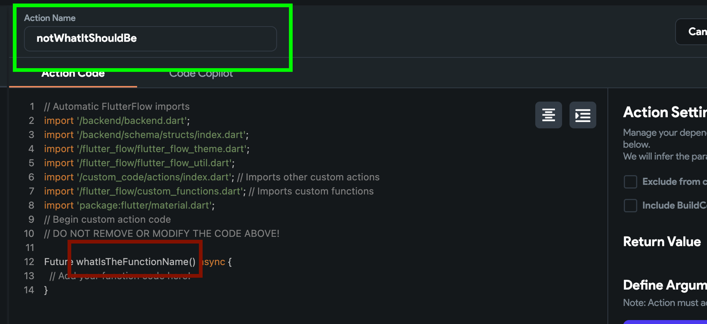
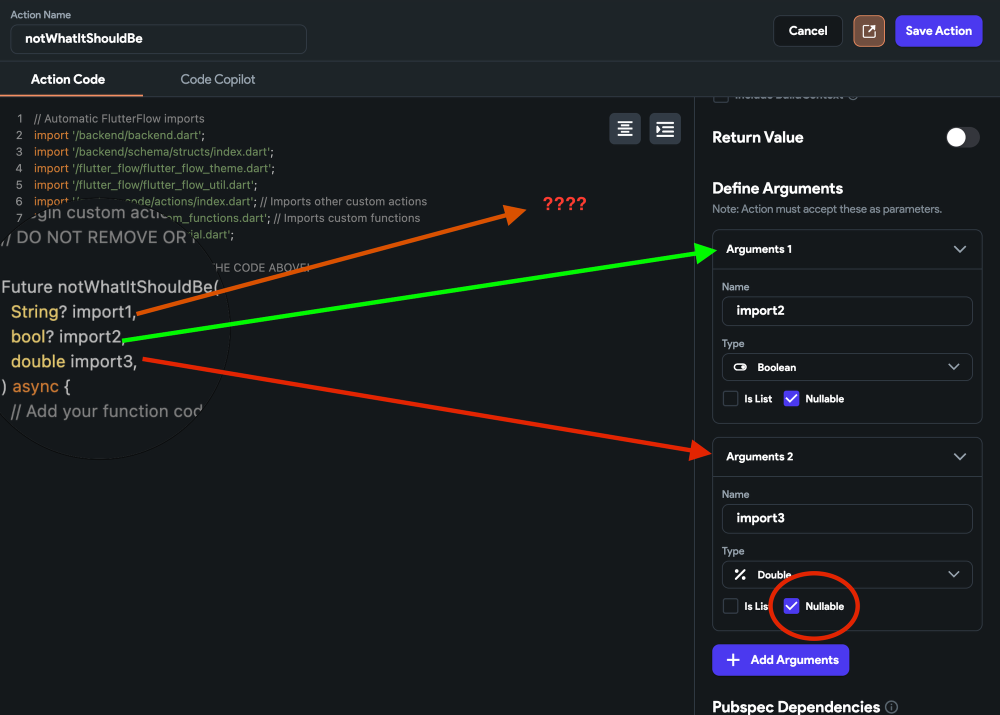
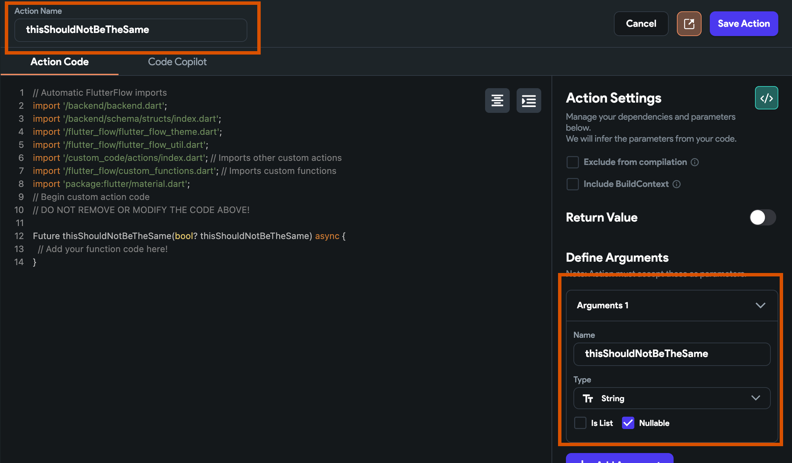
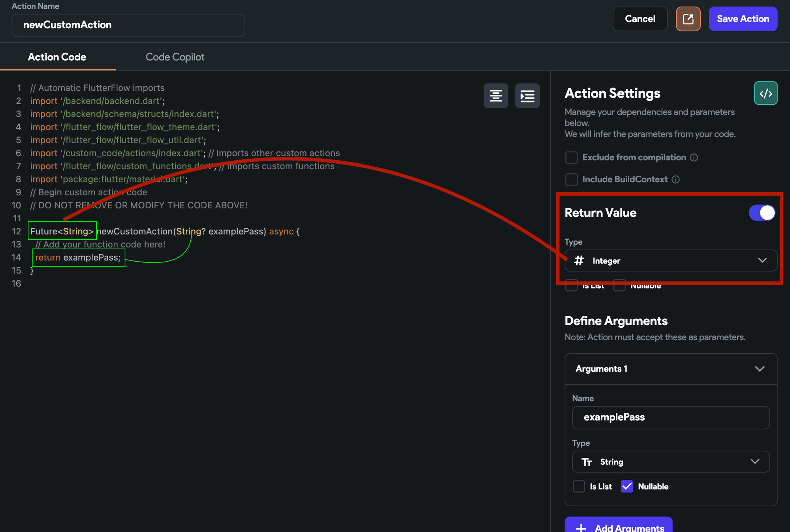
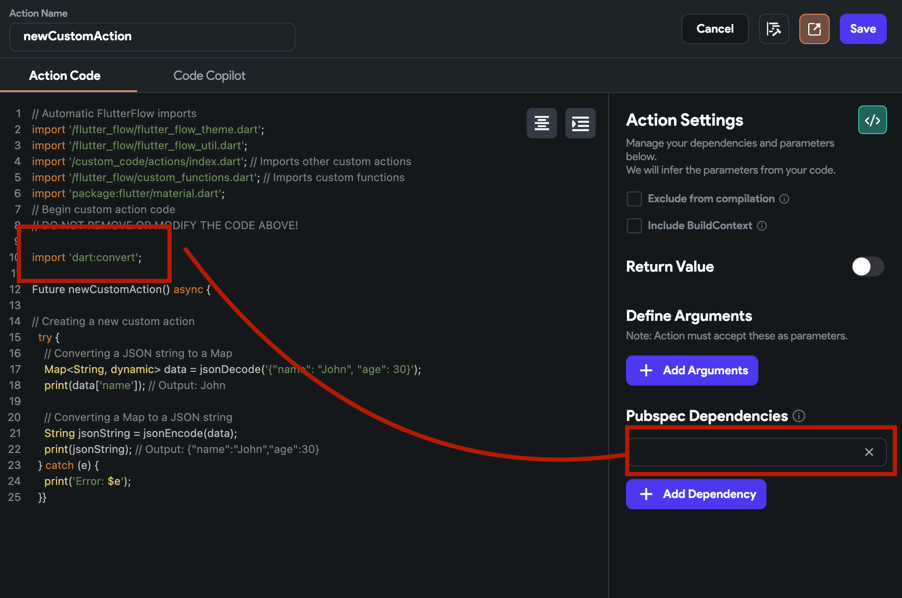
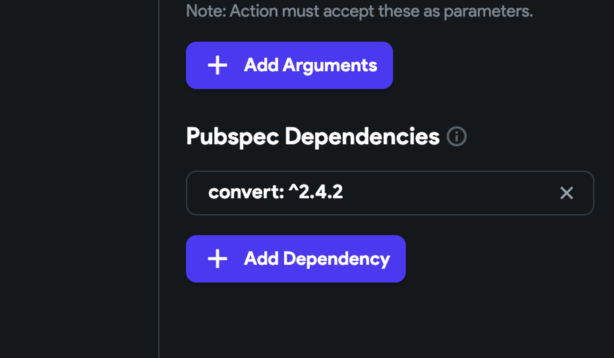
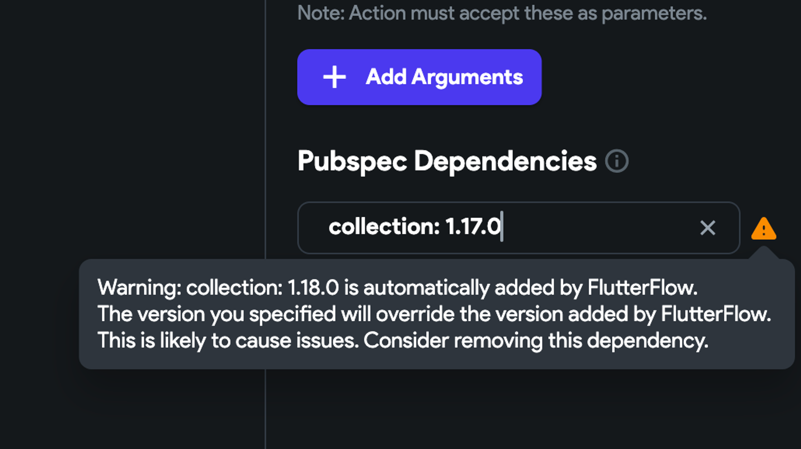
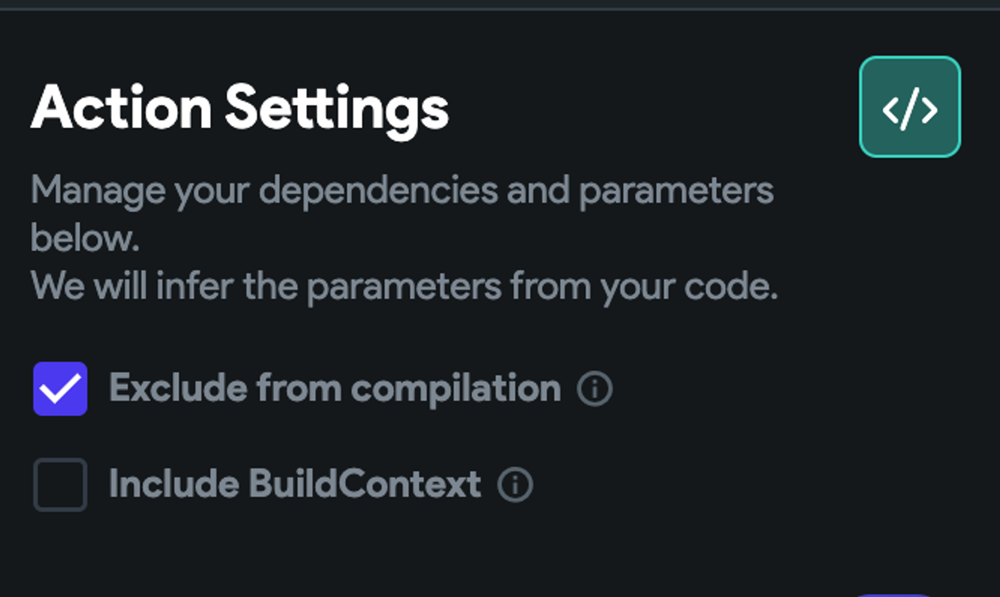
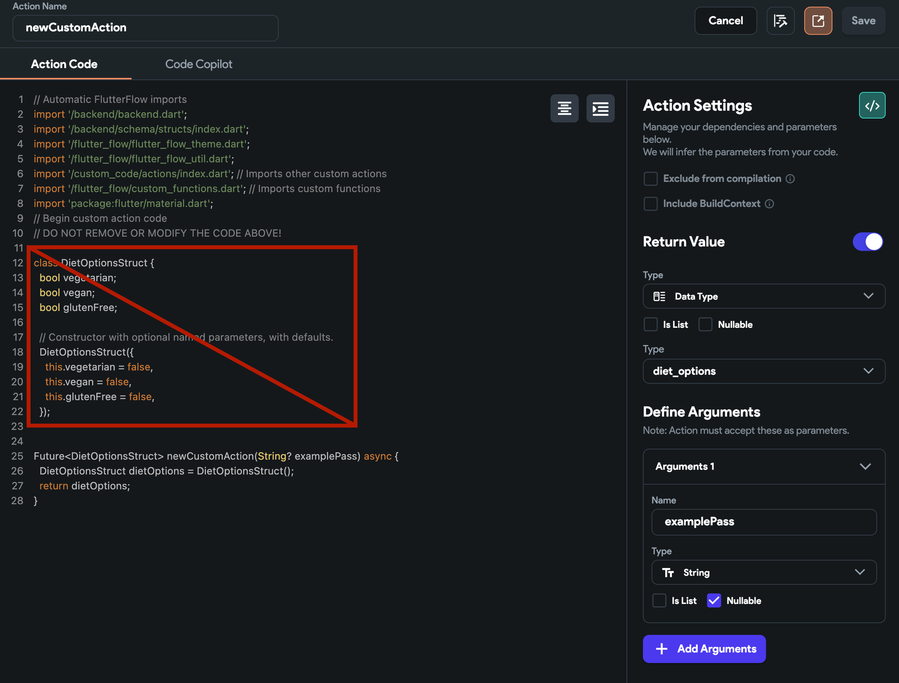
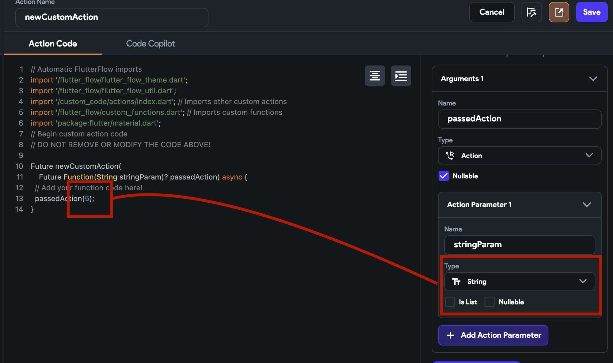

# Custom Actions Errors

:::info[Prerequisites]
- A basic understanding of how custom actions work.
- A FlutterFlow project with a custom action already created.
:::


Custom actions are powerful, but troubleshooting them can be tricky. This guide will help you systematically resolve common issues.


- **Read the Error Message**

    Always read the error message printed during test mode, compilation, or local build. The message often provides a clue about the potential issue.

- **Common Troubleshooting Checklist**

    - **Action Name Mismatch**

        Ensure the name in the action matches the custom action in your code.

        

        :::tip
        Use the `Add BoilerPlate Code` option to generate code with the correct action name.
        :::

    - **Imports and Arguments**

        - Check that all required imports are present.
        - Ensure arguments are defined in both the action settings and your code.

            

            Example:

                - Argument 1: Missing definition in settings panel
                - Argument 2: Correctly imported
                - Argument 3: Nullable selected, but not specified as nullable in code

                    Follow the steps below to fix this issue:

                        1. Manually update arguments in both the settings panel and your code.
                        2. Use the `Add BoilerPlate Code` option (on web, copy only what you need; on desktop, it may replace all code).

                        

    - **Name Conflicts**

        - Avoid using the same name for an action and its argument.

            

    - **Reserved Keywords**

        - Do not use Dart/Flutter reserved keywords as argument names. **Examples:** `abstract`, `else`, `import`, `show`, `as`, `enum`, `in`, `static`, `this`.
        *FlutterFlow usually warns you, but double-check!*

    - **Return Type Mismatch**

        - Ensure the custom action returns the correct data type as defined in the settings.

            

            *The function should return the type specified in the settings panel.*

    - **Internal Library Imports**

        - If importing internal libraries (example, `../../flutterflow`), set **Exclude from compilation** to `true` if needed.

    - **Pubspec Dependencies**

        - Ensure your dependencies are declared in your code and are compatible with FlutterFlow.

            

            Check for:
                - Version conflicts (check on **[pub.dev](https://pub.dev)**)
                - Multiple versions of the same dependency
                - Conflicts with FlutterFlow's auto-imported dependencies

                    

                    

    - **Code Errors:**

        - **Null values:**
            
            Handle null values safely.

                ```js
                int example = passingIntWhichMayBeNullable ?? 0;
                ```
        - **Correct data types:**

            Convert data types explicitly.

                ```js
                String str = "5";
                int result = int.parse(str); // ✅
                ```
                Use `.toString()`, `.toInt()`, `.toDouble()` as needed.

        - **Single elements** vs **arrays:**
            
            Ensure you are not passing a single element where a list is expected, or vice versa.

    - **Exclude from Compilation**

        If this option is enabled, the code won’t be checked during build but can still run during test..

            

    - **Duplicate Data Types/Structs**

        Do not redefine data types or structs already defined in the data schema panel.

            

    - **Callback Data Types**

        Ensure callback actions return the correct data type.

            


:::info[Additional Resources]
- **Debugging with the Browser Console:** Use the browser debug console for logic errors.
- **FlutterFlow University Video**: [Custom Actions Video](https://www.youtube.com/watch?v=rKaD9eKuZkY).
- **Official Docs:** [Custom Actions | FlutterFlow Docs](/concepts/custom-code/custom-actions/)
:::

:::tip
When in doubt, regenerate the boilerplate and compare with your code. Consistency between settings and code is key!
:::