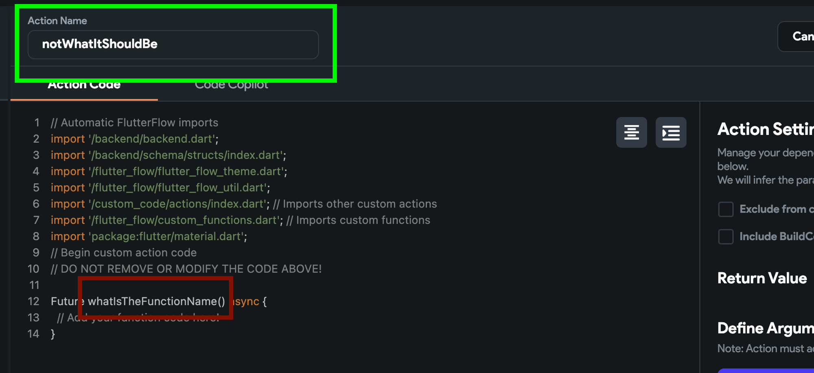
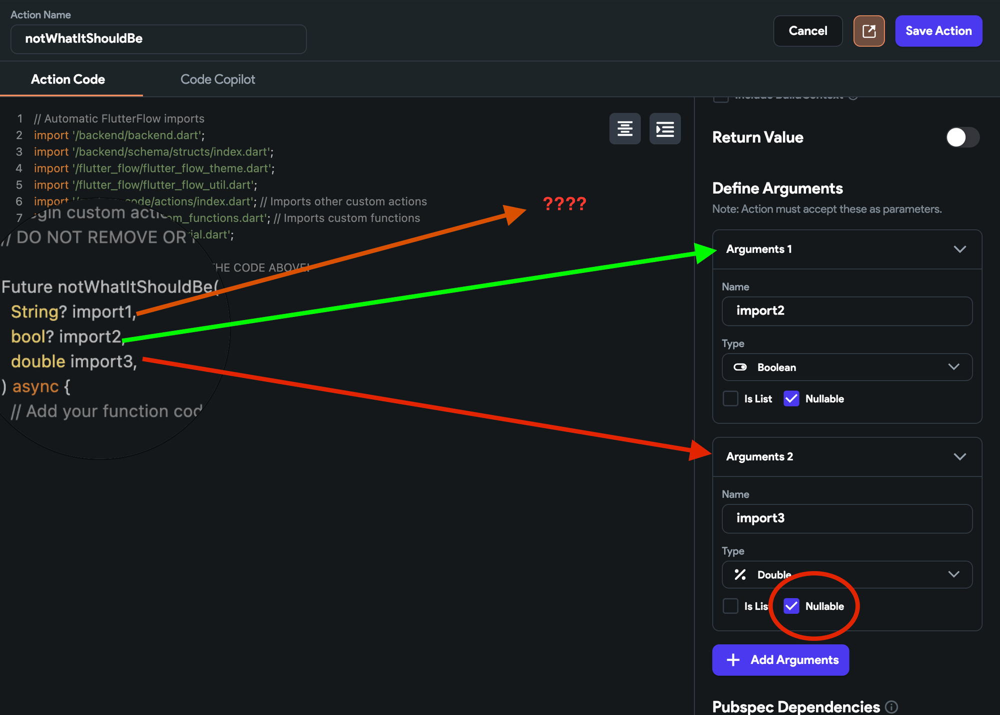
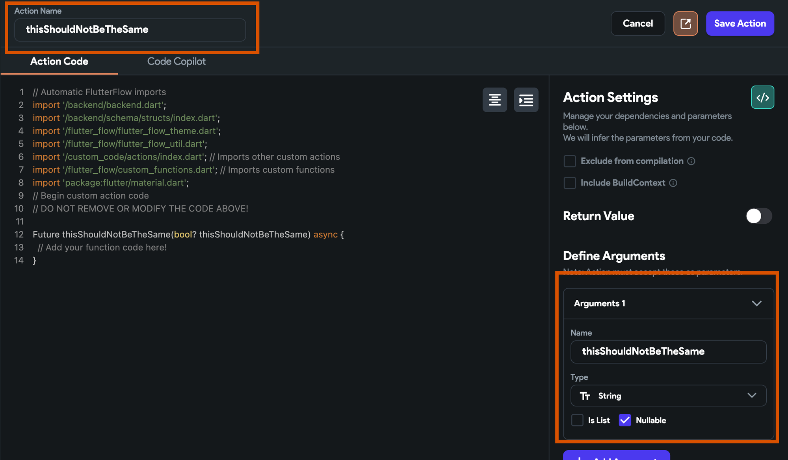
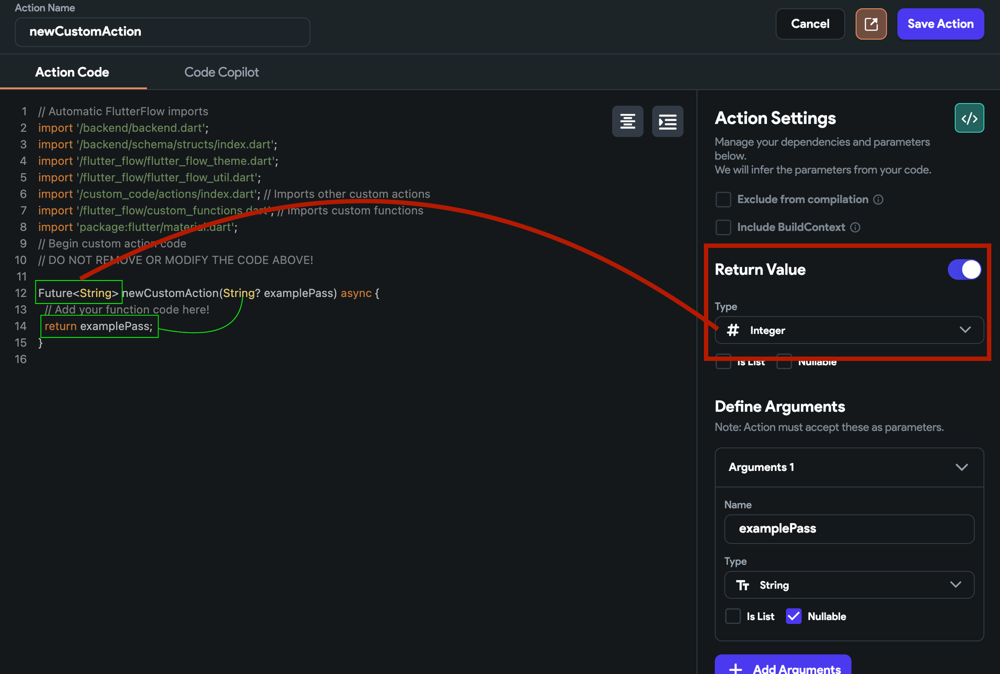
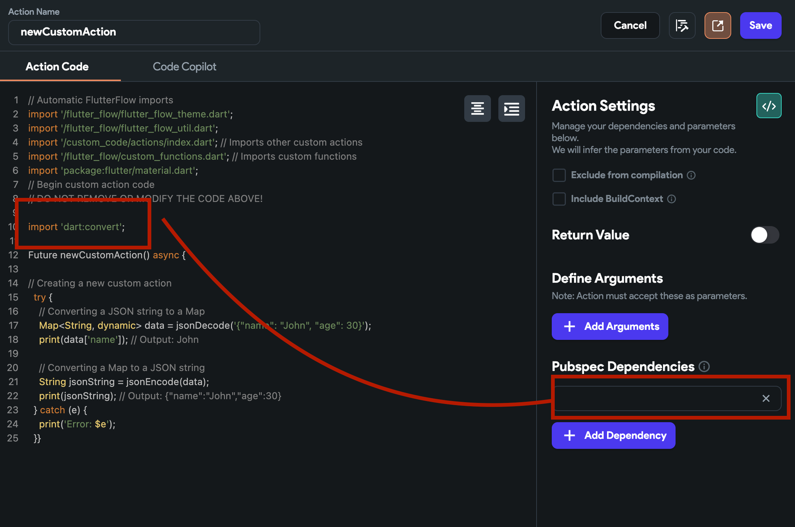
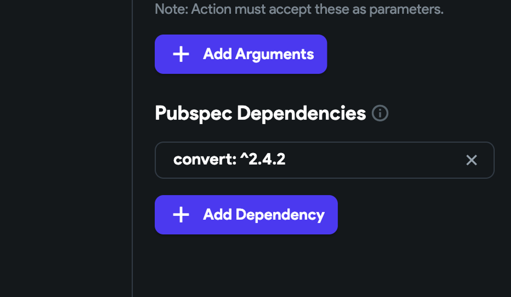
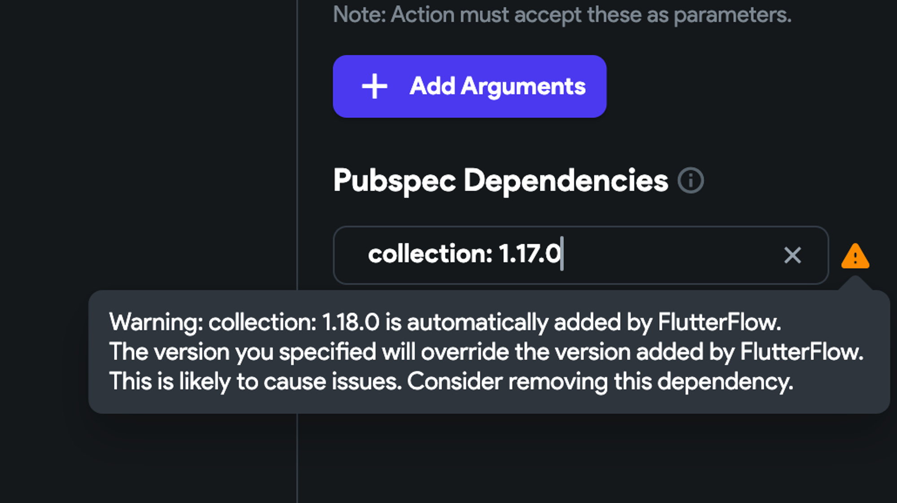
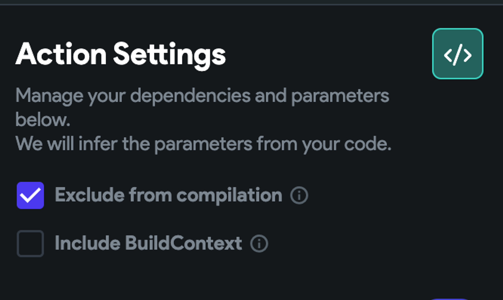
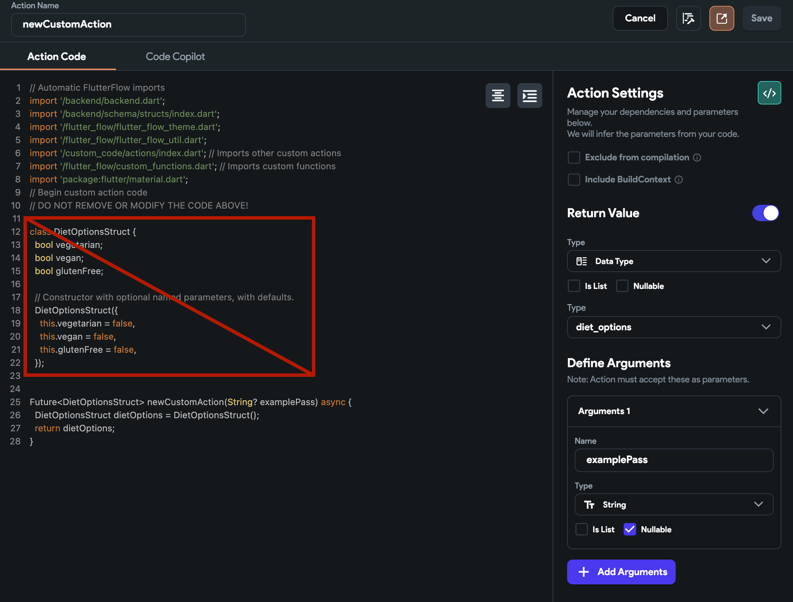
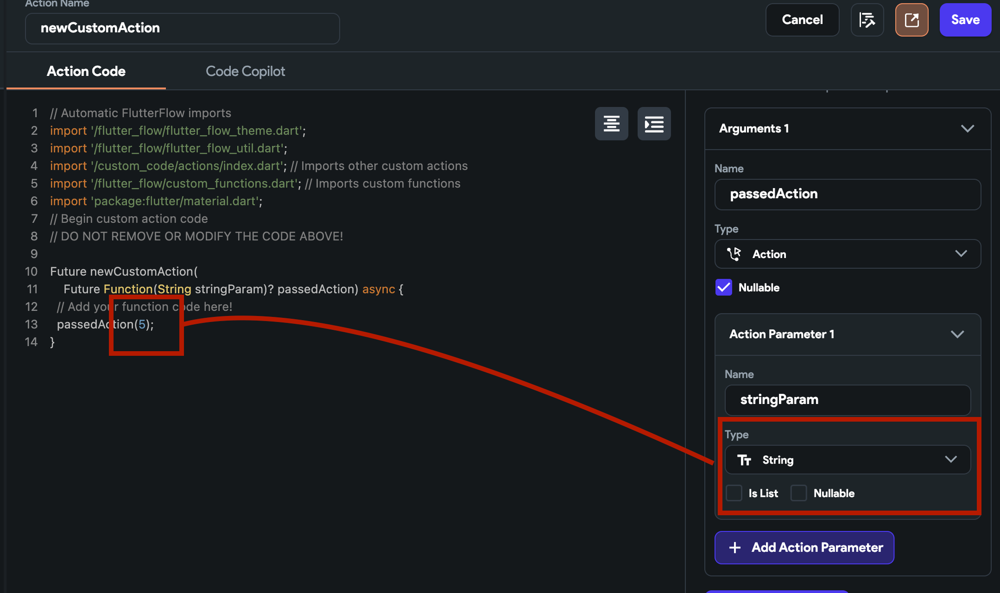

# Custom Actions Troubleshooting

Custom actions in FlutterFlow are powerful, but troubleshooting them can be tricky. This guide will help you systematically resolve common issues.


## 1. Read the Error Message

Always read the error message printed during test mode, compilation, or local build. The message often provides a clue about the potential issue.

## 2. Common Troubleshooting Checklist

### Action Name Mismatch
- Ensure the name in the action matches the custom action in your code.

    

    :::tip
    Use the **Add BoilerPlate Code** option to generate code with the correct action name.
    :::

### Imports and Arguments

- Do all imports match those declared in the action settings?
- Are all arguments passed within the builder itself?

    

    Example:
    - Argument 1: Missing definition in settings panel
    - Argument 2: Correctly imported
    - Argument 3: Nullable selected, but not specified as nullable in code

How to fix:
1. Manually update arguments in both the settings panel and your code.
2. Use the **Add BoilerPlate Code** option (on web, copy only what you need; on desktop, it may replace all code).


### Name Conflicts

- Avoid using the same name for the action and any argument.

    

### Reserved Keywords

- Do not use Dart/Flutter reserved keywords as argument names.
- **Examples:** `abstract`, `else`, `import`, `show`, `as`, `enum`, `in`, `static`, `this`
    *FlutterFlow usually warns you, but double-check!*

### Return Type Mismatch
- Ensure the custom action returns the correct data type as defined in the settings.

    

    *The function should return the type specified in the settings panel.*

### Internal Library Imports
- If importing internal libraries (e.g., `../../flutterflow`), set **Exclude from compilation** to `true` if needed.

### Pubspec Dependencies
- Are all required dependencies included in both the code and the PubSpec?

    

- Check for:
    - Version conflicts (check on [pub.dev](https://pub.dev))
    - Multiple versions of the same dependency
    - Conflicts with FlutterFlow's auto-imported dependencies

    

    

### Code Errors
- **Null values:**

    ```dart
    int example = passingIntWhichMayBeNullable ?? 0;
    ```
- **Correct data types:**

    ```dart
    String numberAsString = "5";
    int example = thisWord; // ❌ Passing a string to an int
    ```
    Use `.toString()`, `.toInt()`, `.toDouble()` as needed.

- **Single elements** vs **arrays:**
    - Ensure you are not passing a single element where a list is expected, or vice versa.

### Exclude from Compilation
    If this is checked, code will not be error-checked during compilation, but will still run in Test/Run Mode.

    

### Duplicate Data Types/Structs
- Do not redefine data types or structs already defined in FlutterFlow's data schema panel.

    

### Callback Data Types
- Ensure callback actions return the correct data type.

    


## 3. Additional Resources

- **Debugging with the Browser Console:**
    - Use the browser debug console for logic errors.
- **FlutterFlow University Video:**
    - [Custom Actions Video](https://www.youtube.com/watch?v=YOUR_VIDEO_LINK)
- **Official Docs:**
    - [Custom Actions | FlutterFlow Docs](https://docs.flutterflow.io/custom-actions)


:::tip
When in doubt, regenerate the boilerplate and compare with your code. Consistency between settings and code is key!
:::