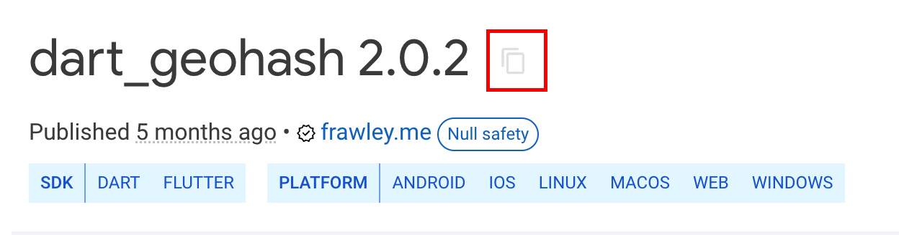
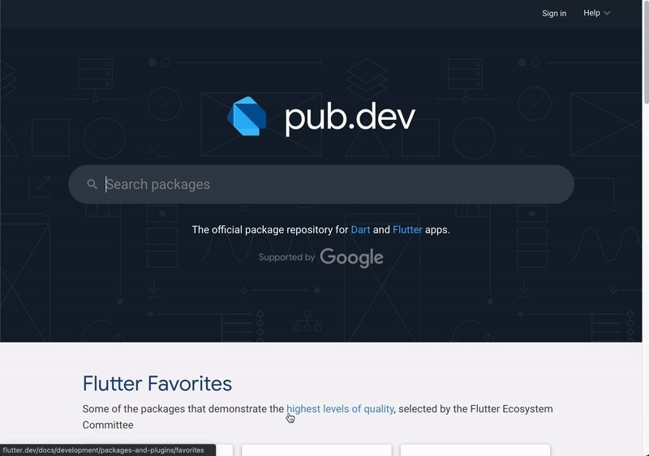

# Import a Flutter Package into FlutterFlow

You can enhance your FlutterFlow project by importing packages from **[pub.dev](https://pub.dev)**. These packages are used in **Custom Actions** or **Custom Widgets** to extend functionality beyond what’s available in the UI builder.

:::info[Prerequisites]
Before importing a package, ensure you’ve created a **Custom Action** or **Custom Widget** within FlutterFlow.
:::

Follow the steps below to import a Flutter package into FlutterFlow:

1. **Get the Package Name and Version**

    To add a dependency to your custom code:

        1. Go to the package page on **[pub.dev](https://pub.dev)**.
        2. Click the **Copy** icon next to the package name and version.

        

        3. Paste the copied line into the **Required Pubspec Dependencies** field in the FlutterFlow custom code form.

        

        Example:  
        `http: ^1.2.3`

2. **Add the Import Statement**

    To use the package in your code, you'll need to import it:

        1. On the same pub.dev package page, click the **Installing** tab.
        2. Under **Import it**, click the **Copy** icon next to the import statement.
        3. Paste it at the top of your Custom Widget or Custom Action code.

        

        Example:  
        `import 'package:http/http.dart';`

3. **Tips for Using Custom Code**

    - **Web Support**: Ensure the package supports **Flutter Web** for use in FlutterFlow’s Run/Test mode.
    - **Correct Format**: Use the correct format: `package_name: ^version_number`. Not including a version may result in outdated or unstable dependencies.
    - **Recompile**: Always recompile your custom widget or action after adding new parameters.
    - **Safe Deletion**: You cannot delete a custom widget or action if it's currently in use. Remove it from all screens first.

:::info[Additional Resources]
- [Create a Custom Widget](/custom-code/widgets)
- [Create a Custom Action](/custom-code/actions)
:::