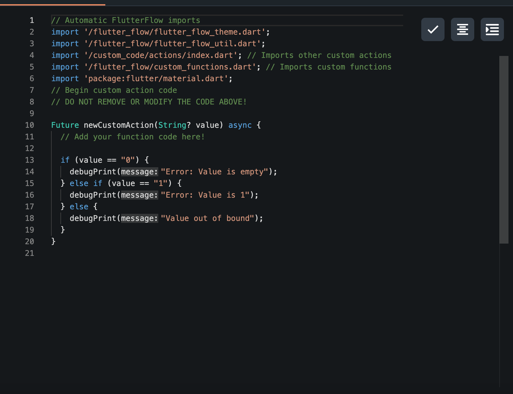
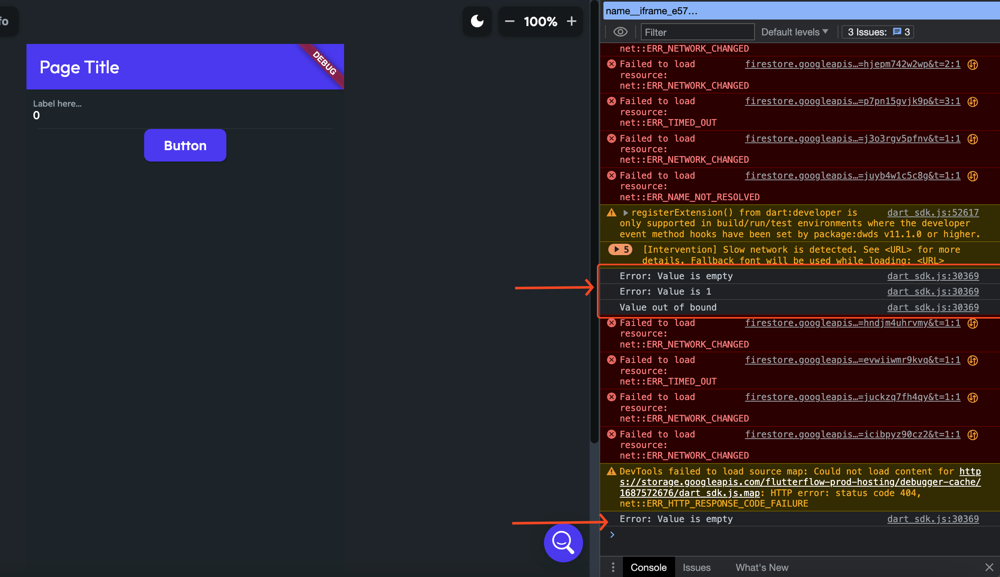

# Testing Custom Actions using Debug Console

## Background

Sometimes, the compiler does not show any errors in the custom action, but the custom action still won't work as expected. This might be due to the code logic or the implementation. In order to test the implementation and the flow, you can use the debug console to test the custom action in different scenarios.

## Steps for Implementation:

The core function that you can use to test the custom actions on the console is the **debugPrint** function in Flutter. To use that in the custom actions, follow these steps:

### Step 1

Use debugPrint to print some error on the debug console in case of a specific result. You can use if-else statements or try-catch statements in order to test the success of the scenario:​

### Step 2

After the correct implementation in the code, use the action inside the app. On the run mode, open the console. Now you should be able to see the errors in the console upon performing the action.

## Still having issues?
If you are still running into issues in your implementation after following the outlined steps, please contact support via chat in-app or email at support@flutterflow.io.​