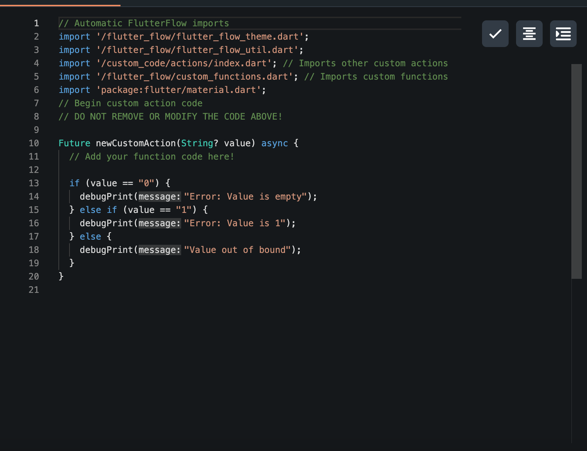
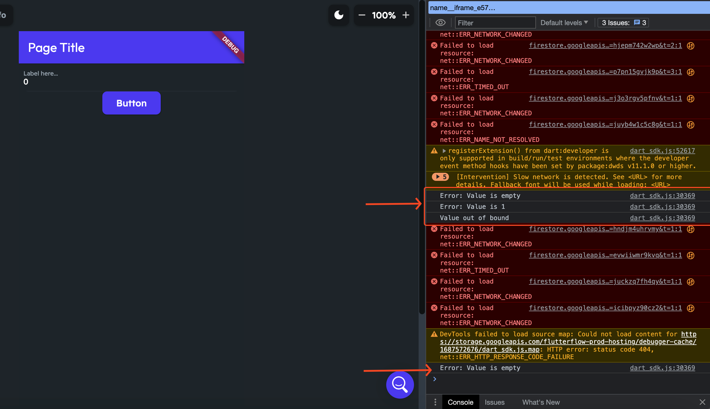

---
keywords:
  - testing
  - debug
  - console
slug: /troubleshooting/custom-actions/testing-custom-actions-using-debug-console
title: Testing Custom Actions Using Debug Console
description: >-
  Sometimes, the compiler does not show any errors in the custom action, but the
  custom action still won't work as expected.
tags:
  - FlutterFlow
  - Troubleshooting
  - Custom Actions
last_verified: 2026-09-02
---
# Testing Custom Actions using Debug Console

Sometimes, the compiler does not show any errors in the custom action, but the custom action still won't work as expected. This might be due to the code logic or the implementation. In order to test the implementation and the flow, you can use the debug console to test the custom action in different scenarios.

:::info[Prerequisites]
- You have created a custom action in FlutterFlow.
- You are familiar with using Run Mode and viewing the browser console.
:::

The core function that you can use to test the custom actions on the console is the `debugPrint` function in Flutter. To use that in the custom actions, follow the steps below:

1. **Add `debugPrint` Statements in the Code**

    Use `debugPrint` for a safe status or error code. Never print passwords, bearer tokens, cookies, API keys, complete request/response bodies, personal data, or proprietary records.

    

    Example:

    ```js
    try {
        final result = someFunction();
        debugPrint('Function result: $result');
    } catch (e) {
        debugPrint('someFunction failed: ${e.runtimeType}');
    }
    ```

2. **Run the App and Open Console**

    Run the action and open the console. Reproduce one case at a time and correlate it with a non-sensitive request or trace ID. Browser logs cover web runs; use the appropriate Flutter/device logs for Android and iOS behavior.

    

:::info[Still having issues?]
If you continue to experience issues after testing your logic with debugPrint, please contact support at support@flutterflow.io.​
:::

## Related documentation

See [Custom Actions Errors](/troubleshooting/custom-actions/custom-actions-errors) for a related FlutterFlow workflow.
