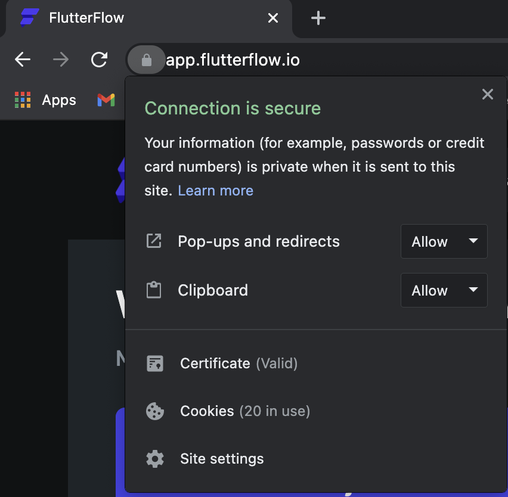
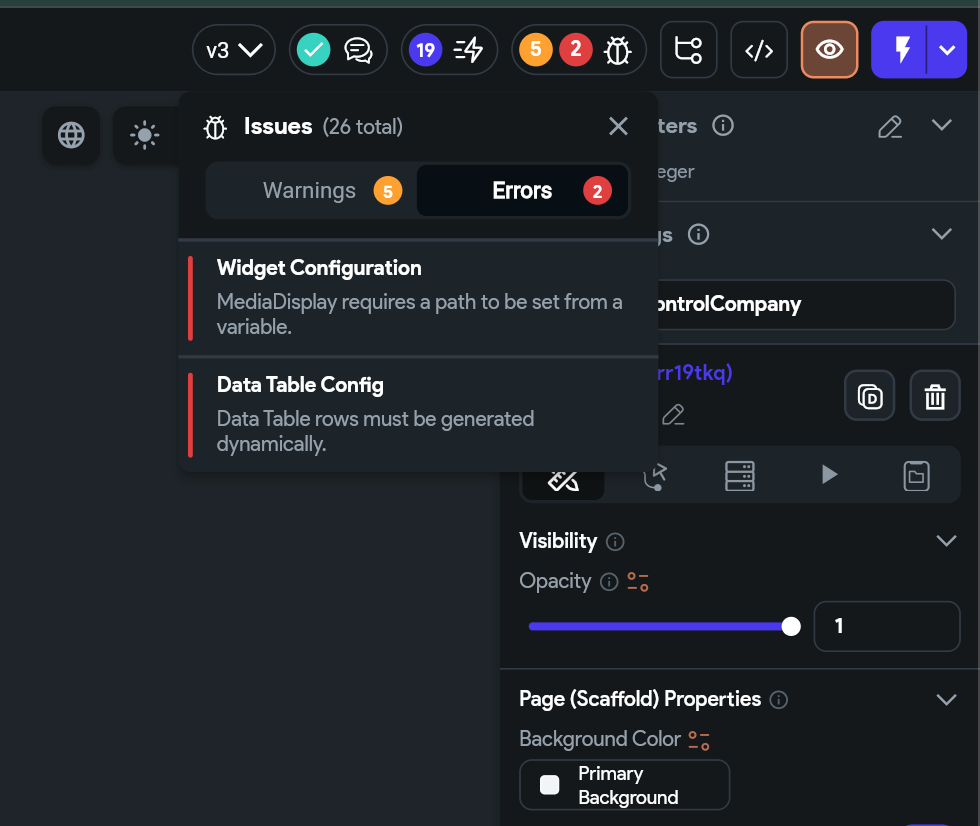

# Can't Download APK or Code in FlutterFlow

---

## 🧪 Check Your Browser Permissions

The most common cause of download issues (APK or project code) is **insufficient browser permissions**. Make sure **pop-ups and redirects** are allowed for FlutterFlow.

### ✅ For Chrome:
1. Click the **lock icon** in the address bar.
2. A pop-up will appear — ensure **Pop-ups and redirects** is set to **Allow**.
3. Also set **Clipboard** to **Allow** (used for copy-pasting widgets inside FlutterFlow).
4. Try downloading again.

> 💡 **Tip:** Downloads will be saved in your browser’s **default download folder**.

---

## ❗ Resolve Project Errors

You won’t be able to download APK or code if your project has **unresolved errors**.

If you see a **red indicator** in the top toolbar or project issues pane, it means you must fix errors before building or downloading.

> Once all errors are resolved, you should be able to download your APK or source code successfully.

---

## 📩 Need More Help?

If you still face issues:
- Contact us at [support@flutterflow.io](mailto:support@flutterflow.io)

---

## 🎥 Additional Resources

- [YouTube Tutorial: Download Code](https://intercom.help/flutterflow/en/articles/6150279-can-t-download-apk-or-code-in-flutterflow)
