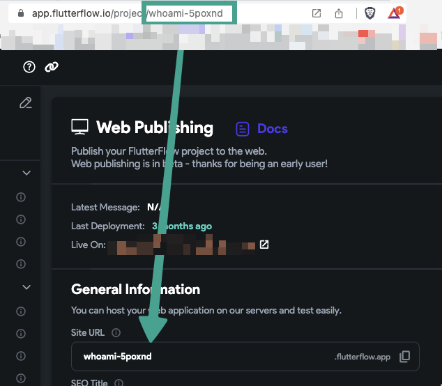
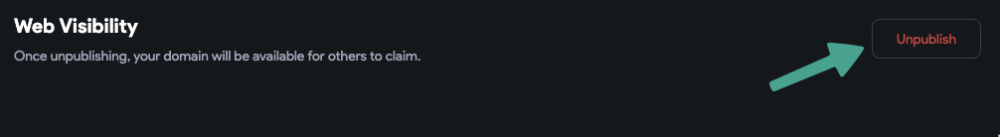

# Can't Publish to `flutterflow.app` Subdomain

---

## ❗ Issue

You are trying to publish your web app to the `.flutterflow.app` domain and encounter the following error:

```text
Error reserving subdomain. You have exceeded the quota for subdomains.
```


---

## 🧠 Why You Are Seeing This Error

There is a limit to how many **custom subdomains** you can publish under the `flutterflow.app` domain:

- **Free plan:** up to **3 subdomains**
- **Paid plan:** up to **10 subdomains**

> **Note:** Only *custom* subdomains count toward this quota. If your subdomain uses the **project ID**, it does **not** count.

---

## ✅ Solutions

### 1. Change the Subdomain Name to Your Project ID

Use your **project ID** as the subdomain name (set in the “Site URL” field). This avoids counting against your quota.



---

### 2. Unpublish Other Projects

If you've reached your subdomain quota, unpublish some of your existing projects:

1. Go to **Web Publishing**
2. Click the **Unpublish** button on older projects.


