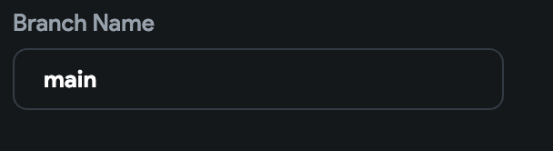

# Codemagic Build Error: Format Exception – Could Not Find End of Central Directory Record

> **Tip:** Not sure which type of error your project has? Check out [this article](https://intercom.help/flutterflow/en/articles/6146843-how-to-identify-your-codemagic-error) on how to identify your Codemagic error.

## What Does This Error Mean?

This error usually means that the **branch name** was entered incorrectly in the Codemagic settings for your GitHub repo.

---

## Full Error Message

```text
Codemagic build error: Format Exception: Could not find End of Central Directory Record
```


---

## How to Resolve This Issue

To fix this, make sure you're **only entering the branch name**, and **not the full `repo-name/branch-name` path**, because the project is already connected to the correct GitHub repo.

Incorrect (❌): repo-name/branch-name


Correct (✅): branch-name


### Example

Incorrect:


Correct:


---

## The Issue Was Not Resolved

If the error still persists after correcting the branch name, please contact **FlutterFlow Support** via chat or email at [support@flutterflow.io](mailto:support@flutterflow.io).


