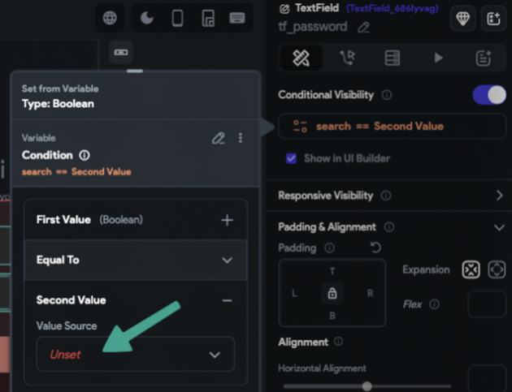

# Build Failed: Error Loading Project for Test or Run Mode

When trying to build your project in **Run** or **Test** mode, you may receive a **Build Failed** error, even when no issues are visible in the FlutterFlow editor.

---

## What This Error Means

This error indicates that your project contains a compilation issue that is not being flagged in the FlutterFlow interface.

FlutterFlow usually highlights potential problems through the **Debug** menu. However, some errors may not yet be automatically detected.

---

## Common Causes of This Error

- Copy/pasting a widget with many actions or visibility rules  
- Copy/pasting widgets that include animations or animation actions  
- Copy/pasting entire pages or components  
- Using a data source that doesn’t exist at build time (e.g., a periodic action referenced before it's created)  
- A potential bug in FlutterFlow  

If you suspect a bug, report it via the [FlutterFlow GitHub issue tracker](https://github.com/FlutterFlow/flutterflow/issues).

---

## Troubleshooting Steps

1. **Download and Run Locally**
   - If you have access to the downloaded code, run the project on your local machine.
   - Review the compilation error directly in your IDE to identify the root cause.

2. **Use Snapshots to Track Changes**
   - Check your recent snapshots to identify what changes may have introduced the error.
   - Focus on duplicated pages, modified actions, or new widgets added right before the error started.

3. **Inspect Visibility Rules and Actions**
   - Even if no error is visible, some issues may be buried within conditions.

Example:

At first glance, this rule appears valid. However, opening the condition reveals the issue:

The second value is unset and highlighted in red. Errors like these can prevent the build from succeeding.

