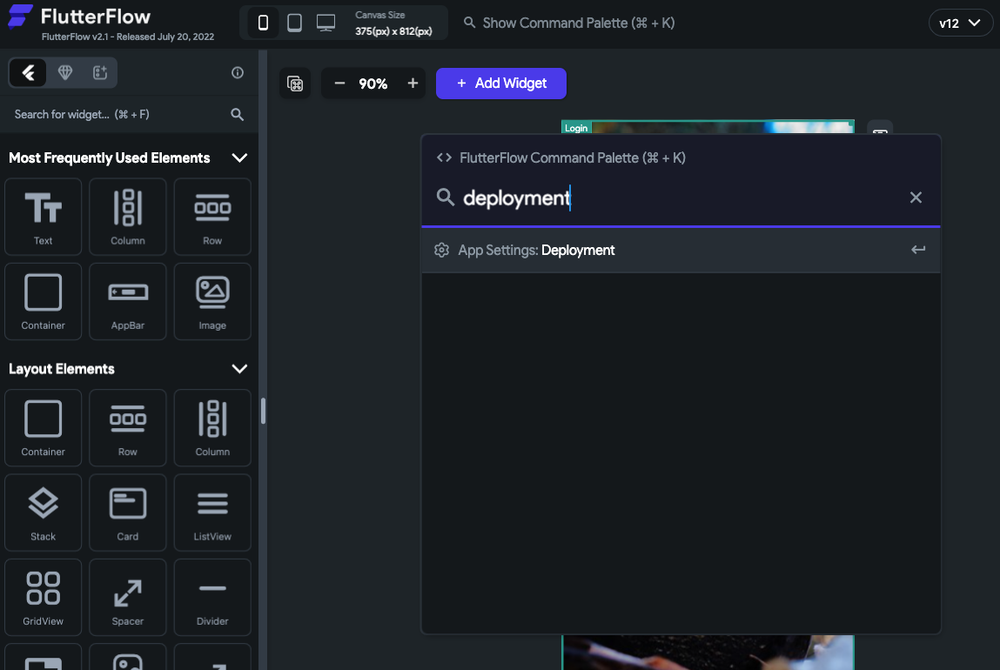
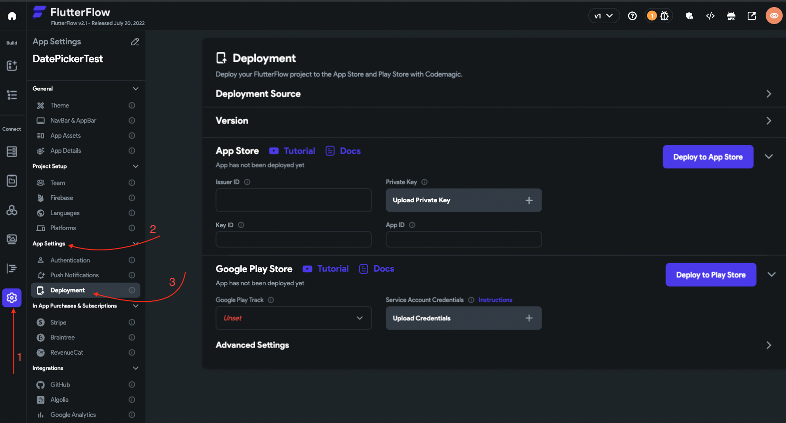
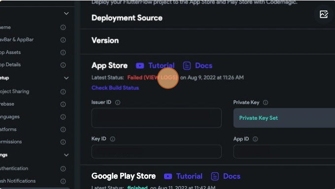
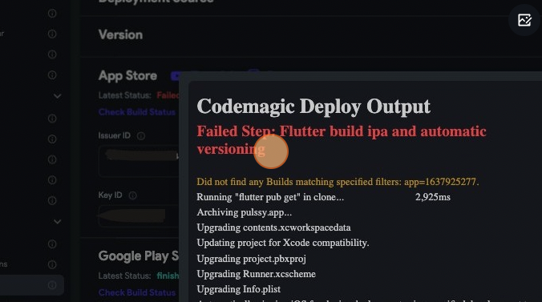
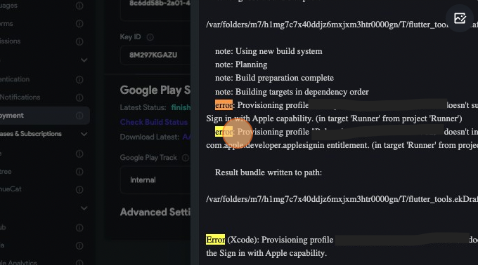
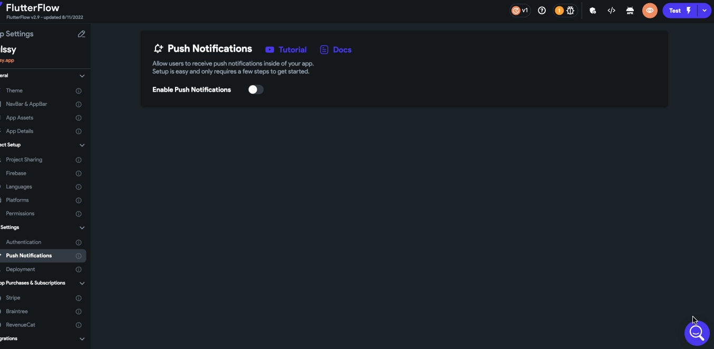

# Codemagic Deployment Error Identification

Follow the steps below to identify your codemagic error:

- Press **Cmd/Ctrl + k**, type **"deployment"** and hit enter. It will take you to the deployment page.​

  

- Navigate to the Deployment section by clicking **Project Settings** &gt; **Deployment** (under App Settings).​

  
​

- Click on the **Failed (VIEW LOGS)** text to see the logs. ​

  
  
  In this step, you'll need to note the Failed Step that been displayed by CodeMagic error log. ​

  
​

- Now, press **Cmd/Ctrl + F** to search for the term **"error"** in the logs to find the root cause of the issue. Keep pressing **"Enter"** till you find the error ( this is usually at the bottom of the logs ).

  If you search for "error" and still don't find an error message that makes sense to you then you can also try with the following keyword: "message".

    

- Now select and copy this error message and paste it in the Help Center search in the chat icon in the bottom-right corner to search the error. This will help you find the help article for this issue and then you can find the fix for it. 

  