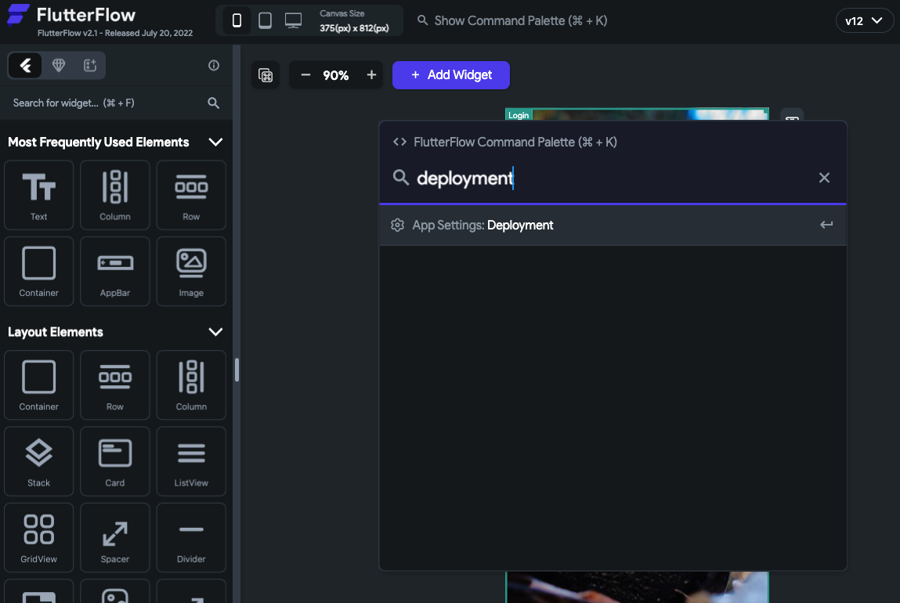
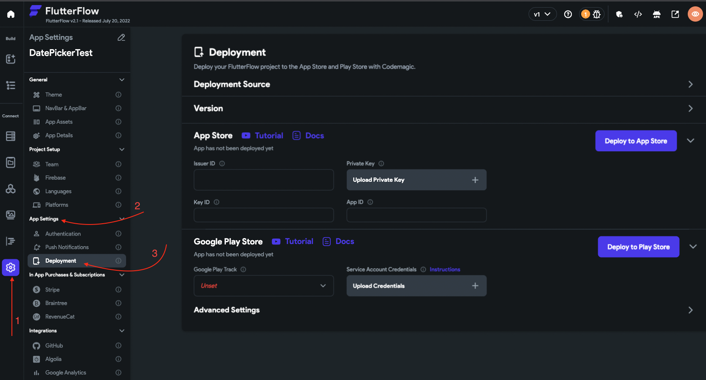
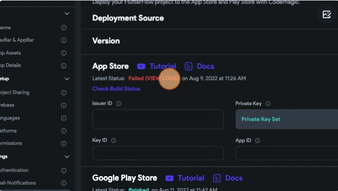
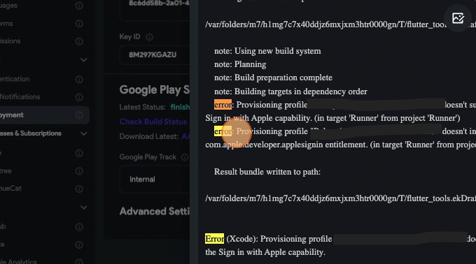
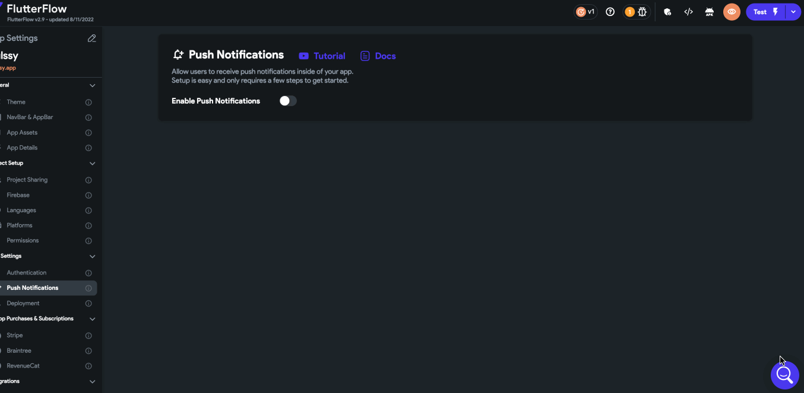

---
keywords:
  - deployment
  - error
  - identification
slug: /troubleshooting/deployment/codemagic-deployment-error-identification
title: Codemagic Deployment Error Identification
description: >-
  Follow the steps below to identify your codemagic error: - Press Cmd/Ctrl + k
  , type "deployment" and hit enter.
tags:
  - FlutterFlow
  - Troubleshooting
  - Deployment
last_verified: 2026-09-02
---
# Codemagic Deployment Error Identification

Follow the steps below to identify your codemagic error:

- Press **Cmd/Ctrl + k**, type **"deployment"** and hit enter. It will take you to the deployment page.​

  

- Navigate to the Deployment section by clicking **Project Settings** &gt; **Deployment** (under App Settings).​

  
​

- Click on the **Failed (VIEW LOGS)** text to see the logs. ​

  

  In this step, you'll need to note the Failed Step that been displayed by CodeMagic error log. ​

  
​

- Start at the failed step and find the **first causal error**, not merely the last line containing “error.” Later failures are often consequences. Search for `error`, `failed`, and the command or package named by the failed step.

  If you search for "error" and still don't find an error message that makes sense to you then you can also try with the following keyword: "message".

    

- Search the Help Center using the stable error code and a short redacted excerpt. Remove credentials, signing material, repository URLs, bundle data, personal information, and proprietary source before sending logs to support or an AI assistant.

  

## Related documentation

See [CodeMagic Deployment Tips](/troubleshooting/deployment/codemagic-deployment-tips) for a related FlutterFlow workflow.
