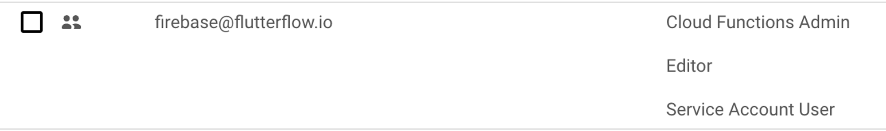
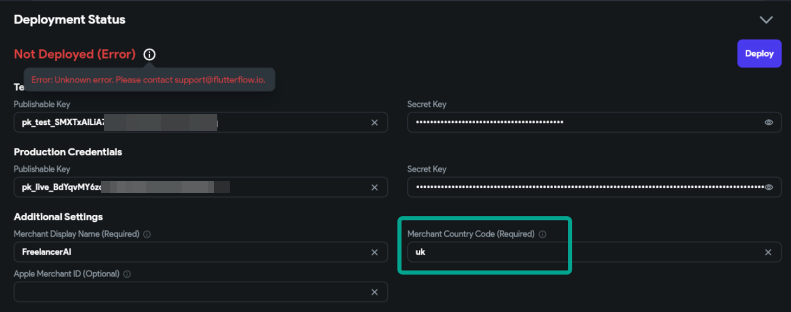
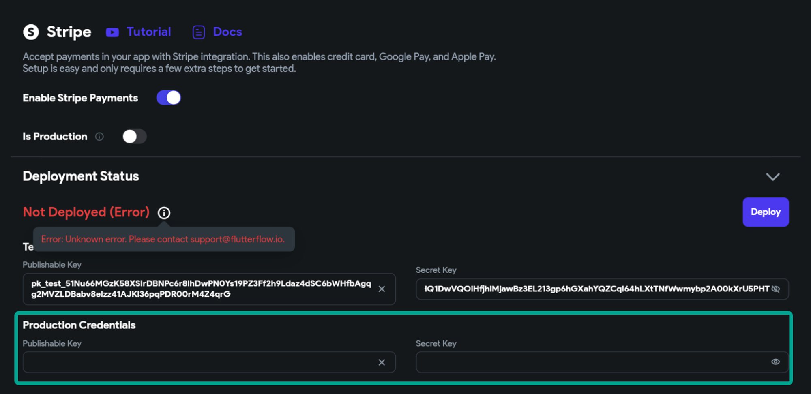
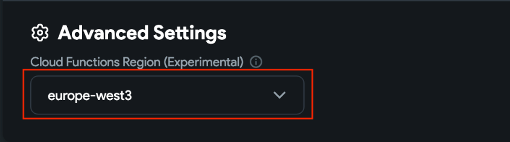
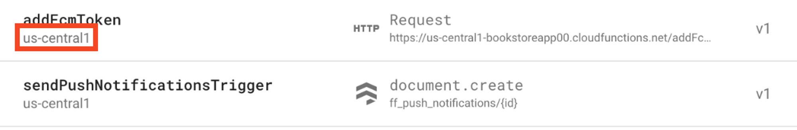

# Deployment Issues with Stripe Integration

Integrating Stripe in your FlutterFlow project can help you accept payments efficiently. However, some common deployment issues may arise. This article outlines key steps and best practices to ensure a smooth Stripe integration and deployment experience.

1. **Firebase Connection**

    Stripe integration requires a connected Firebase project. Before running through this checklist, it's important to ensure your FlutterFlow project is linked to Firebase, a crucial step for successful payment processing. Detailed guidance can be found at **[FlutterFlow's Firebase Setup Guide](/integrations/firebase/connect-to-firebase/#step-1-set-up-your-project)**.

2. **Upgrade to Firebase Blaze Plan**

    Stripe functionality requires a Firebase Blaze Plan for operational capabilities. To avoid disruptions, you will need to upgrade from the Firebase Spark plan to the Blaze plan. Learn more about **[Google's process for upgrading](https://firebase.google.com/docs/projects/billing/firebase-pricing-plans)**.

3. **Set the Google Cloud Platform (GCP) Location**

    A defined Google Cloud Platform (GCP) location for your Firebase project ensures the correct regional operation of services. The absence of a set location can hinder the deployment process.​

    

4. **Firebase Project Permissions**

    Ensure you have the necessary permissions enabled for your Firebase project. Two critical permissions involve access management and service configuration. You can also reference the **[setup guide](/integrations/firebase/connect-to-firebase/#step-1-set-up-your-project)** as well.​

    

5. **Correct Merchant Code**

    Use the correct 3-letter merchant country code (e.g., "GBR" for the United Kingdom vs. "UK"). Incorrect codes can lead to failed transactions. For accurate codes, refer to **[IBAN Country Codes](https://www.iban.com/country-codes)**.​

    
    
    

6.  **Test and Live Keys**

    For deployment, both Test and Live Stripe keys must be configured in your project settings, regardless of the development stage. This ensures Stripe's API can properly interact with your application.​

    

7. **Consistent Region Settings**

    Align your Firebase project's region with that of your FlutterFlow settings to prevent deployment failures. Inconsistencies can cause function deployment issues.​
    
    
    
    

If you find that this article hasn't fully addressed your concerns or if you have more questions, please don't hesitate to reach out to us at support@flutterflow.io

​