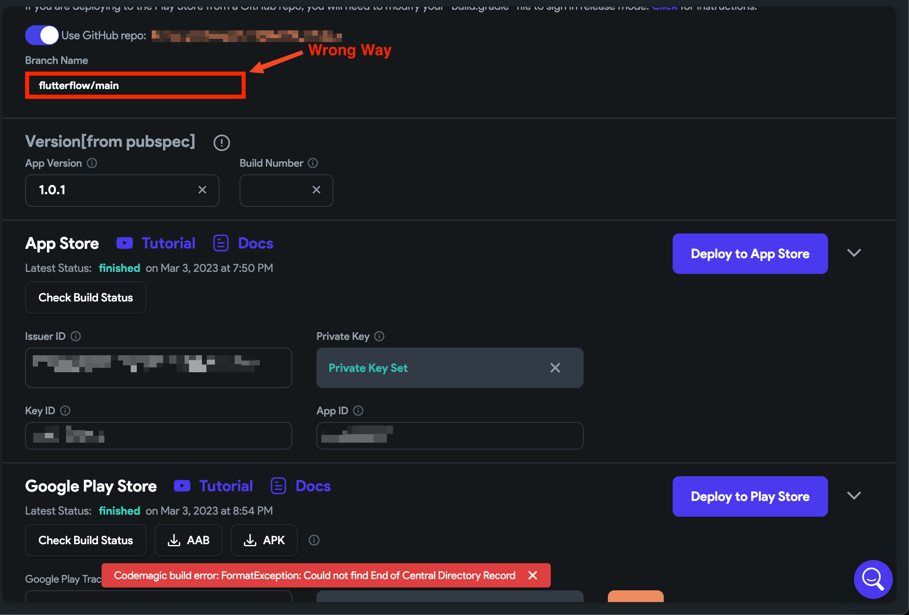

# Fix Codemagic Format Exception Build Error

When triggering a build through Codemagic from a connected GitHub repository, you may encounter the following error:

    ```text
    Codemagic build error: Format Exception: Could not find End of Central Directory Record
    ```
    This issue typically occurs when the **branch name** is entered incorrectly—especially if you include the repository name in the input field.

:::info[Prerequisites]
- You must have already connected your GitHub repository to your FlutterFlow project.
- You should be using Codemagic for automated deployment.
:::

To fix this issue, ensure that you only enter the **branch name**, not the full path with the repository name.

:::tip
Use only the branch name. Avoid formats like `repo-name/branch-name`.
:::

Incorrect input:

    

Correct input:

    