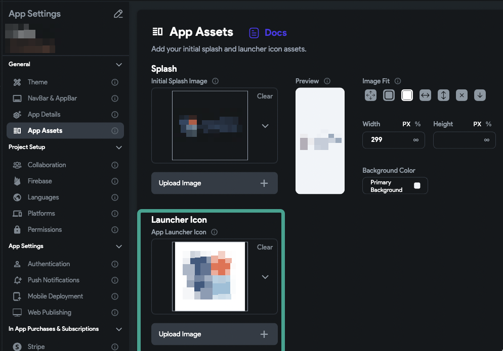

# Fix Mobile Build Error Nocodeerforimageformat

This error typically occurs when the mobile app build fails due to an unsupported icon file format.

The build process cannot generate a launcher icon from the provided app icon asset. This often happens when the selected file is in an unsupported format such as SVG.

Follow these steps to fix the error:

   1. Go to **Settings > App Assets** in your FlutterFlow project.
   2. Replace the current app icon and splash image with supported formats.
   3. Ensure that:
      - The asset file is **not too large** (recommended size is 1024×1024 pixels).
      - The icon file is in **PNG or JPEG** format (SVG is not supported).
   4. Avoid PNG icons with transparency if building for iOS.

:::info[Recommended Guidelines]
- Use **PNG or JPEG** formats only.
- Use an icon of at least **1024×1024 pixels**.
- Avoid transparent PNGs for iOS builds.
- Ensure the image adheres to platform-specific design standards.
:::