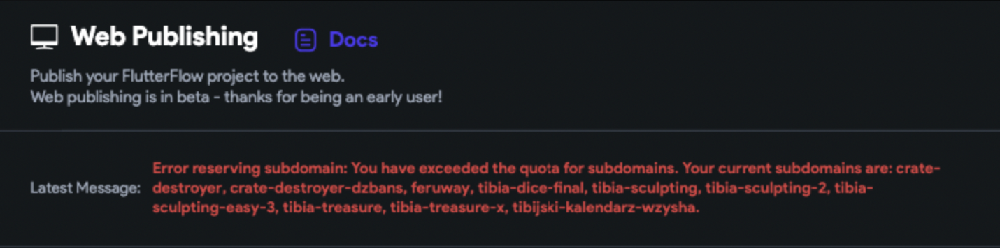
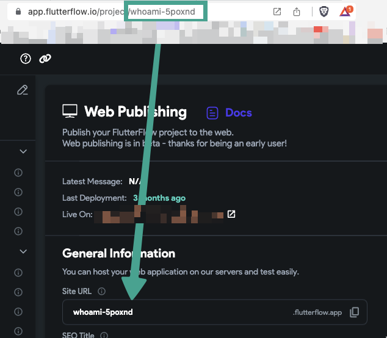
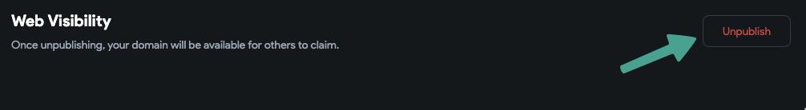

# Fix Subdomain Limit Error When Publishing to Flutterflow.app

This article explains how to resolve the following error when publishing a web app:

    ```text
    Error reserving subdomain. You have exceeded the quota for subdomains.
    ```

    

This error occurs because FlutterFlow limits the number of custom subdomains a user can reserve under the `.flutterflow.app` domain.

    - **Free plans** can reserve up to **3** custom subdomains.
    - **Paid plans** can reserve up to **10** custom subdomains.

:::tip
Only **custom** subdomains count toward this limit. Subdomains using the default **project ID** do **not** count.
:::

Follow the steps below to fix this error:

1. **Use the Default Project ID as Subdomain**

    Using the project ID as the subdomain will not count toward your quota.

        - Go to the **Site URL** field in the **Web Publishing** page.
        - Set the subdomain to match the project ID.

        

2. **Unpublish Unused Projects**

    You can free up space by unpublishing existing custom subdomains:

    1. Go to the **Web Publishing** page of a previously published project.
    2. Click the **Unpublish** button.

    

    Once space is freed, return to your current project and attempt to publish again.