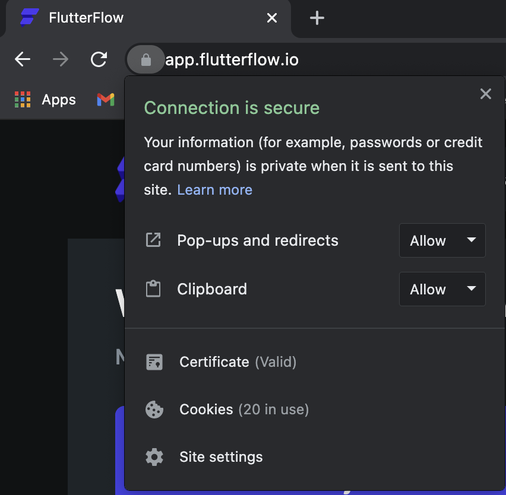
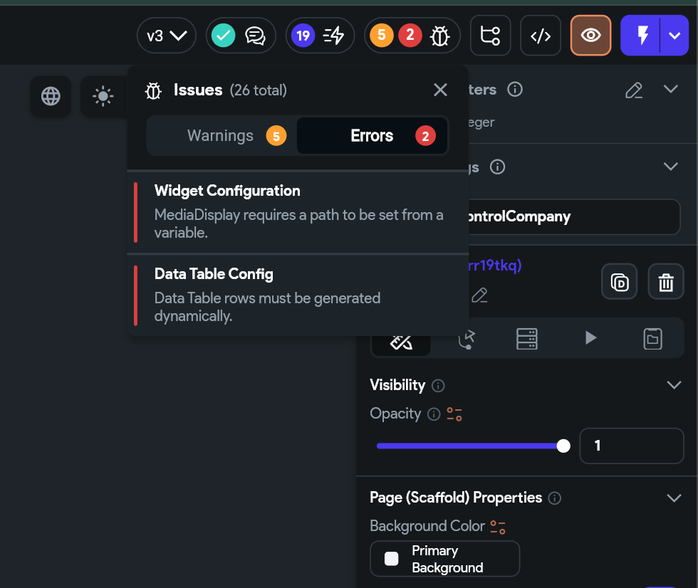

# Fix Download Issues for APK or Code in FlutterFlow

If you're unable to download the APK or source code from FlutterFlow, the issue is likely related to browser permissions or unresolved project errors.

:::info[Prerequisites]
- You must be logged in to your FlutterFlow account.
- Your project must not contain critical build errors.
:::

Follow the steps below to resolve this issue:

1. **Enable Pop-Ups and Redirects**

   A common cause of failed downloads is blocked pop-ups in your browser.

   To enable them in **Google Chrome**:

   1. Click the **lock icon** in the address bar while on the FlutterFlow site.
   2. In the dropdown:
      - Set **Pop-ups and redirects** to **Allow**.
      - Optionally, set **Clipboard** to **Allow** to enable copy-paste features.
   3. Attempt the download again.

      

      :::tip
      Downloaded files are saved to your browser’s default **Downloads** folder.
      :::

2. **Check for Project Build Errors**

   FlutterFlow blocks downloads if there are unresolved project issues.

   To resolve them:

   1. Look for a red dot on the **Project Issues** panel in the bottom toolbar.
   2. Open the panel and review the listed issues.
   3. Fix all errors before retrying the download.

      

If downloads still fail after fixing permissions and project errors, reach out to **[support@flutterflow.io](mailto:support@flutterflow.io)** with your project details.

