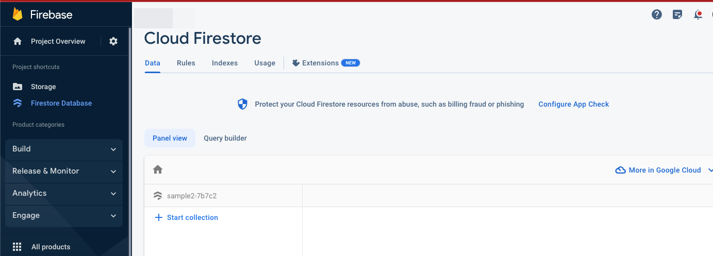
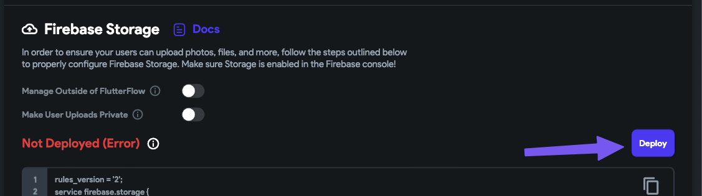

# Fix Firebase Server Directory Error

This error may occur when deploying Firebase Storage rules from FlutterFlow, even after enabling Firebase Storage. It is commonly caused by incorrect Cloud Firestore setup in the Firebase Console.

Here is the error message: 

    ```text
    Error: Failed to create server directory. Please contact support@flutterflow.io
    ```


    

:::info[Prerequisites]
- You must have already connected your Firebase project to FlutterFlow.
- Firebase Storage must be enabled in the Firebase Console.
:::

Follow the steps below to resolve the Issue:

1. **Set Default GCP Resource Location:**

    1. Open your Firebase Project.
    2. Navigate to **Project Settings**.
    3. Set the **Default GCP Resource Location** to your preferred region.

        


2. **Enable Firebase Storage:**

    1. In the Firebase Console, go to the **Build > Storage** section.
    2. Click **Get Started**.
    3. Set the rules to **Testing Mode**.
    4. Choose the **same location** as set in your project settings.

        

        

3. **Enable Cloud Firestore in Native Mode:**

    1. Navigate to **Build > Firestore Database**.
    2. If it is in **Datastore Mode**, you must switch to **Native Mode**.
    3. Click **Go to Google Cloud Console**.
    4. Click **Switch to Native Mode**.
    5. Return to Firebase and reload Firestore.

        

        
        
        

4. **Re-deploy Firebase Storage Rules in FlutterFlow**

    1. Return to your FlutterFlow project.
    2. Re-deploy the Firebase Storage Rules.

        
        
        

If the issue persists after completing the steps above, please contact FlutterFlow Support via chat or email at **support@flutterflow.io**.
