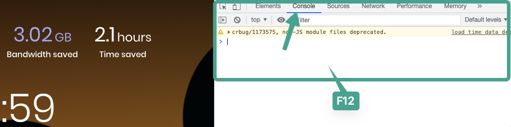
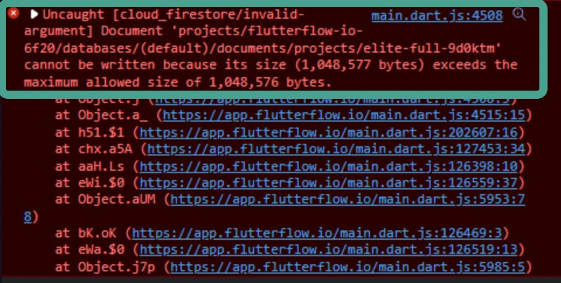

# Fix Project Not Saving Issue

If your FlutterFlow project is not saving changes, you may have exceeded the project size limit. This can prevent edits from being saved or synced. Use the developer console to confirm if the issue is size-related.

**Check for Project Size Limit Errors**

    You can verify the issue by using the browser console in Google Chrome:

        1. Press **F12** to open Chrome DevTools.
        2. Select the **Console** tab.
        3. Continue working in your FlutterFlow project.
        4. Watch for error messages related to project size.

        
        
        

        If the error indicates you've hit the size limit, FlutterFlow currently does **not** support increasing this limit.

**Optimize Your Project to Reduce Size**

    To resolve the issue, follow these steps to reduce your project size:

        1. **Remove unused assets:** Delete unnecessary images and files in your assets folder. When possible, upload files to **Firebase Storage** and use their URLs.
        2. **Clean up temporary pages/components:** Delete test or draft pages that are no longer needed.
        3. **Use cloned projects for backups:** If you're holding on to elements “just in case,” move them into a clone of the project.
        4. **Remove unused UI elements:** Save a snapshot/version before cleanup. You can always recover elements from previous versions.
        5. **Use reusable components:** Convert repeating UI elements into components to reduce duplication.
        6. **Simplify repeated pages:** If the same layout is repeated, make it dynamic or convert it into a modal.

        :::warning
        There is currently no way to increase the maximum project size in FlutterFlow.
        :::

        :::tip
        Keeping your project optimized not only avoids size issues but also improves performance and loading times during development.
        :::

