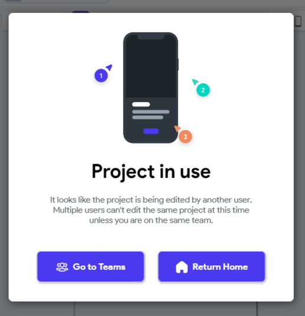
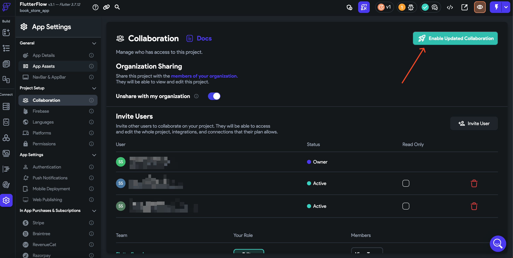

# Fix Realtime Collaboration Error in FlutterFlow

When attempting to access a project within an organization, you may encounter an error preventing project collaboration.

This message appears when the project has not been shared with the organization, making it inaccessible to other collaborators.

:::info[Prerequisites]
You must have Admin or Owner access to the project in FlutterFlow to modify sharing and collaboration settings.
:::

Follow the steps below to resolve the issue:

   1. **Open the Project in FlutterFlow**  
      Navigate to the project where the error occurs.

   2. **Go to Collaboration Settings**  
      Open the **Settings > Collaboration** tab from the left navigation panel.

   3. **Enable Organization Sharing**  
      Toggle the **Share with my organization** option.

      

   4. **Enable Real-Time Collaboration (Optional)**  
      If you want team members to see and apply changes live, toggle the **Real-Time Collaboration** feature.

      

   Once these steps are completed, all members of your organization will be able to access and collaborate on the project simultaneously in real-time.

If the error persists after applying these steps, please contact **FlutterFlow Support** via the in-app chat or email: **support@flutterflow.io**
