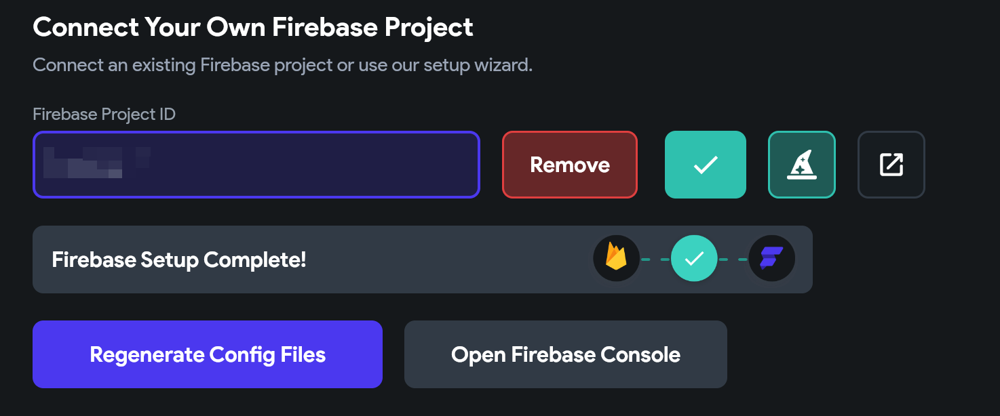
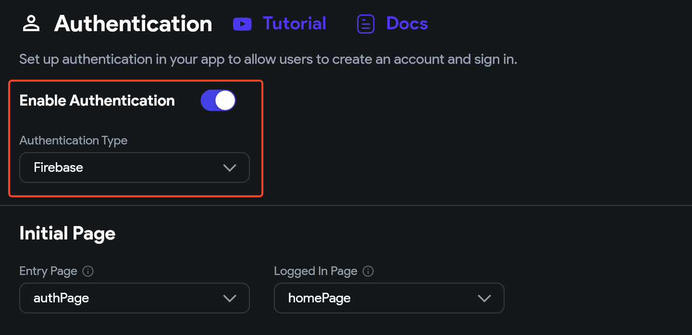
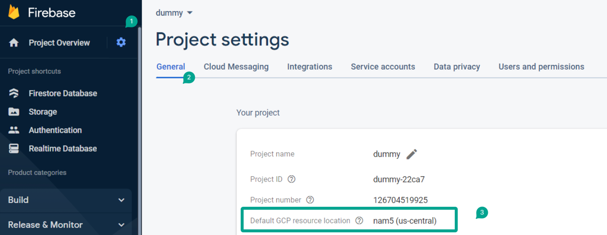
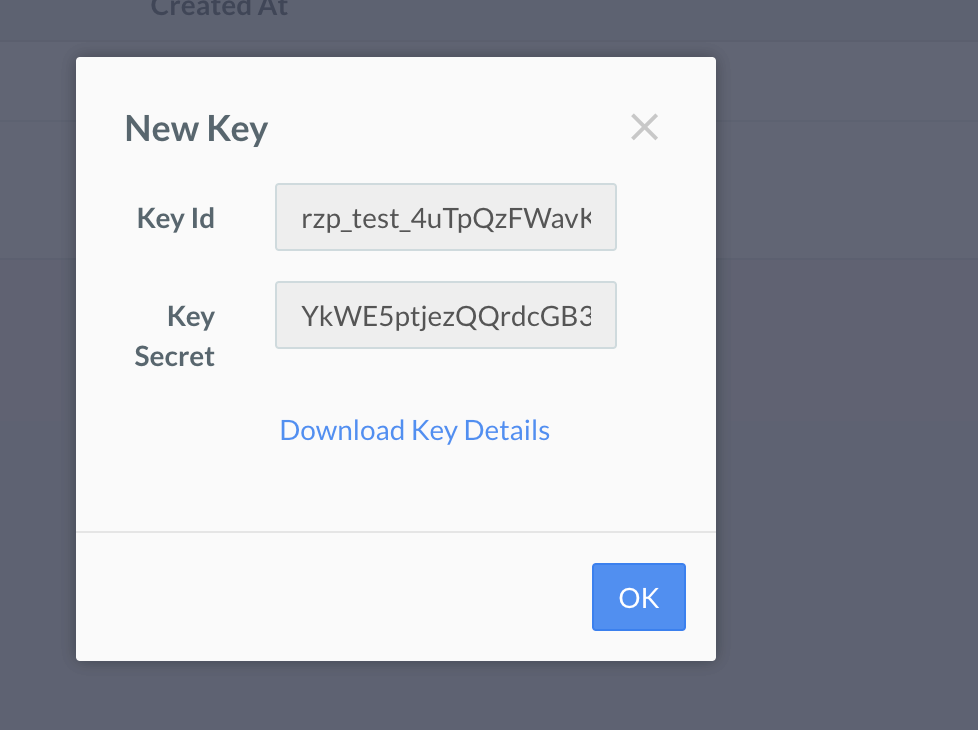
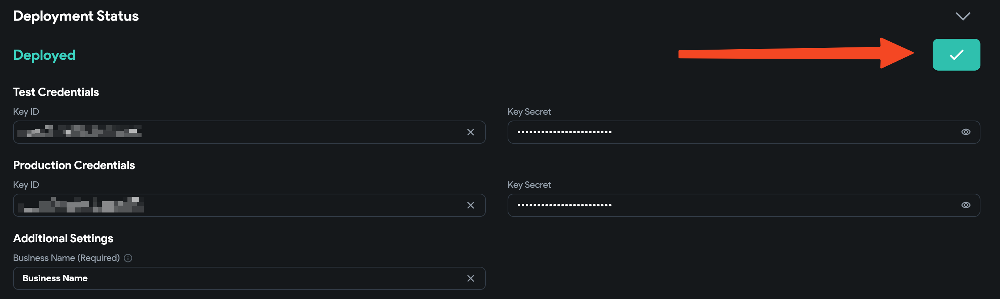
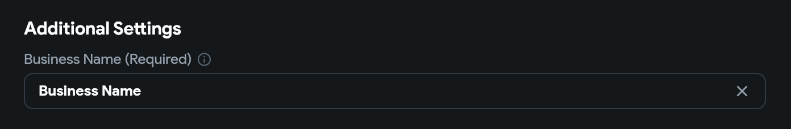
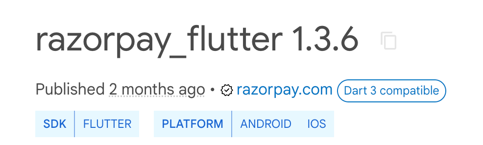

# Fixing Razorpay Deployment

Razorpay is a major payment processor in India. Integrating [Razorpay](https://razorpay.com/) can allow users to make payments using their app. This article outlines some common scenarios and troubleshooting instructions for Razorpay deployment issues.

1. **Firebase Integration and Auth**

    FlutterFlow uses Firebase integration and cloud functions to facilitate Razorpay payments. Ensure you have Firebase configured in your FlutterFlow project and that Firebase Auth is enabled. 

    
    

2. **Firebase Blaze Plan**

    Razorpay uses cloud functions behind the scenes to facilitate payments. Cloud functions are a part of Firebase's "Blaze" plan. You must upgrade from the Firebase Spark plan to the Blaze plan to avoid disruptions. Learn how to upgrade here. On the bottom left side of your Firebase console, you will see which plan you are on

    

3. **Set Google Cloud Location**

    Ensuring your Firebase project is pinned to a specific Google Cloud Platform (GCP) location is key for optimal service functionality across regions. Skipping this step could result in errors.​

    

4. **Firebase Project Permissions**

    Make sure your Firebase project has the required permissions activated. Access management and service configuration are two essential permissions to focus on. For guidance on setting these up, look at the instructions in the [FlutterFlow Project Setup](https://docs.flutterflow.io/resources/projects/settings/project-setup/).

5. **Razorpay Keys Check**

    Make sure to copy and paste the correct Key ID and Key Secret from Razorpay for testing and production, respectively. For testing, make sure "Is Production" is turned off.

    

    

    

6. **Razorpay Business Name**

    Finally, ensure you have entered the proper "Business Name" in the Razorpay additional settings in FlutterFlow. Make sure this business name matches your business name in Razorpay records. 

    

:::info[Other Considerations]
Razorpay currently works only on mobile (Android and iOS). This is due to a limitation from Razorpay's Flutter Package. If you are planning to collect payments on a web app - consider using Stripe.

:::

If you are still facing issue with deploying Razorpay on Flutterflow, please feel free to reach out to support@flutterflow.io

