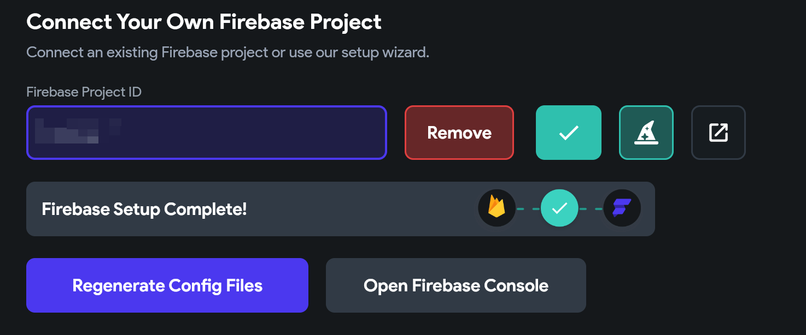
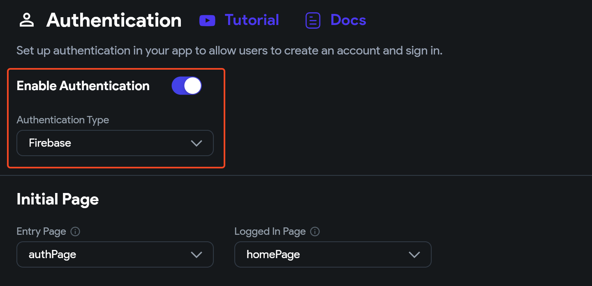
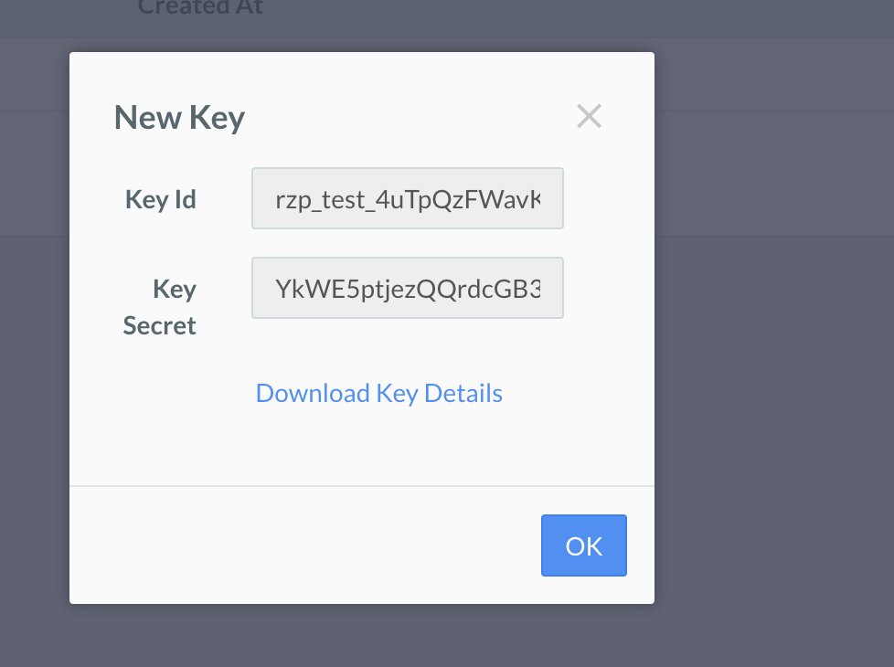
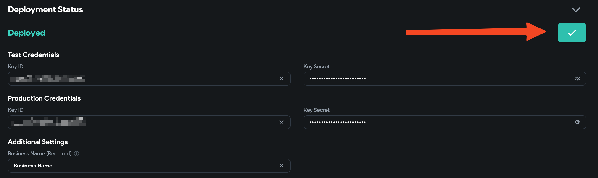
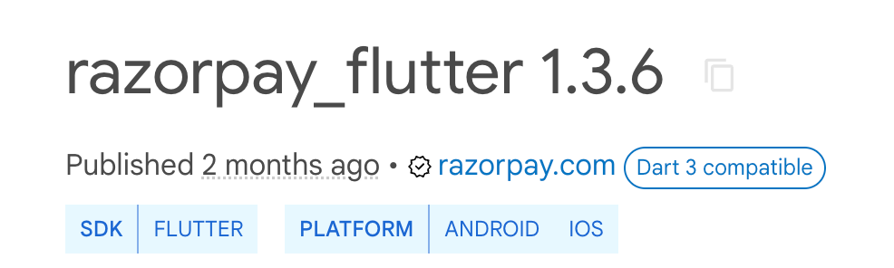

---
keywords:
  - deployment
  - firebase
  - razorpay
slug: /troubleshooting/deployment/fixing-razorpay-deployment
title: Fixing Razorpay Deployment
description: >-
  Razorpay is a major payment processor in India. Integrating Razorpay can allow
  users to make payments using their app.
tags:
  - FlutterFlow
  - Troubleshooting
  - Deployment
last_verified: 2026-09-02
---
# Fixing Razorpay Deployment

Razorpay is a major payment processor in India. Integrating **[Razorpay](https://razorpay.com/)** can allow users to make payments using their app. This article outlines some common scenarios and troubleshooting instructions for Razorpay deployment issues.

1. **Firebase Integration and Auth**

    FlutterFlow uses Firebase integration and cloud functions to facilitate Razorpay payments. Ensure you have Firebase configured in your FlutterFlow project and that Firebase Auth is enabled.

    
    

2. **Firebase Blaze Plan**

    Razorpay uses cloud functions behind the scenes to facilitate payments. Cloud functions are a part of Firebase's "Blaze" plan. You must upgrade from the Firebase Spark plan to the Blaze plan to avoid disruptions. Learn how to upgrade here. On the bottom left side of your Firebase console, you will see which plan you are on

    

3. **Set Google Cloud Location**

    Ensuring your Firebase project is pinned to a specific Google Cloud Platform (GCP) location is key for optimal service functionality across regions. Skipping this step could result in errors.​

    

4. **Firebase Project Permissions**

    Make sure your Firebase project has the required permissions activated. Access management and service configuration are two essential permissions to focus on. For guidance on setting these up, look at the instructions in the **[FlutterFlow Project Setup](/resources/projects/settings/project-setup/)**.

5. **Razorpay Keys Check**

    Use a test key pair when **Is Production** is off and a live key pair when it is on. Store the Key Secret only in FlutterFlow's dedicated server-side field or an approved secret manager; never put it in generated client code, app state, logs, screenshots, or chat.

    

    

    

6. **Razorpay Business Name**

    Finally, ensure you have entered the proper "Business Name" in the Razorpay additional settings in FlutterFlow. Make sure this business name matches your business name in Razorpay records.

    

:::info[Other Considerations]
Razorpay currently works only on mobile (Android and iOS). This is due to a limitation from Razorpay's Flutter Package. If you are planning to collect payments on a web app - consider using Stripe.

:::

Deployment success does not validate payment security. Calculate the amount on a trusted server, verify Razorpay signatures or webhooks, and make fulfillment idempotent before releasing. Never fulfill an order solely from a client callback.

If you are still facing issue with deploying Razorpay on Flutterflow, please feel free to reach out to support@flutterflow.io
