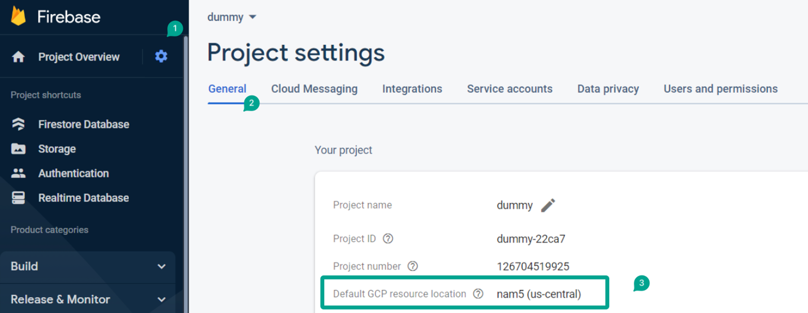
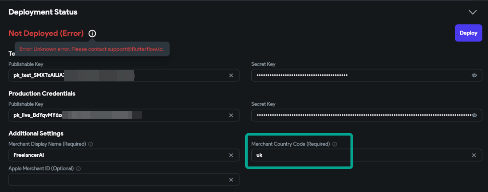
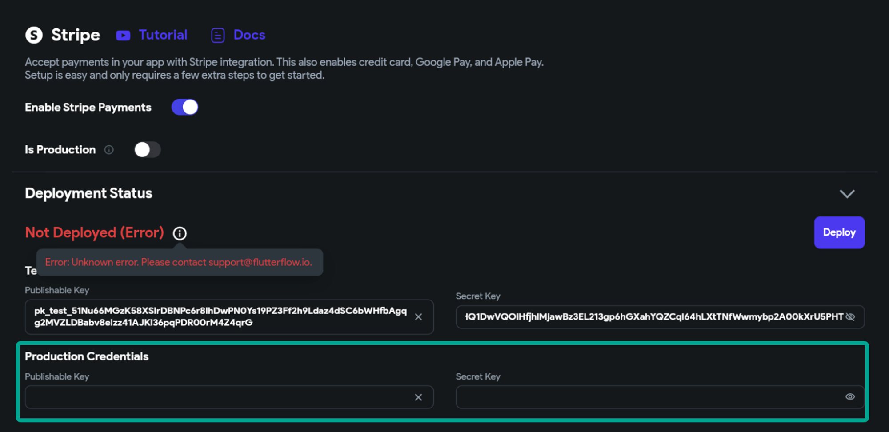
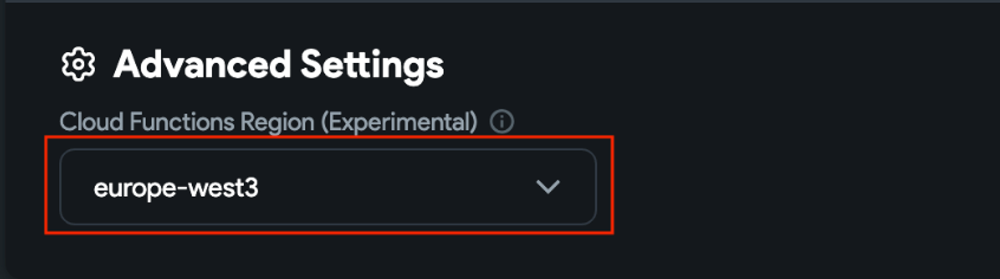
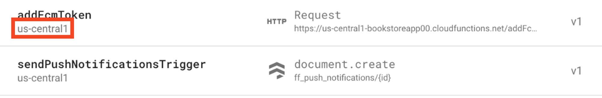
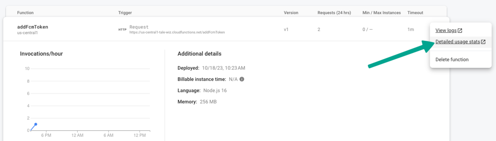
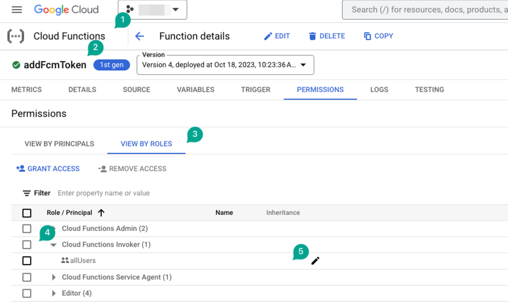

# Fixing Stripe Deployment & Payment Errors

Integrating Stripe for payment processing in FlutterFlow can significantly simplify monetization. However, developers may encounter issues during deployment or while managing transactions. This guide outlines common deployment and payment issues—and how to fix them—to help ensure a seamless Stripe integration experience in FlutterFlow apps.

## Deployment Checklist for Stripe Integration

1. **Firebase Connection**

    Stripe integration requires a connected Firebase project. Before running through this checklist, it's important to ensure your FlutterFlow project is linked to Firebase, a crucial step for successful payment processing. Detailed guidance can be found at **[FlutterFlow's Firebase Setup Guide](/integrations/firebase/connect-to-firebase/)**.

2. **Upgrade to Firebase Blaze Plan**

    Stripe functionality requires a Firebase Blaze Plan for operational capabilities. To avoid disruptions, you will need to upgrade from the Firebase Spark plan to the Blaze plan. Learn more about **[Google's process for upgrading](https://firebase.google.com/docs/projects/billing/firebase-pricing-plans)**.

3. **Set the Google Cloud Platform (GCP) Location**

    A defined Google Cloud Platform (GCP) location for your Firebase project ensures the correct regional operation of services. The absence of a set location can hinder the deployment process.​

    

4. **Firebase Project Permissions**

    Ensure you have the necessary permissions enabled for your Firebase project. Two critical permissions involve access management and service configuration. You can reference the **[setup guide](/integrations/firebase/connect-to-firebase/)**
.

    

5. **Correct Merchant Code**

    Use the correct 3-letter merchant country code (example., "GBR" for the United Kingdom vs. "UK"). Incorrect codes can lead to failed transactions. For accurate codes, refer to **[IBAN Country Codes](https://www.iban.com/country-codes)**.​

    
    
    

6. **Test and Live Keys**

    Both Test and Live Stripe keys must be configured in your project settings, regardless of the development stage. This ensures Stripe's API can properly interact with your application.​

    

7. **Consistent Region Settings**

    Align your Firebase project's region with that of your FlutterFlow settings to prevent deployment failures. Inconsistencies can cause function deployment issues.​

    
    
    

## Addressing Payment Transaction Issues

1. **Authentication Requirement**

    Stripe payments **require an authenticated user session**. Before initiating payment processes, ensure your application logic includes user login or account creation.

2. **Payment Modal Variations**

    It's important to note that web and mobile platforms present different payment modal presentations. These UI differences are out-of-the-box for Stripe and cannot currently be customized within FlutterFlow.

3. **Price Format**

    Prices should be submitted to Stripe in **cents**, not **dollars**. Utilize a custom function to convert dollar values to cents for accurate transaction processing.​To set a price in cents to Stripe, you can simply use a custom function that takes the price in dollars and returns it as cents.​

    Here is a custom code you can use to make this calculation in a custom function: 

    ```js
    int dollarToCent(double amount) {
    // Convert the amount to a string
    String st = amount.toString();

    // Remove any dots or commas
    st = st.replaceAll('.', '');
    st = st.replaceAll(',', '');

    // Convert the cleaned string to an integer
    return int.parse(st);
    }
    ```

    // Input: 14.99

    // Output: 1499 cents


4. **CORS Error Resolution**

    A CORS error during payment initiation often indicates a permissions issue with your Firebase function. Verify and adjust the `allUsers` permission for your Stripe function in the Firebase console to resolve this error.​

    
    
    

5. **Subscriptions**

    Currently, Apple and Google restrict Stripe subscriptions on mobile platforms. To expand your subscription capabilities, you can use alternative solutions like RevenueCat for mobile apps and direct API calls for web applications.​

:::info[**For further information and troubleshooting:**] 
- [Stripe Documentation](https://stripe.com/docs)
- [Stripe Payments](https://stripe.com/payments)
- [FlutterFlow University](https://university.flutterflow.io/)
- [Payments - Intro | FlutterFlow University](https://university.flutterflow.io/courses/flutterflow-payments)
:::