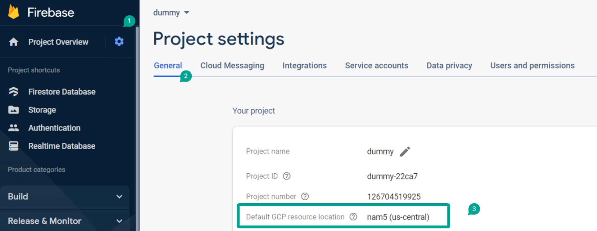
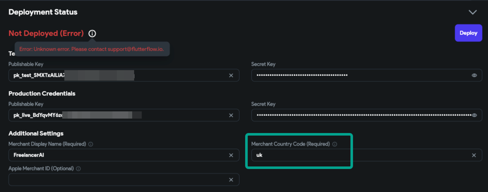
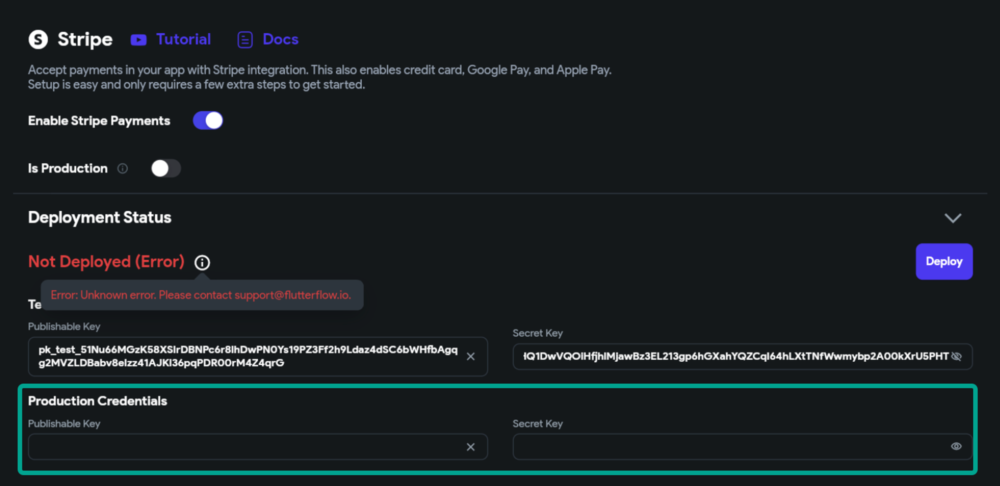
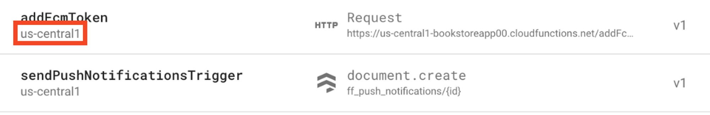
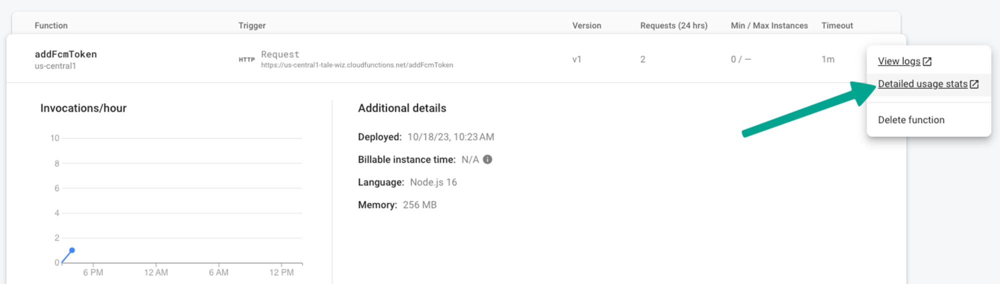
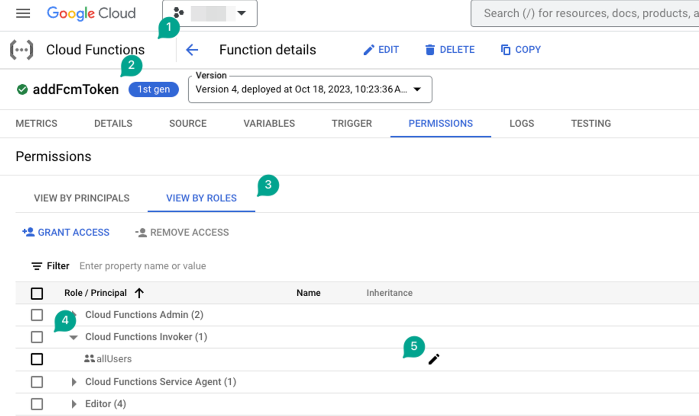

---
keywords:
  - deployment
  - payment
  - issues
slug: /troubleshooting/deployment/fixing-stripe-deployment-and-payment-errors
title: Fixing Stripe Deployment & Payment Errors
description: >-
  Integrating Stripe for payment processing in FlutterFlow can significantly
  simplify monetization.
tags:
  - FlutterFlow
  - Troubleshooting
  - Deployment
last_verified: 2026-09-02
---
# Fixing Stripe Deployment & Payment Errors

Integrating Stripe for payment processing in FlutterFlow can significantly simplify monetization. However, developers may encounter issues during deployment or while managing transactions. This guide outlines common deployment and payment issues—and how to fix them—to help ensure a seamless Stripe integration experience in FlutterFlow apps.

## Deployment Checklist for Stripe Integration

1. **Firebase Connection**

    Stripe integration requires a connected Firebase project. Before running through this checklist, it's important to ensure your FlutterFlow project is linked to Firebase, a crucial step for successful payment processing. Detailed guidance can be found at **[FlutterFlow's Firebase Setup Guide](/integrations/firebase/connect-to-firebase/)**.

2. **Upgrade to Firebase Blaze Plan**

    Stripe functionality requires a Firebase Blaze Plan for operational capabilities. To avoid disruptions, you will need to upgrade from the Firebase Spark plan to the Blaze plan. Learn more about **[Google's process for upgrading](https://firebase.google.com/docs/projects/billing/firebase-pricing-plans)**.

3. **Set the Google Cloud Platform (GCP) Location**

    A defined Google Cloud Platform (GCP) location for your Firebase project ensures the correct regional operation of services. The absence of a set location can hinder the deployment process.​

    

4. **Firebase Project Permissions**

    Ensure you have the necessary permissions enabled for your Firebase project. Two critical permissions involve access management and service configuration. You can also reference the **[setup guide](/integrations/firebase/connect-to-firebase/)**.​

    

5. **Correct Merchant Code**

    Use the correct 3-letter merchant country code (example., "GBR" for the United Kingdom vs. "UK"). Incorrect codes can lead to failed transactions. For accurate codes, refer to **[IBAN Country Codes](https://www.iban.com/country-codes)**.​

    

    

6. **Test and Live Modes**

    Configure and test in Stripe test mode first, then add live credentials only when you are ready to release. Keep secret keys in FlutterFlow's server-side integration field or an approved secret manager, never in client code or logs.

    

7. **Consistent Region Settings**

    Align your Firebase project's region with that of your FlutterFlow settings to prevent deployment failures. Inconsistencies can cause function deployment issues.​

    

    

## Addressing Payment Transaction Issues

1. **Authentication Requirement**

    Stripe payments **require an authenticated user session**. Before initiating payment processes, ensure your application logic includes user login or account creation.

2. **Payment Modal Variations**

    It's important to note that web and mobile platforms present different payment modal presentations. These UI differences are out-of-the-box for Stripe and cannot currently be customized within FlutterFlow.

3. **Price Format**

    Stripe expects an integer in the currency's smallest unit. Do not remove punctuation from a floating-point string: that breaks values such as `14.9`, locale-formatted input, and zero-decimal currencies. Select a server-owned product/Price ID where possible, or parse a validated decimal amount and convert according to the currency's exponent on a trusted server.

4. **CORS Error Resolution**

    CORS and IAM are different controls. First verify the exact origin, preflight response, callable-versus-HTTP protocol, authentication token, and function logs. Do not grant `allUsers` merely to silence a CORS error; expose only the endpoint intended to be public and enforce authentication, authorization, validation, rate limits, and server-side price calculation.

    

    

5. **Subscriptions**

    Currently, Apple and Google restrict Stripe subscriptions on mobile platforms. To expand your subscription capabilities, you can use alternative solutions like RevenueCat for mobile apps and direct API calls for web applications.​

6. **Verify Fulfillment**

    Verify Stripe webhook signatures and retrieve authoritative payment state on the server. Make order fulfillment idempotent and never trust the client success callback as proof that funds settled.

:::info[**For further information and troubleshooting:**]
- [Stripe Documentation](https://stripe.com/docs)
- [Stripe Payments](https://stripe.com/payments)
- [FlutterFlow University](https://university.flutterflow.io/)
- [Payments - Intro | FlutterFlow University](https://university.flutterflow.io/courses/flutterflow-payments)
:::
