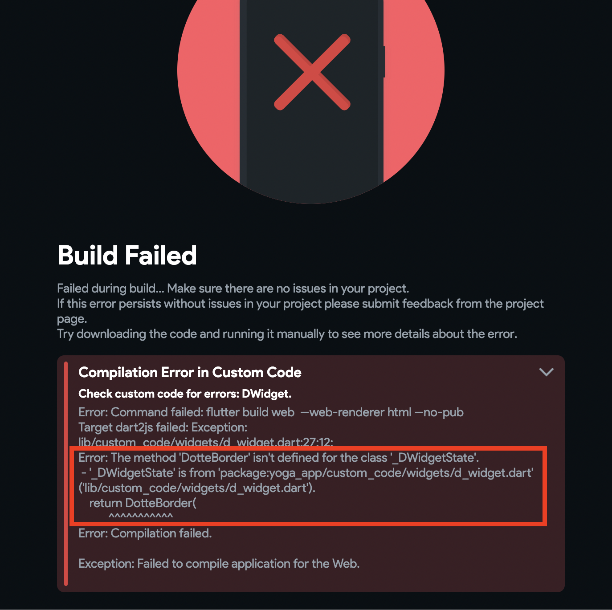

# Resolve Errors in Downloaded Code

When you download your project from FlutterFlow and run it locally in your IDE, you may encounter errors due to Flutter version mismatches. This guide outlines how to resolve these issues by ensuring your local Flutter version matches the version supported by FlutterFlow.

1. **Check FlutterFlow’s supported Flutter version**

    To find the Flutter version currently supported by FlutterFlow:
        - Open the FlutterFlow dashboard.
        - Navigate to your project settings or export screen.
        - Locate the displayed Flutter version used for your project.

        

2. **Verify the Flutter version on your machine**

    To check the Flutter version installed locally, run the following command in your terminal:

        ```js
        flutter --version
        ```
        Here's an example of how you can do that:

        ​

3. **Upgrading or Downgrading to the correct Flutter version**

    If the current version on your machine is different than what is currently supported by FlutterFlow, you can downgrade or upgrade to the supported version. You can learn more about [**upgrading Flutter**](/testing/local-run/#4-running-app-on-device). ​By following these steps, you can fix the errors that you face after downloading the code and run locally. 

## Resolving In-App Errors Before Downloading

    Sometimes, errors in your app — such as misconfigured widgets or faulty custom code — can cause download or build failures. FlutterFlow displays helpful error popups to help you catch and fix these issues before downloading your code.

    - **Error popup**
    
        If you see a popup, open the red-colored section (click *Read More*), and at the bottom, you will see the exact widget or error causing the build or download failure.
    
        Let's see a couple of examples of what you might encounter while building your app:
    
        **Example 1**
    
        Suppose you have a Text widget and added an action that is incomplete. When you try to download the project in such a situation, you might see the following:
    
        
    
        To track down the error-causing widget in the widget tree, start reading the widget list (from top to bottom in a popup) and locate the widget using its child number. For example, when a widget is displayed as *Child 1*, it will be the first child of its previous widget (see the widget in a popup). And when it is shown as *Child 2,3*, and so on, it will be the sibling widget of *Child 1*.
    
        If you have a practice of naming the widget, it will be straightforward to track it down (as we'll display the exact widget name). Here is how it looks:
    
        
    
        :::info
        To find out what caused the widget to fail, you can check errors in the [project issues](../../intro/ff-ui/toolbar.md#project-issues).
        :::
    
        **Example 2**
    
        Let's say you have added a custom widget that works fine. But while modifying it, you made some typo in the code, and now it shows this:
        
        
        
        The second "**Error:"** line clearly mentions that there is some issue with a method name in a custom code.

If you continue to experience issues, contact the FlutterFlow support team via live chat or email at support@flutterflow.io.


