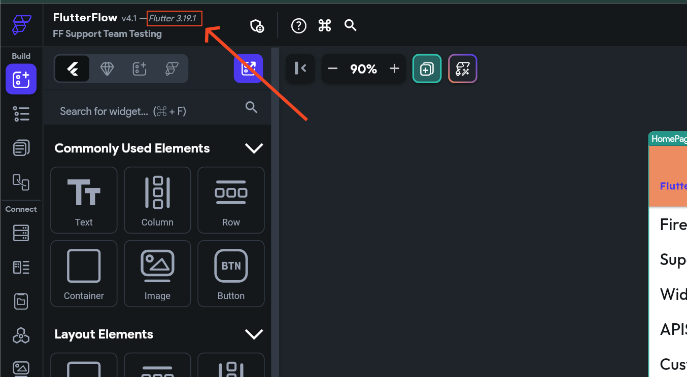

# Resolve Errors in Downloaded Code

When you download your project from FlutterFlow and run it locally in your IDE, you may encounter errors due to Flutter version mismatches. This guide outlines how to resolve these issues by ensuring your local Flutter version matches the version supported by FlutterFlow.

1. **Check FlutterFlow’s supported Flutter version**

    To find the Flutter version currently supported by FlutterFlow:
        - Open the FlutterFlow dashboard.
        - Navigate to your project settings or export screen.
        - Locate the displayed Flutter version used for your project.

        

2. **Verify the Flutter version on your machine**

    To check the Flutter version installed locally, run the following command in your terminal:

        ```js
        flutter --version
        ```
        Here's an example of how you can do that:

        ​

3. **Upgrading or Downgrading to the correct Flutter version**

    If the current version on your machine is different than what is currently supported by FlutterFlow, you can downgrade or upgrade to the supported version. You can learn more about [**upgrading Flutter**](https://docs.flutterflow.io/deploying-your-app/testing-your-app/testing-on-mobile-device#id-2.-verify-correct-flutter-version). ​By following these steps, you can fix the errors that you face after downloading the code and run locally. 

If you continue to experience issues, contact the FlutterFlow support team via live chat or email at support@flutterflow.io.


