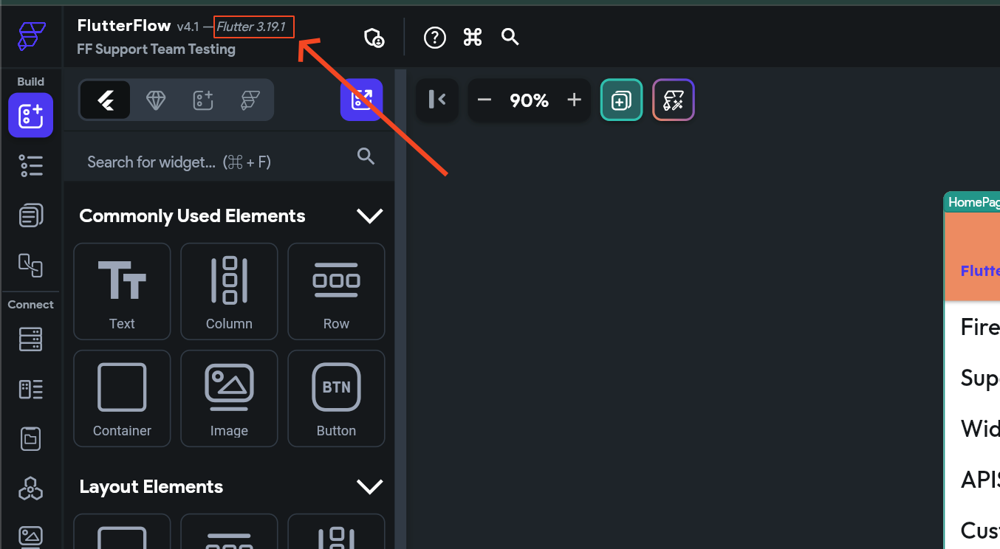
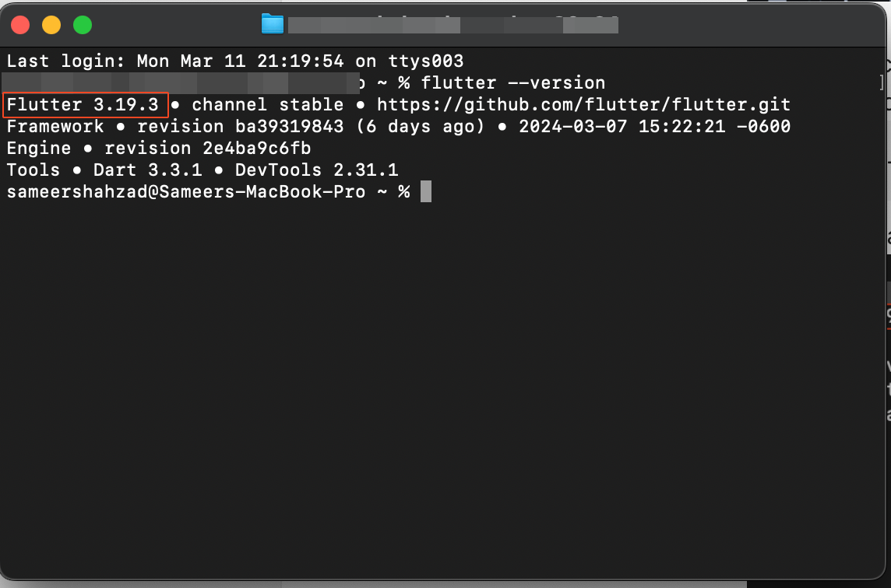

---
keywords:
  - flutter
  - downloaded
  - code
slug: /troubleshooting/deployment/resolve-errors-in-downloaded-code
title: Resolve Errors in Downloaded Code
description: >-
  When you download your project from FlutterFlow and run it locally in your
  IDE, you may encounter errors due to Flutter version mismatches.
tags:
  - FlutterFlow
  - Troubleshooting
  - Deployment
last_verified: 2026-09-02
---
# Resolve Errors in Downloaded Code

When you download your project from FlutterFlow and run it locally in your IDE, you may encounter errors due to Flutter version mismatches. This guide outlines how to resolve these issues by ensuring your local Flutter version matches the version supported by FlutterFlow.

1. **Check FlutterFlow’s supported Flutter version**

    To find the Flutter version currently supported by FlutterFlow:
        - Open the FlutterFlow dashboard.
        - Navigate to your project settings or export screen.
        - Locate the displayed Flutter version used for your project.

        

2. **Verify the Flutter version on your machine**

    To check the Flutter version installed locally, run the following command in your terminal:

        ```js
        flutter --version
        ```
        Here's an example of how you can do that:

        ​

3. **Upgrading or Downgrading to the correct Flutter version**

    Use a version manager or an isolated SDK checkout to select the project version rather than changing a shared system SDK blindly. Then run dependency resolution and inspect the first analyzer or compiler error. A matching Flutter version removes one variable but does not prove dependencies, native tooling, signing, or custom code are valid. See [**running locally**](/testing/local-run/#4-running-app-on-device).


If you continue to experience issues, contact the FlutterFlow support team via live chat or email at support@flutterflow.io.
