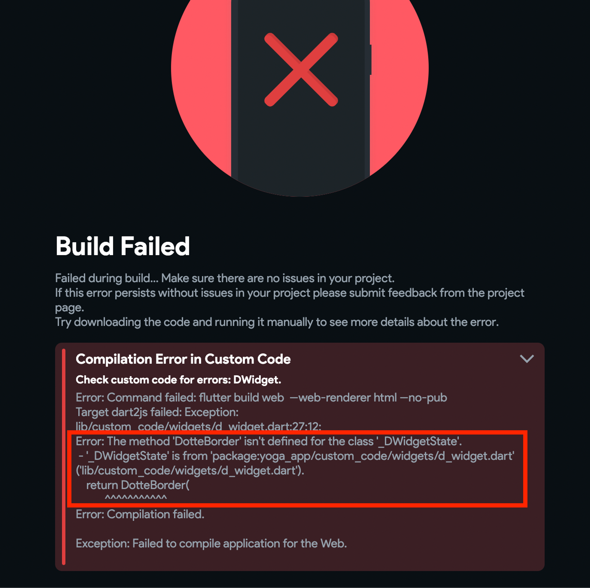
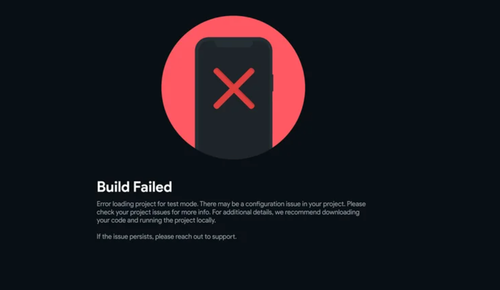

# Run Mode: Build Failure

Encountering a "Run mode: Build failed" error can be frustrating when you're eager to see your app in action. This error typically signifies a project issue that prevents a successful build. Addressing these errors promptly ensures your app's functionality and performance. 

This guide provides a structured approach to troubleshooting and resolving "Run mode: Build failed" errors, ensuring a smooth development process for your projects.

- **Recognizing the Error**

    Here's what the "Run mode: Build failed" error looks like inside of FlutterFlow:

    

- **Understanding Test Mode vs. Run Mode**

    Here's a little background on run mode vs. test mode in FlutterFlow. Test mode runs as a "test" to help you identify errors before deployment. These features include a debugger and display warnings. Alternatively, run mode attempts to run the app in **release mode** to better mimic what your users can expect in production. In release mode, **warnings are mostly suppressed**, meaning it's important to ensure you are acknowledging and addressing warnings in debug mode before you enter run mode.

    The "Run mode: Build failed" error can occur under various circumstances, during:

        - Run mode

        - APK download

        - Code download

        - GitHub push

        - And more

## Common Scenarios and Solutions

- **Custom Code Failures**

    - **Issue**: Your project's custom code doesn't show errors within the editor, but errors appear when you try to run the app.

    - **Example**: A custom widget lacks web support.

    - **Solution**: Verify on pub.dev or equivalent platforms that the custom code supports the necessary platforms (example, web, iOS, Android).

    - **Best practice**: Consider running the code locally on a sample Flutter project before implementing the custom code inside FlutterFlow to identify possible errors logged.

- **Widget Failures**

    - **Issue**: A widget within your app causes the build to fail due to errors.

    - **Example**: Actions assigned to a widget are incomplete or improperly configured.

    - **Solution**: Locate the error-causing widget (usually identified in the error message)

        To correct the issue:

            - Ensure the widget tree is correctly formatted

            - Verify that widgets are named clearly for easy identification

- **Build Fails Without Error Messages**

    - **Issue**: The build process fails without displaying an error message, making it challenging to diagnose the problem.

    - **Solution**: Download and run the project code locally with a debugger to identify and resolve the issue. If downloading the code is problematic, check your browser's console for errors that might indicate the cause.

        

- **Grey Screen in Run Mode**

    - **Issue**: Encountering a grey screen in run mode usually indicates an error suppressed by the release mode.

    - **Solution**: Run the app in test mode to potentially reveal the error for troubleshooting. If test mode does not display errors, use the browser's developer console for clues.

## Checklist for Troubleshooting

- **Identify when and where the error occurs**: 

    Determine if the error is specific to run mode, test mode, or other instances like APK download or code download.

- **Locate the source of the error**: 

    The error message often provides clues about where the problem lies, whether in custom code, a specific widget, or elsewhere.

- **Check for platform support**:

    For issues related to custom code, ensure compatibility with your target platforms.

- **Examine widget configuration**: 

    Verify that all actions and configurations associated with widgets are complete and correct.

- **Utilize local debugging**: 

    If the error is elusive, running the debugger locally on your downloaded code can help identify the issue.

    **Use Device Logs in the FlutterFlow Desktop App**

        If you're using the FlutterFlow Desktop App and running the app with a local run, you can access detailed logs that may point directly to the problem. These logs are especially helpful for catching runtime issues that might not appear in the FlutterFlow UI.

        You can learn how to access these logs in this guide:  
        [Access Device Logs in Local Run](../../testing-deployment-publishing/running-your-app/local-run.md#access-device-logs-in-local-run)

        For example, if a user enters a character instead of a numeric value for a quantity field, and that type mismatch causes an error, it will be captured in the logs — allowing you to identify and fix it quickly.

        

        :::tip
        Not sure what the error means? Just copy and paste the full error message into ChatGPT and ask for help understanding it.
        :::

        In fact, for the error shown above, **[we asked ChatGPT](https://chat.openai.com/share/77f3ceb5-6b2f-4f94-b85c-e01a1fce002a)** to explain and resolve the issue — and the solution turned out to be quick and simple.

- **Leverage browser tools**: 

    The browser's console and developer tools can offer insights, especially when dealing with errors that don't manifest in traditional debug outputs.

:::info[Additional Resources]
[Basic Troubleshooting Guide – FlutterFlow Documentation](https://docs.flutterflow.io/troubleshooting/basic-troubleshooting-guide)
:::
